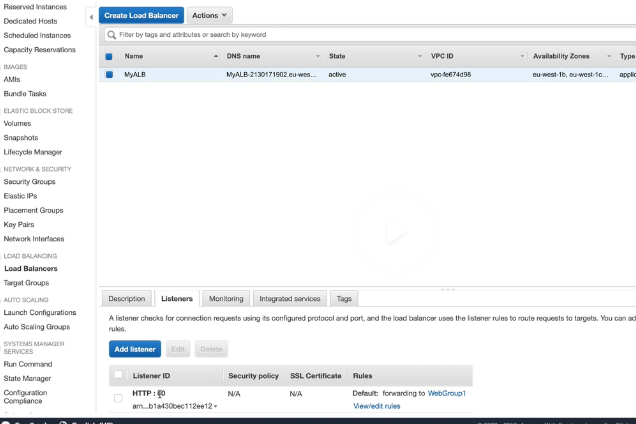
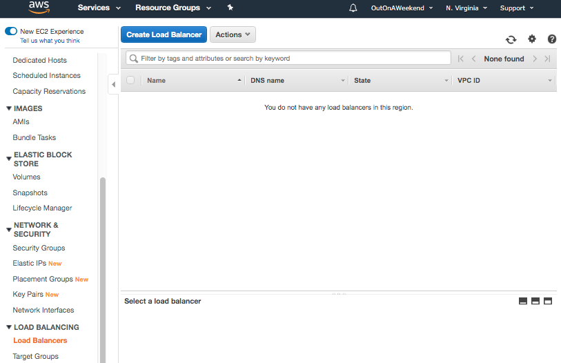
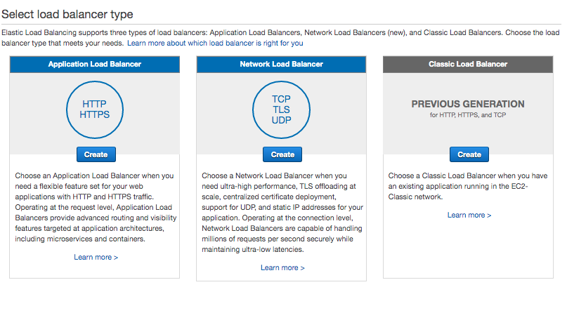
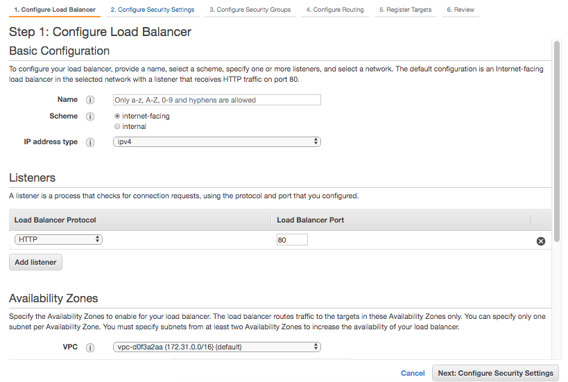
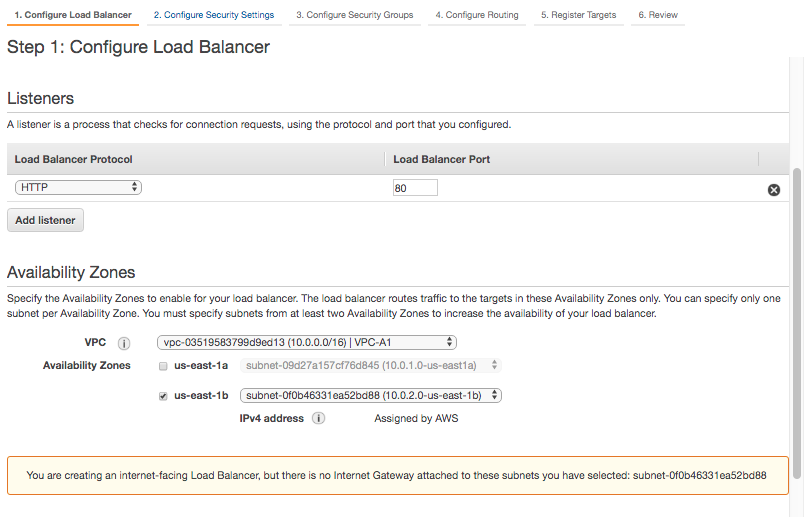

###### Different kinds of Load Balancers

Load Balancers section is in EC2. There are 3 different kinds of load balancers.
1. Application load balancer
2. Network load balancer
3. Classic load balancer

`Application load balancers` are best suited for load balancing of HTTP and HTTPS traffic. They operate in layer 7 and can see inside the incoming requests to make intelligent routing with quite customized rules.

`Network load balancers` are best suited for load balancing of TCP traffic. They operate at layer 4, and are capable of handling millions of requests per second. These are the ones used for extreme performance.

`Classic load balancers` are the legacy load balancers. They typically use layer 7 specific features such as `X-Forwarded-For` and sticky sessions. They are not quite advanced.

In case of Application Load Balancers, intelligent rules can be added via the listeners tab.

> Read ELB FAQs
If application stops responding, the ELB (i.e. a classic load balancer) responds with a 504.

`X-Forwarded-For` header - This is the header that has the actual user's public IP address.

> Load balancers need not necessarily be for internet facing applications only, but typically they are. And thy are usually used for web servers.

###### Creating an Application Load Balancer.
Scheme can be internet-facing or internal.

 Load Balancers section  |  Load Balancer Types 
--- | ---
 | 

If a AZ is selected that does not have an internet facing gateway, a warning message is shown. Also subnets from at least 2 AZs must be specified to increase the availability of the load balancer.

 AZ should have internet facing Gateway  |  There should be subnets from at least 2 AZs 
--- | ---
 | 
