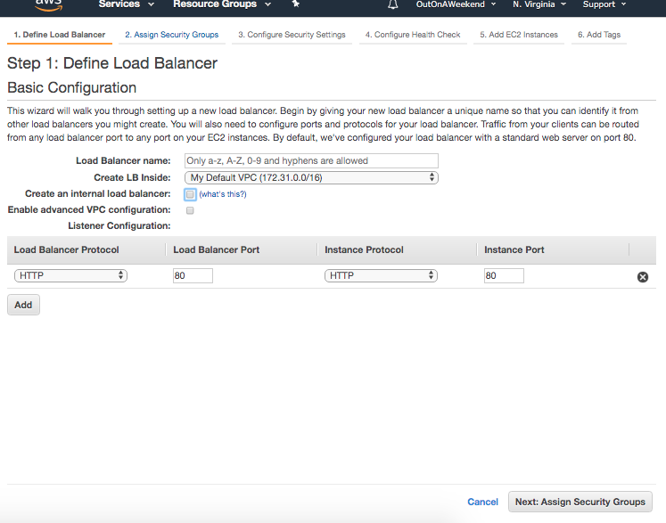
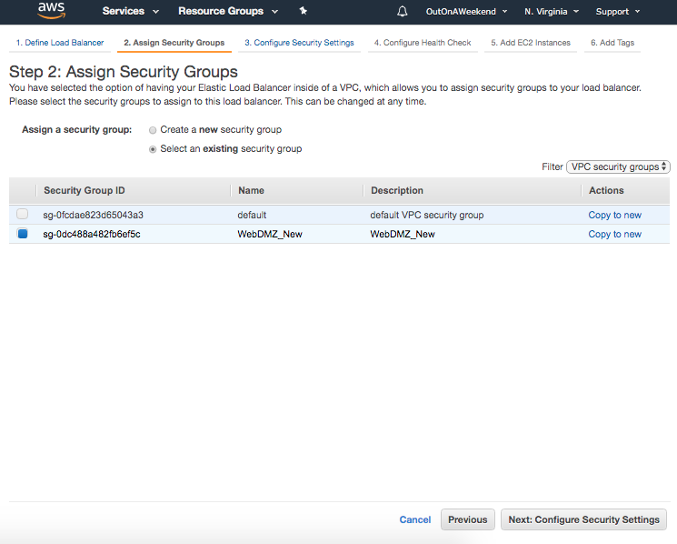
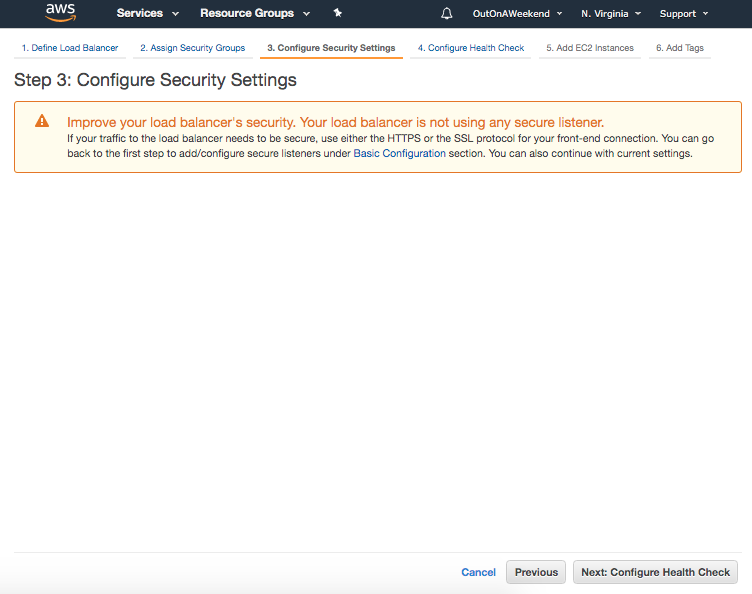
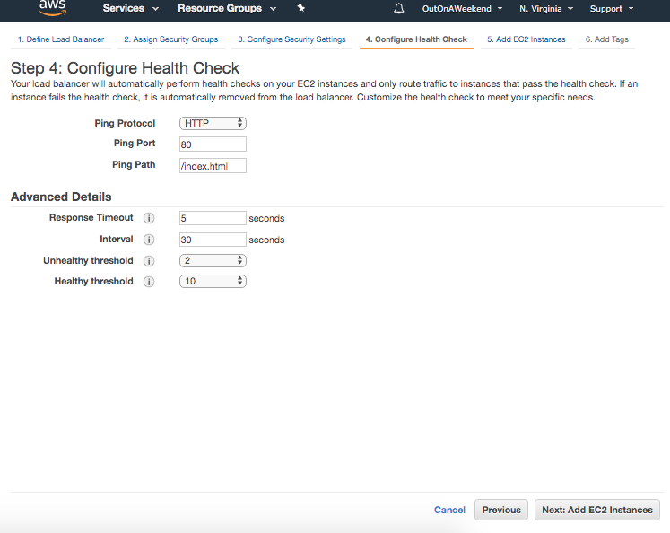
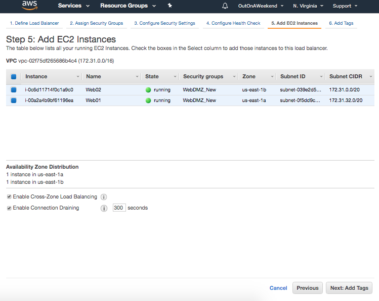
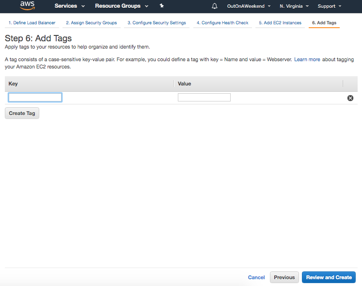
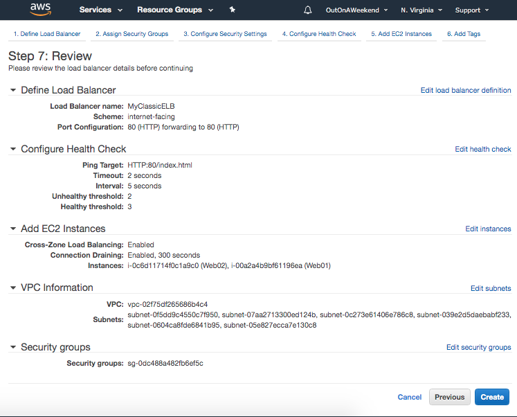
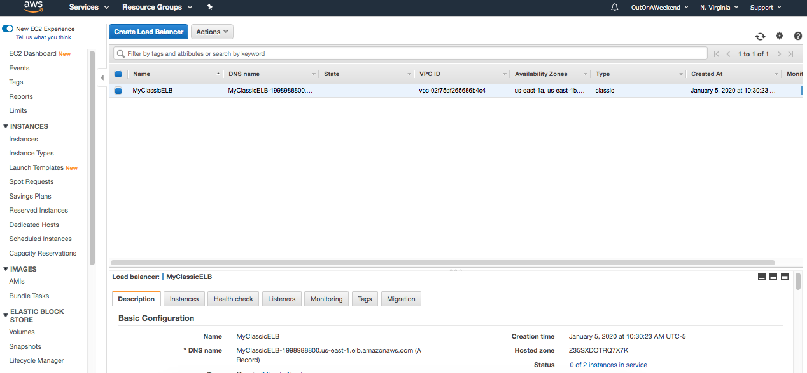
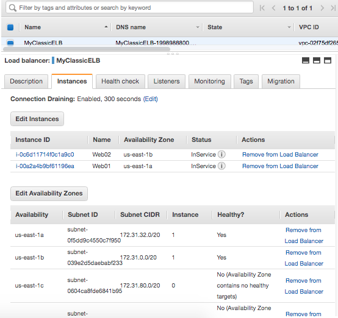

###### Creating an ELB

Have multiple EC instances (in different AZs).

1. Define Load Balancer Configuration  |  2. Assign Security Groups  |  3. Configure Security Settings 
--- | --- | ---
 |  | 

 4. Configure Health Check  |  5. Add EC2 Instances  |  6. Add Tags 
--- | --- | ---
 |  | 

 7. Review  |
--- |

Once the load balancer is created, its DNS name is also generated. For example, `MyClassicELB-1998988800.us-east-1.elb.amazonaws.com (A Record)`.

You can then enter the DNS name in the browser, and it will balance the load accordingly (i.e. redirect the traffic to appropriate server).

There is never an IP address that is available for a ELB.

###### Options during ELB creation

`Internal load balancers` are the ones that are inside private subnet.

`Advanced configuration` specifies which subnets is the load balancer is deployed into (there should be at least 2 subnets selected).

`Configure Health Check` is where the heath check parameters for the servers being load balanced are configured.

`Enable Cross-Zone Load Balancing` distributes traffic evenly across all targets in an AZ.

###### Checking ELB's details

Things such as DNS name are shown in Description tab.

Attached Instances are shown in Instances tab.

