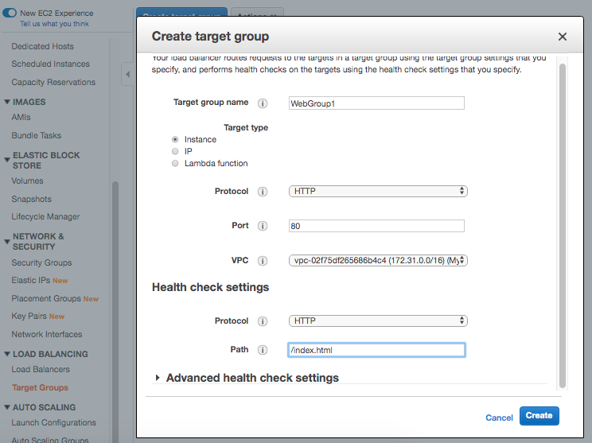
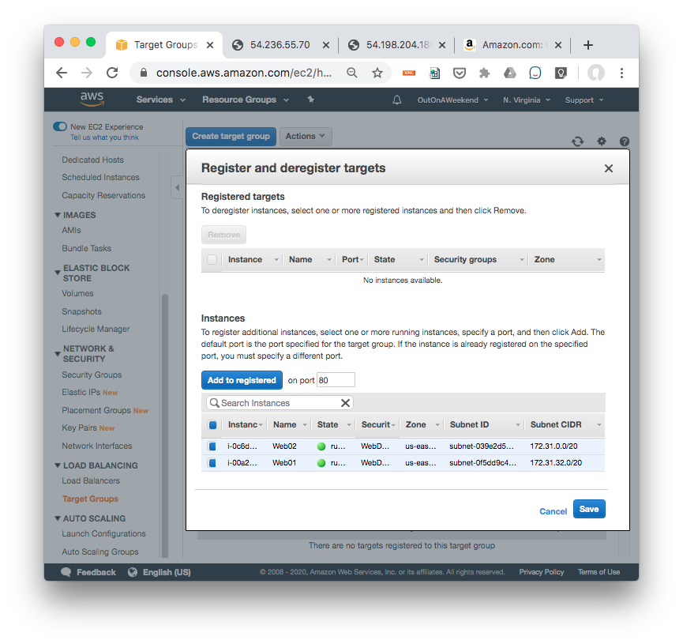
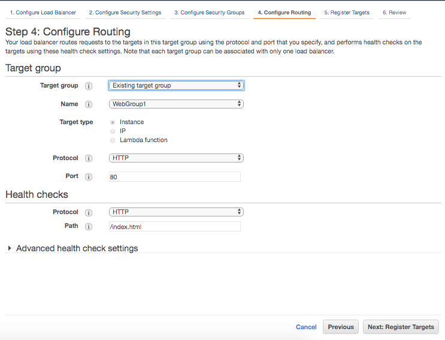
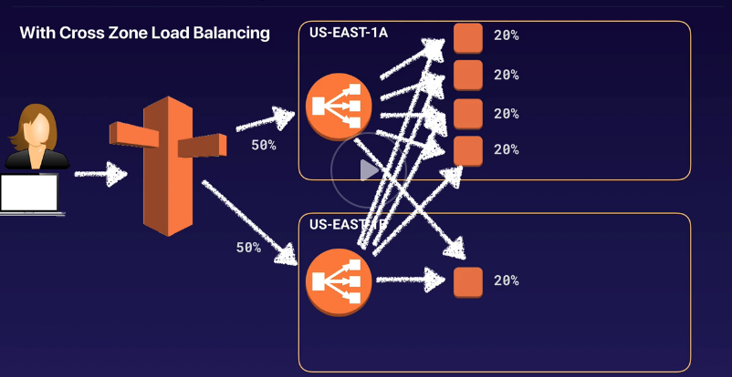

###### Target Groups

Target groups seem to be a way of grouping together multiple EC2 instances. And then load balancers can balance targets instead of instances.

 1. Create Target Group  |  2. Register Targets to it  |  3. Attach Target Group while creating ALB 
--- | --- | ---
 |  | 

###### Sticky Sessions

`Sticky Sessions` allow to tie a user's session to a specific EC2 instance. That is, all the requests from the user during a session are sent to the same instance.

Sticky sessions can be enabled for ALBs as well, but the traffic is sent at target group level (i.e. it will go to same group of targets and not necessarily the same target?).

###### Cross-Zone Load Balancing

`Cross-Zone Load Balancing` is a way to balance the load across different AZs in a way that all instances get the apportioned traffic even if all the AZs do not have the same number of instances.

###### Path Patterns

`Path Pattern` or `Path-based routing` is a way to forward requests based on URL path (i.e. probably some deep nesting in the path). For example, general requests can be routed to one target group and requests to render images can be routed to another target group (which can even be in a different AZ).
