###### What is Auto Scaling

`Auto Scaling` is a way to automatically scale and provision additional resources (i.e. EC2 instances, etc.) in case any of the existing resources go down. The parameters on how to monitor the resources can also be specified.

([Reference](https://aws.amazon.com/autoscaling/))

###### Creating a Launch Configuration

The interface is a lot like that of creating new instances, as that is what this likely means. That is what the new instances to be launched should be like.

 1. Choose AMI  |  2. Choose Instance Type  |  3. Configure Details 
--- | --- | ---
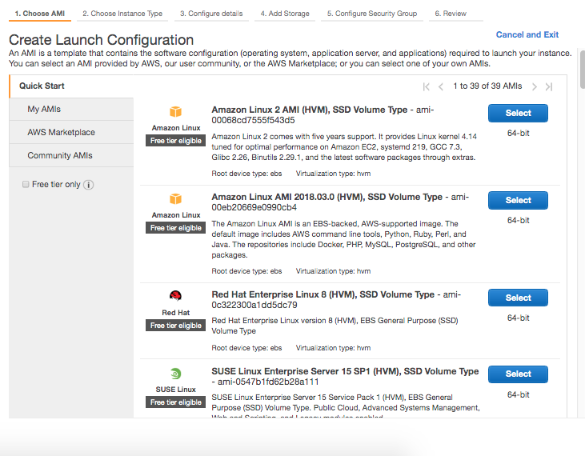 | 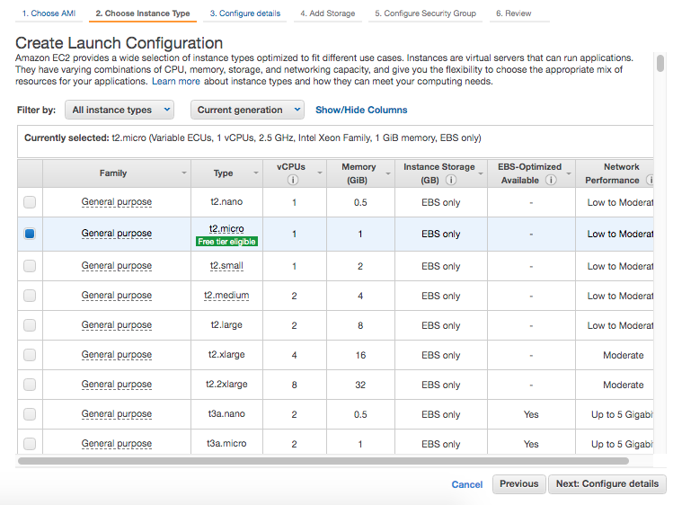 | 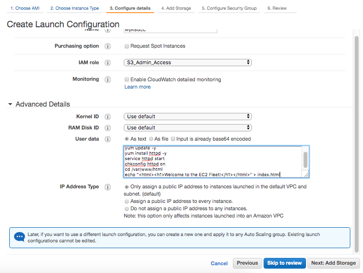

 4. Add Storage  |  5. Configure Security Group  |  6. Review 
--- | --- | ---
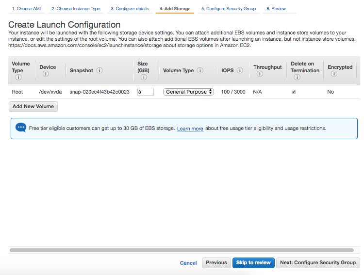 | 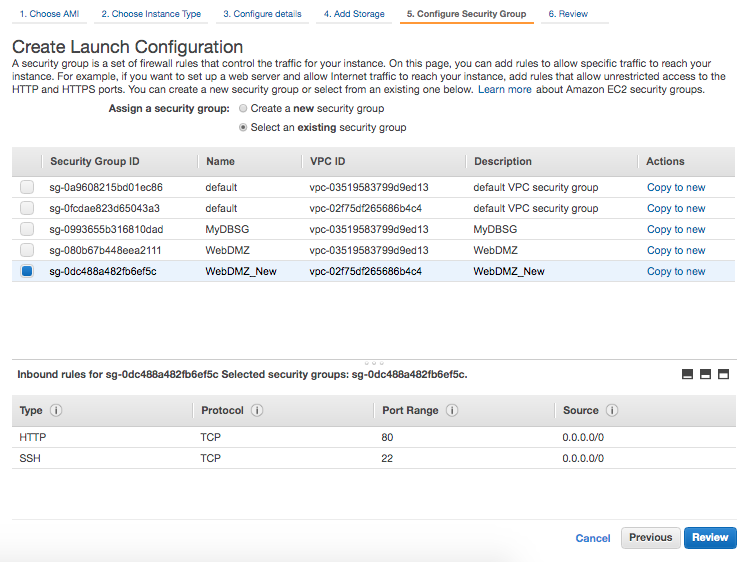 | 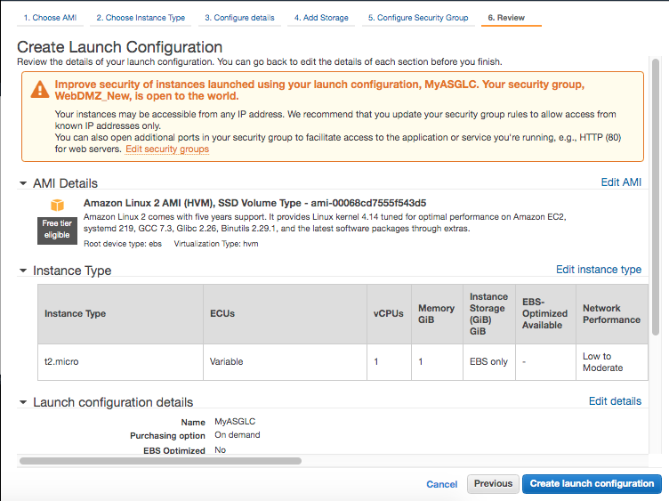

###### Creating an Auto Scaling Group

Things such as how many instances the group includes, what subnets they should be in are specified here.

 1. Configure Auto Scaling Group Details  |  2. Configure Scaling Policies  |  3. Configure Notifications 
--- | --- | ---
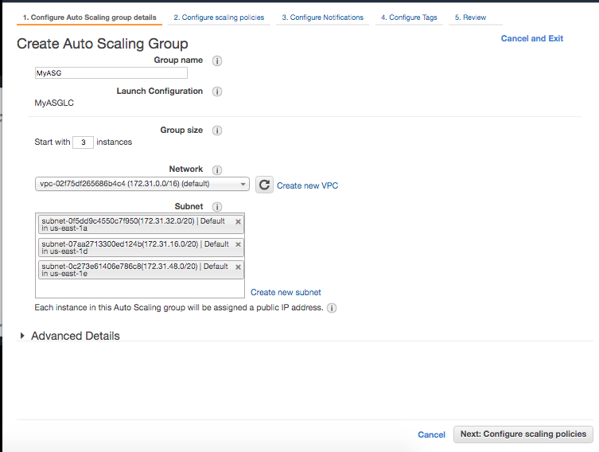 | 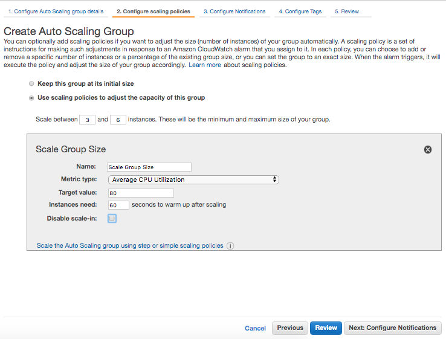 | 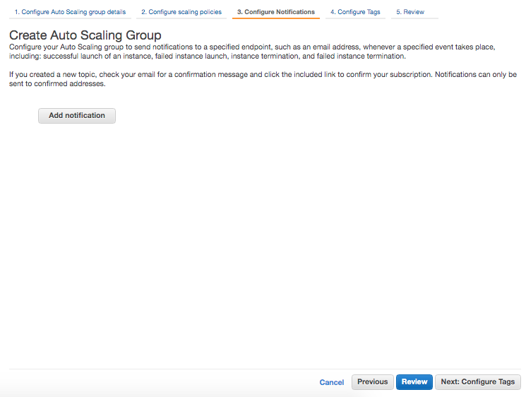

 4. Configure Tabs  |  5. Review 
--- | ---
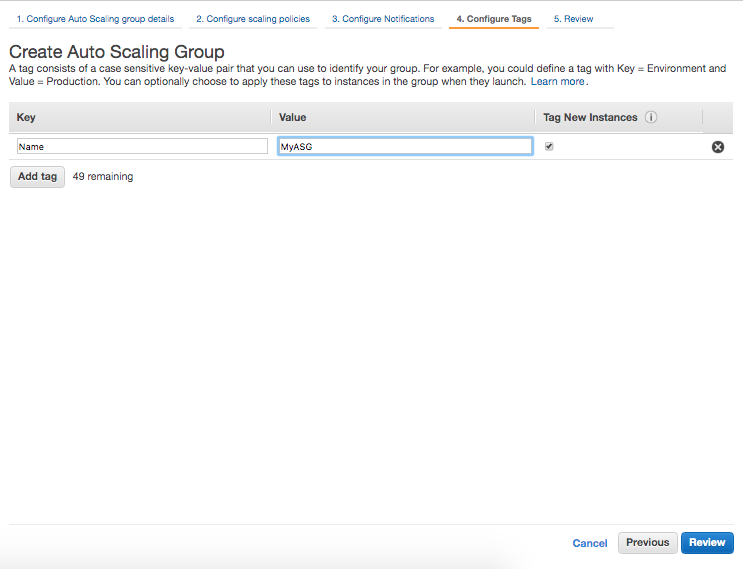 | 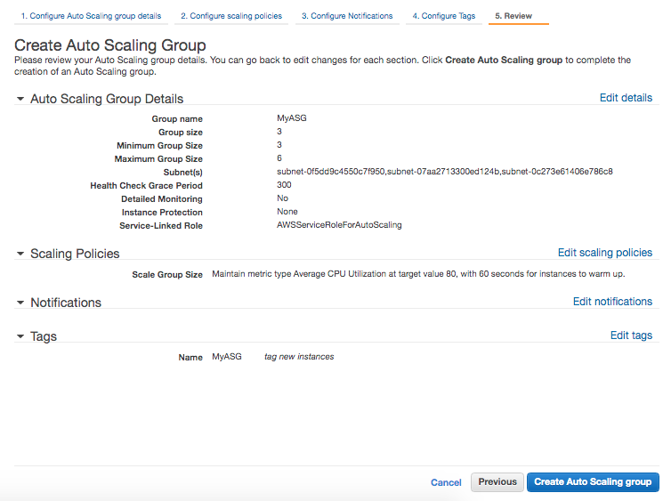

> However something went wrong when I tried. The group was not created.

###### Checking Auto-Scaling Group's details

The basic details are shown in Details tab.

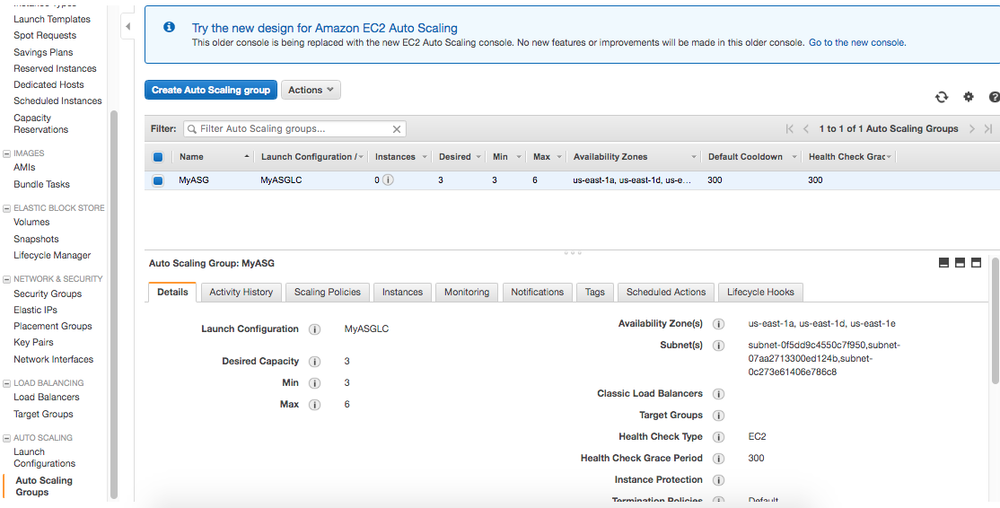

The instances initially includes in the group are shown in Instances tab.

###### Scaling Out and Scaling Up

`Scaling Out` means auto-scaling, i.e. new instances being launched if needed.

`Scaling Up` means the resources of existing instances being amped up if needed. For example, it may be upgraded from T2 micro to 6X extra large.
