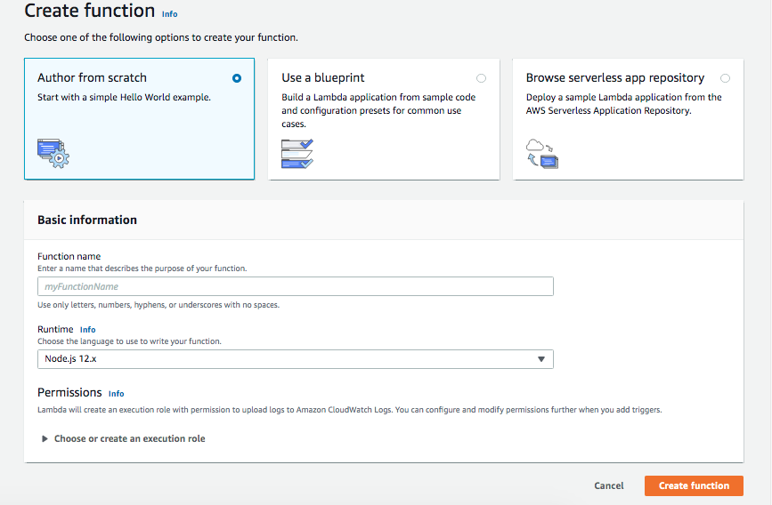
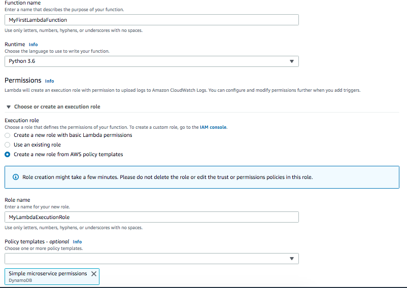
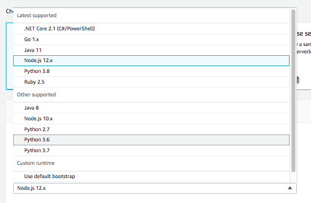
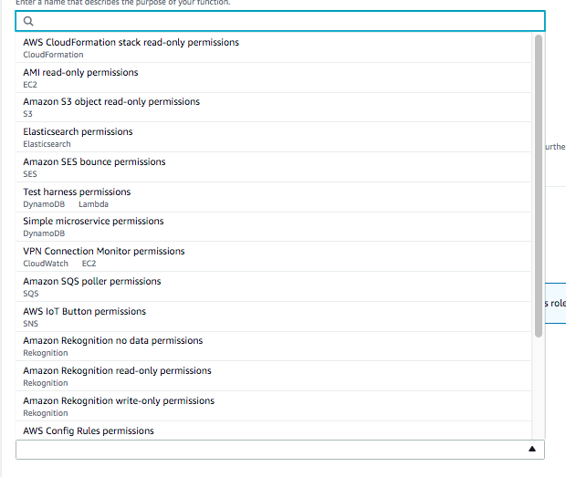

#### Creating a Lambda function

There are 3 ways to start creating a Lambda function. Creating from scratch, or creating using a blueprint, or using a serverless application repository. The latter two methods are especially used while creating Alexa skills.

An IAM role is also needed, and can be created based off policy templates. The policy template for a simple micro-service is available as `Simple micro-service permissions`.

> What is language? Is it for the script that is inserted later on?

 1. Choose how to start (author from scratch)  |  2. Select language, role, policy template, etc. 
--- | ---
 | 

 Supported Languages  |  Available Policy Templates 
--- | ---
 | 

So just doing the above actually creates the Lambda function.
