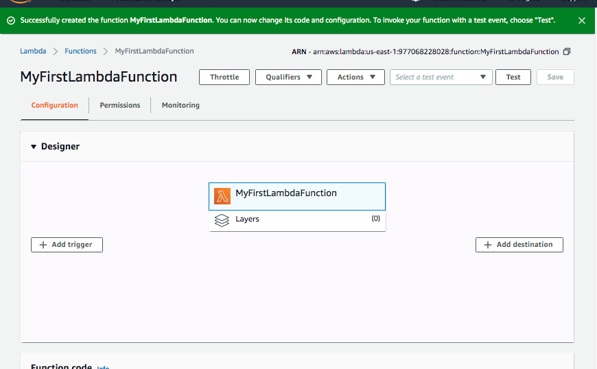
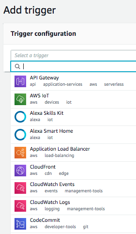
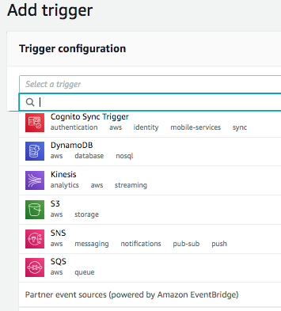
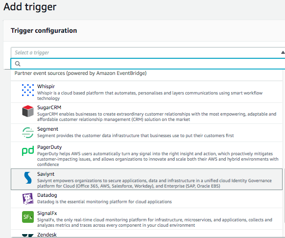
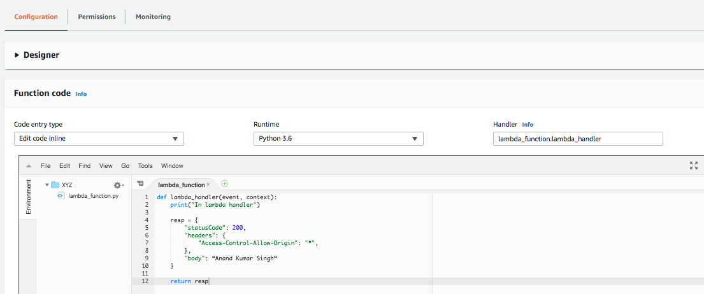
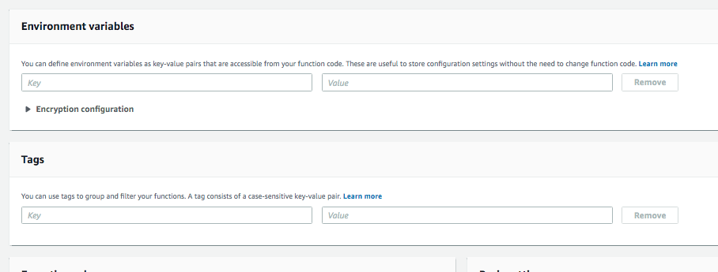
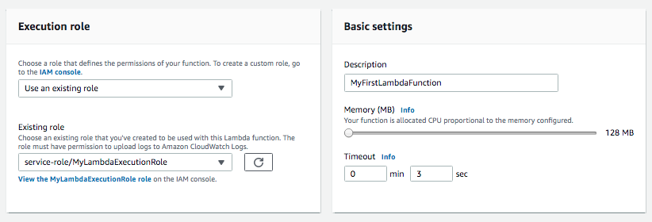
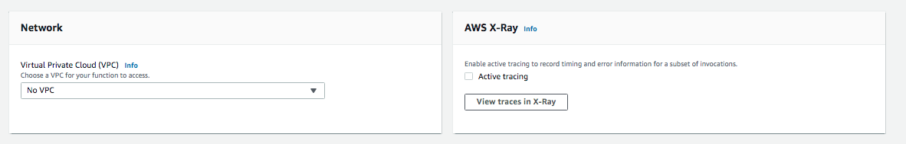
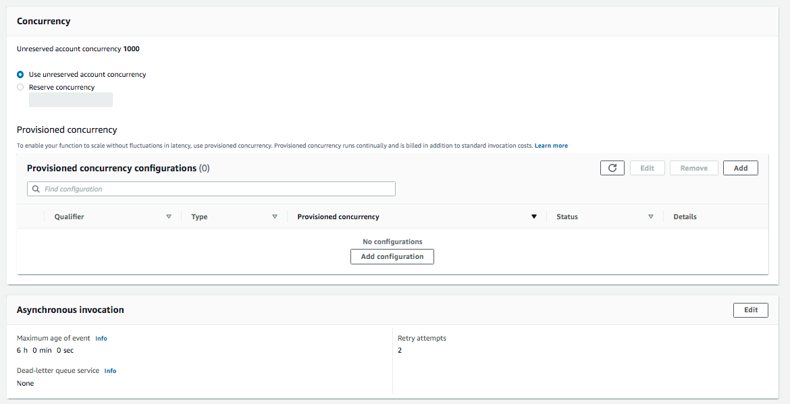

#### Various sections in a Lambda function Configuration

###### Designer

This is where you add the trigger. Typically `API Gateway` is specified as the trigger for making APIs.

Here are the various available triggers

 |  | 
--- | --- | ---

###### Function code

This is where the code to be run by Lambda is put.

###### Environment variables and Tags

Environment variables is a way of passing environment variables into the Lambda function.

###### Execution Role and Basic Settings

The IAM role and the function names specified while creating the Lambda show up here. How much memory should be allocated to the function, and the timeout period can also be specified here.

###### Network and Debugging

If the Lambda function needs access to a VPC, that needs to be specified here.

`AWS X-Ray` is probably the section where logging can be enabled and viewed.

###### Concurrency and Asynchronous Invocation

###### Database proxies

