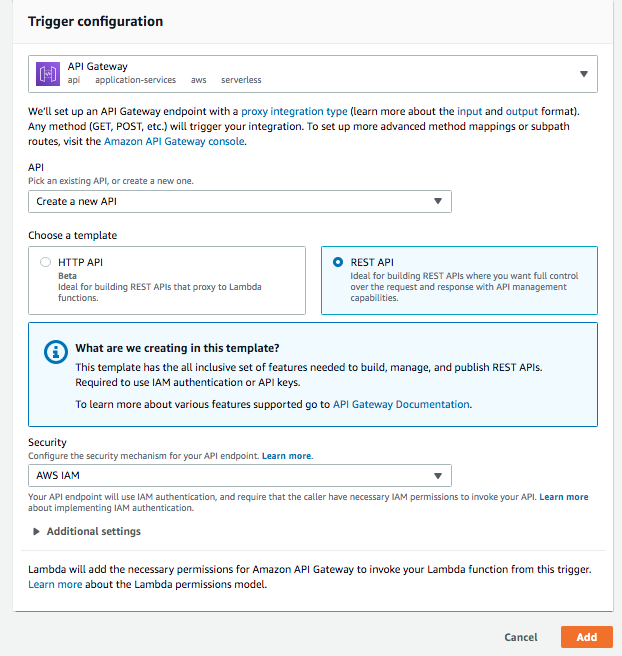
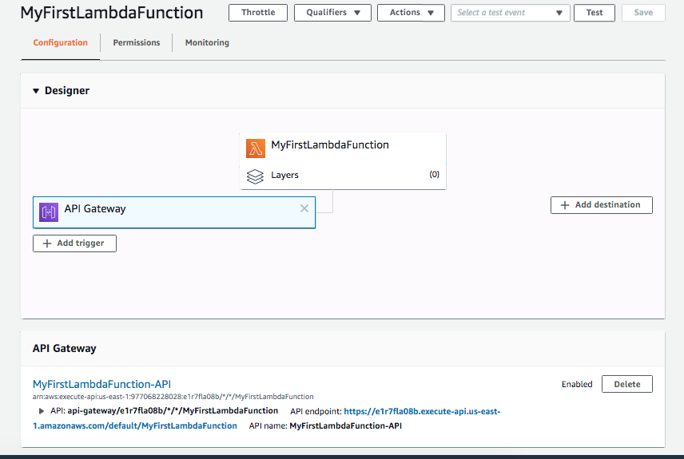
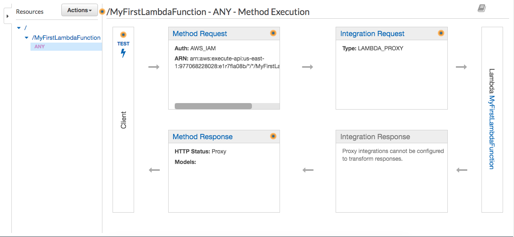
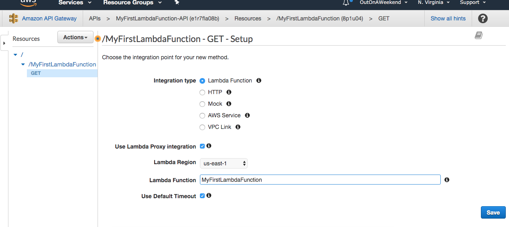
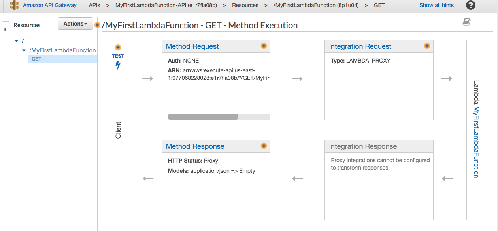
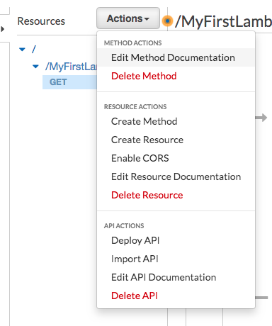
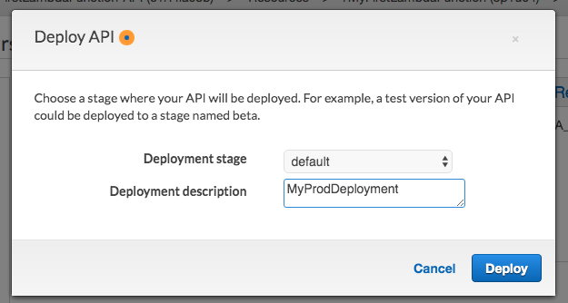

#### Adding a trigger

Select `API Gateway` trigger  
Select `Create New API` (other option is `Existing REST APIs`)  
Choose template `REST API`  
For security select `AWS IAM`  

Once this is done, this new trigger shows up in the Designer canvas. This basically creates a new API endpoint (which also starts showing there).

However now for this function to be actually accessible, it should be appropriately configured in API Gateway. Tapping on the API title opens it in API Gateway.

###### Configuring the API in API Gateway

It initially shows up with a default set of things under `ANY` (which likely denotes all the possible HTTP methods). This can be deleted using the `Actions > Delete Method`.

And then add a new method via `Actions > Create Method`. Specify its integration type as `Lambda function`. Also check `Use Lambda proxy integration`, select the correct AWS region and the Lambda function name.

Once this is done the GET method shows up in the diagram.

Various options available via `Actions` -

###### Deploying the API

Now the API needs to be deployed. This is done via `Actions > Deploy API`.

And now the API becomes actually accessible.
