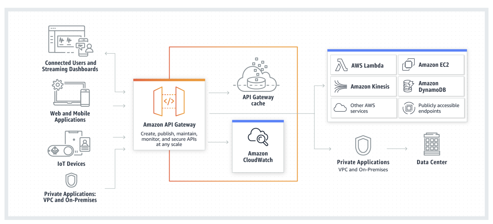
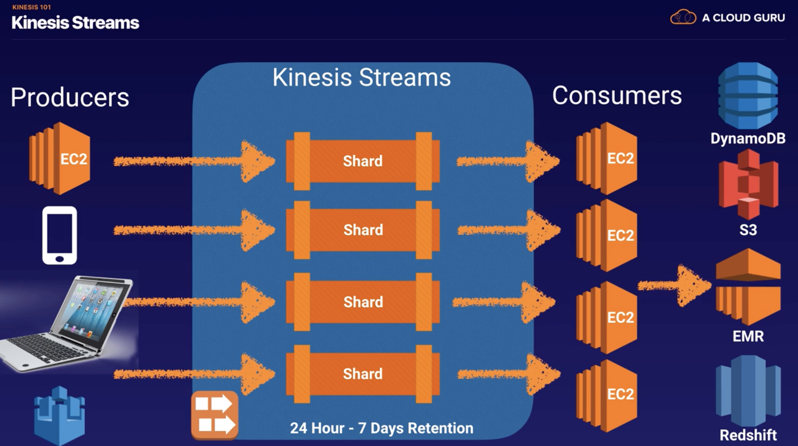
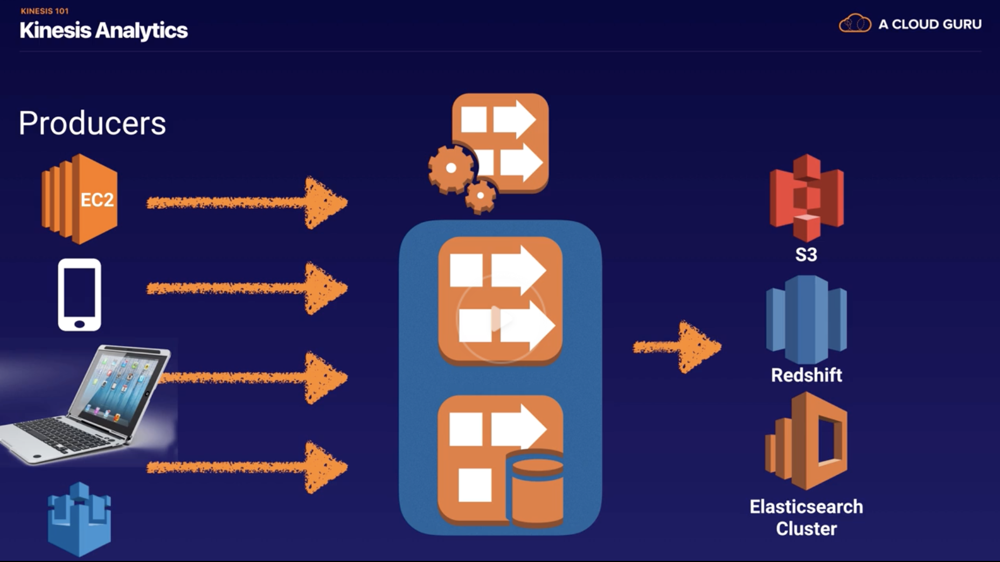
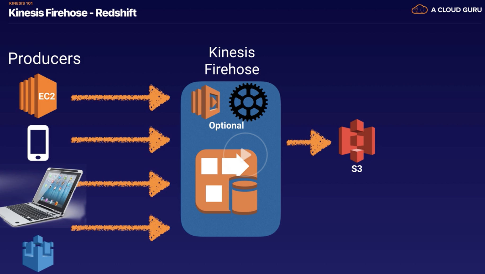
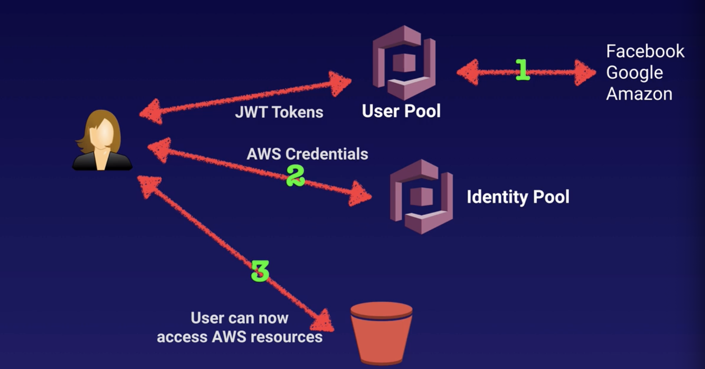

#### Amazon Resource Names (ARNs)

It's like a unique identifier for AWS resources across entire AWS. It's typically needed to identify a resource in  IAM policies, RDS tags, etc.

Here are some sample ARNs.
```
IAM user - arn:aws:iam::<AccountID>:user:/<Username> (Can be found in IAM > User)
IAM policy - arn:aws:iam::policy/aws-service/<PolicyName>
```

#### Elastic Beanstalk

`Compute > Elastic Beanstalk` automatically takes care of things like capacity provisioning, load balancing, scaling and application health monitoring. You just need to upload the application code.

> Check the reference.

#### Simple Queue Service (SQS)

`SQS` is distributed message queue system that is used to store messages while waiting for a resource to process them. It's a temporary repository for messages that are awaiting processing.

Various resources (i.e. EC2 instances, etc.) can regularly pull messages from the queues.

Messages can contain up to 256 KB of text in any format, and are stored in the queue itself. If the messages are bigger (up to 2 GB), they are stored in S3 but SQS still has access to them.

So essentially the queue resolves issues that arise if one component is producing a feed at a different rate than what another component can take.

It's also possible to set up an Auto Scaling group which monitors a SQS queue, such that is number of messages there goes beyond a threshold automatically more instances are launched.

There are 2 types of queues -

1. `SQS Standard queue` The default type. Allows nearly unlimited tps and all messages are guaranteed to be delivered at least once (sometimes they may be delivered multiple times, which is not desirable). Also, messages are generally sent in the same order that they are received.

2. `FIFO queue` Complements the standard queue. The order in which messages are received and sent are strictly preserved, and delivered exactly once. They are also limited to 300 tps.

`Visibility Time Out` is the time that a message is unavailable in SQS queue after a reader has picked up the message. If the job is processed before the time out, the message is deleted from the queue. And if its is not, the message becomes available again. This what is can cause a message to be delivered multiple times. The maximum Visibility Time Out is 12 hours.

`SQS long polling` is a way to retrieve messages from SQS queues. While `short polling` returns immediately (even if the queue is empty), 'long polling' returns only when a message arrives in the queue or when it times out. Long polling is a way to save money, as it can be expensive to send sufficiently frequent short polls.

([Reference](https://aws.amazon.com/sqs/))

#### Simple Workflow Service (SWF)

`SWF` too is a way of coordinating work across distributed components. It's used for media processing, analytic pipelines, and many more use cases. It coordinates 'tasks' (digital as well as manual).

While SQS has a retention period of up to 14 days, with SWF workflow executions can last up to 1 year. SWF also guarantees that a task is assigned only once. SWF also keeps a track of all tasks and events in the application. Whereas with SQS you need to implement your own application-level tracking.

SWF actors - Workflow starters, Deciders, Activity Workers

([Reference](https://aws.amazon.com/swf/))

###### Simple Notification Service (SNS)

It provides a way to set up notifications for various applications. These are also what can be used for sending mobile push notifications. Further notifications can also be SMS, Email, or a message to any HTTP endpoint. The message delivery is possible over multiple transport protocols.

When a 'topic' is published it gets delivered to all the subscribers. Similar endpoint/recipient types can also be grouped together.

All messages published to SNS are stored redundantly across multiple AZs to ensure they are not lost.

Remember that SNS is a push service and does not have any poll (i.e. pull) capability.

([Reference](https://aws.amazon.com/sns/))

#### Elastic Transcoder

It's a media transcoder in the cloud, i.e. it converts media files from one format to another. It already has suggested presets for popular output formats. Its billed based on media duration as well as resolution. It picks file from one location (say S3), transcodes it and then puts it to a location (say S3 again).

([Reference](https://aws.amazon.com/elastictranscoder/))

#### API Gateway

It is a service to create, publish, maintain, monitor, and secure APIs at any scale. Using API Gateway, both RESTful APIs and WebSocket APIs can be created. Its typically used to communicate to Lambda functions (and DynamoDB too), though it can be used to communicate to web applications as well.

It scales automatically, and there is no need to set up separate auto-scaling groups for it.

Its usage is tracked and controlled using API keys. Incoming requests can be throttled as needed.

It can be connected to CloudWatch for monitoring all requests.

And multiple versions of the API can also be maintained.

The endpoints' response can also be cached to reduce latency of the requests.



([Reference](https://aws.amazon.com/api-gateway/))

###### Steps to configuring an API Gateway

1. Define an API (container)

2. Define resources and nested resources (URL paths)

3. Specify HTTP method for the resources

4. Specify security for the resources

5. Specify target (EC2, Lambda, DynamoDB, etc.) for the resources

###### Steps to deploying an API Gateway

It is deployed to a stage. It is used API gateway domain by default, but a custom domain can also be used.

###### Cross Origin Resource Sharing (CORS)

In desktop browsers there is a concept called `same-origin policy`. It means that a web browser allows a web page to access data from another web page that is also open, only if they both share the same origin. This is done to `prevent cross-site scripting (XSS)`.

This can be mitigated for AWS services by enabling `Cross-origin resource sharing (CORS)` in the API Gateway. This allows restricted resources on a web page to be requested from another domain outside the domain from which the first resource was served.
> Understand it better.

Anytime there is an error message called 'origin policy cannot be read at remote resource' while accessing a URL it typically means that CORS needs to be enabled on its API gateway.

#### Kinesis

`Kinesis` is something to which streamed data (i.e. streaming data) can be sent. It makes it easy to load and analyze streaming data.

By default, the data is stored in Kinesis for 24 hours (it can be ramped up to 7 days). Whoever sent the data (typically from outside world) is called a `data producer`. This data is then consumed by `data consumers` such as EC2 instances.

There are 3 different types of Kinesis.

1. `Kinesis Streams` The data is contained in Kinesis in something called `shards`. `Shards` can have support up to 5 transactions per second or 2 MB per second for reads, 1000 records per second or 1 MB per second for writes. Also, the data capacity for the stream is a function of the number of shards specified for the stream.

2. `Kinesis Firehose` There is no persistent storage. Typically, as soon as the data comes in it triggers a lambda function which then stores that data somewhere else (like S3).

3. `Kinesis Analytics` This can analyze Knesis Stream as Kinesis Firehose data on the fly.

<span style="font-weight:normal"> Kinesis Stream </span> | <span style="font-weight:normal"> Kinesis Firehose </span> | <span style="font-weight:normal"> Kinesis Analytics </span>
--- | --- | ---
 |  | 

([Reference](https://aws.amazon.com/kinesis/))

#### Web Identity Federation and Cognito

`Cognito` is a web identity federation service to give users access to AWS resources using their web based identity providers such as Google, Facebook, Amazon, etc.

It is recommended for all mobile applications that AWS services (like which ones?).

`User Pools` are user directories used to manage sign-up and sign-in functionality. Users can sign in directly to the user pool or using Google, Facebook, etc. Successful authentication generates a JSON web token (JWT).

`Identity Pools` provide temporary AWS credentials to access AWS services. This is probably done using IAM roles.



Cognito also keeps a track of the user identities and various devices that they are signed in from. It uses push synchronization to push updates and sync user data across all devices. It uses SNS to send a notification to all devices associated with a given user identity whenever needed.
