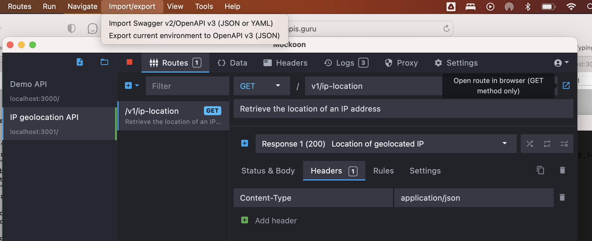
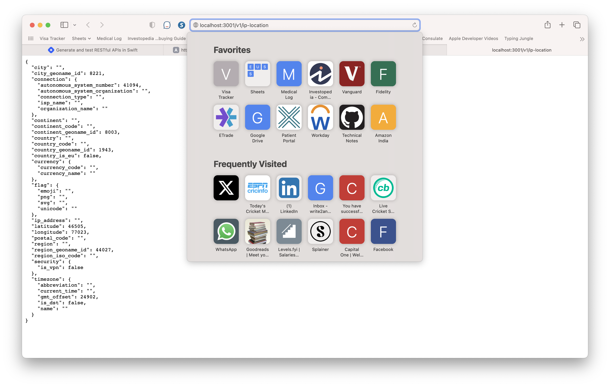
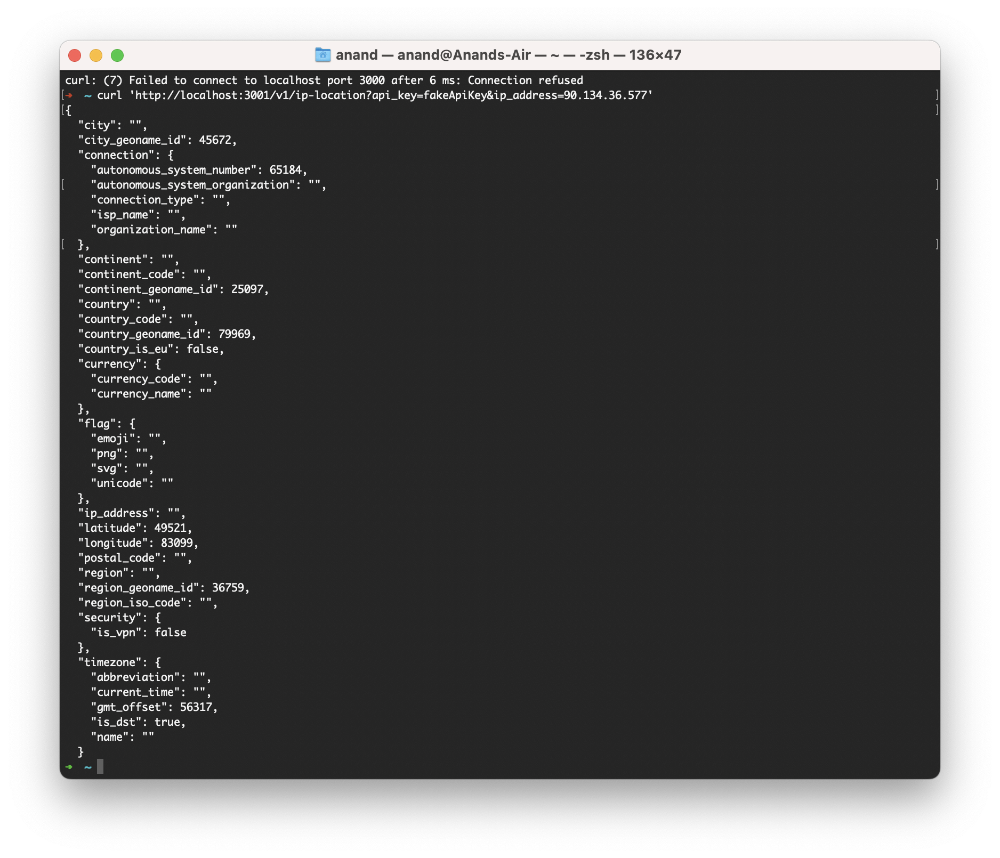
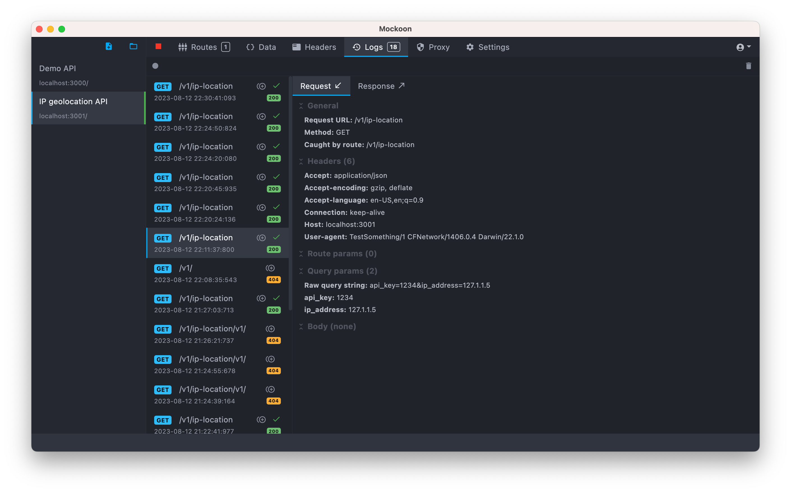

Installing [Mockoon](https://mockoon.com/tutorials/getting-started/) - 

(Creates sample payloads from an OpenAPI spec, and runs a local server)

```
 brew install --cask mockoon
```

1. Download any OpenAPI spec (needs to be json/yaml), a [sample spec](https://api.apis.guru/v2/specs/abstractapi.com/geolocation/1.0.0/openapi.yaml) for getting geographic details from an IP address.

2. Import it in Mockoon <br>

3. Enter some path in the route textfield

4. Tap on the start button on top toolbar if needed to start the server

5. The local server is accessible thereafter

   | Using browser                                                | Using cURL                                                   |
   | ------------------------------------------------------------ | ------------------------------------------------------------ |
   |  |  |

   It even shows real time log of incoming requests in the `Logs` tab.
   
   

yonaskolb/swagger - Swift lib to generate parser given an OpenAPI spec

swagger-api/swagger-codegen (https://github.com/swagger-api/swagger-codegen)