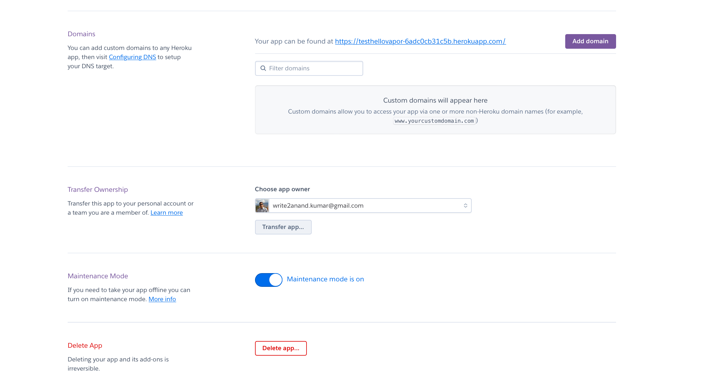

[toc]

#### Terminology

([Reference](https://devcenter.heroku.com/articles/glossary-of-heroku-terminology#eco-dyno))

`Dyno` -  Container that runs a Heroku app’s code. When a dyno starts up, it runs a single command that is usually specified in the app’s Procfile.

`Buildpack` - A collection of scripts that transforms a Heroku app’s code into the executable bundle (called a slug) that is run by the app’s dynos (basically a build pack is what compiles the application code). There are some official buildpacks (for common languages/frameworks), for the rest there are third-party buildpacks.

`Slug` - The executable bundle created from a Heroku app’s source code by Buildpack.

`Procfile` - A plaintext file that declares the commands that an app’s dynos run when they start up.

#### Basic commands

##### Installing Heroku using Homebew

```
brew tap heroku/brew && brew install heroku
```

##### Login

```
heroku login
heroku auth:whoami
```

##### Connect local app with Heroku

```
heroku git:remote -a testhellovapor    // Configure heroku for local web-server repo app
```

##### Create and set Buildpack

```
heroku create --buildpack vapor/vapor     // Sets the buildpack as Vapor
heroku buildpacks:set vapor/vapor
```

##### Create a procfile

The below example is for Vapor. Should be committed and pushed too.

```
echo "web: App serve --env production" \             
  "--hostname 0.0.0.0 --port \$PORT" > Procfile
  
git add .
git commit -m "adding heroku build files"
```

#### How to stop an app in Heroku

To pause an app, its maintenance mode has to be switched on. This can be done using the GUI (through app's settings) as well as CLI (do verify from GUI though).



From CLI

```
heroku maintenance:on   // Switch on maintenance mode
heroku apps:destroy   // Delete
```

#### Pipelines

A `pipeline` is a group of Heroku apps that share the same codebase. Adding apps to a pipeline allows you to define stages and promote code between them.

Why would I want to share code? For the usual reasons as in any codebase?
