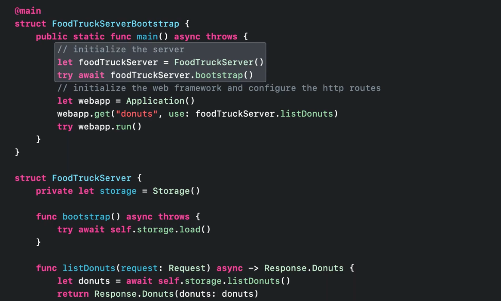

##### What is SwiftNIO

`SwiftNIO` is the official framework offered by Apple. It is however quite low-level, and relies on non-blocking NIO (whatever that may mean). 

With NIO you can build a lot, you can make database connectors like postgres-nio, push notification services (APNSwift), basically you can support any kind of network protocols. On the other hand, if a simple REST API or a similar backend needs to be built, its not advisable to use SwiftNIO directly unless one has enough understanding of network layers, event loops, pipelines, channels, futures and more.

`Vapor` is an external web framework for Swift written on top of SwiftNIO. There are more external server side frameworks (such as Perfect, IBM's Kitura that existed earlier but gradually phased out).

[swift.org Swift on Server page](https://www.swift.org/server/) [Swiftdev post on various frameworks](https://theswiftdev.com/beginners-guide-to-server-side-swift-using-vapor-4/) [Swiftdev post on SwiftNIO](https://theswiftdev.com/swiftnio-tutorial-the-echo-server/) 

Swift open source community has developed database drivers that help interact natively with most databases technologies. Partial list includes Postgres, MySQL, MongoDB, Redis, DynamoDB, and many others.

`Storage` is a type in SwiftNIO (and hence Vapor too) that provides an interface for storing files (and accessing database too?). (Covered in 'WWDC 2022 - Use Xcode for server-side development')

