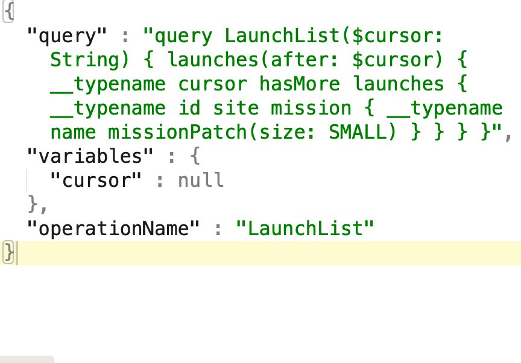
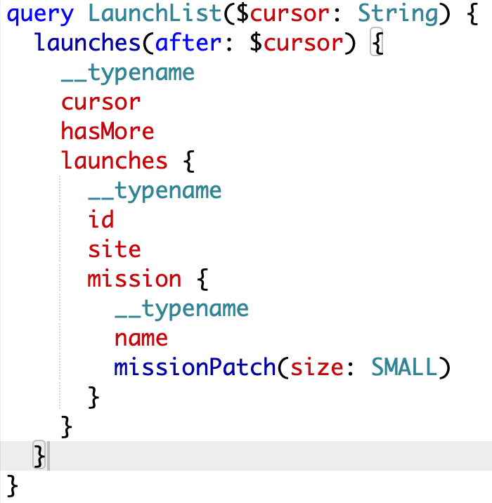
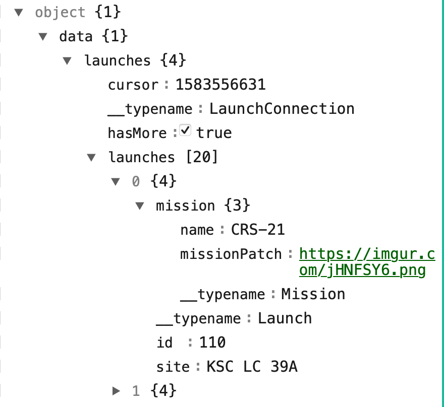
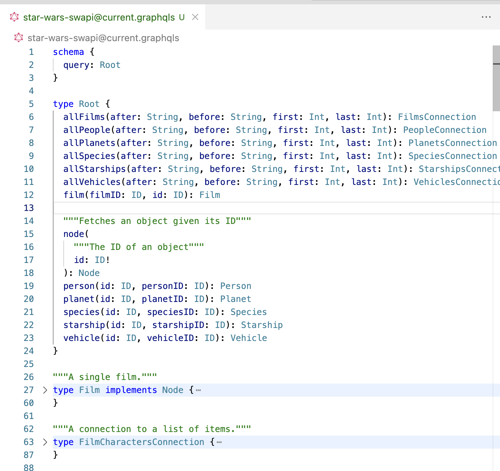

[toc]

#### What is GraphQL

As per the definition, GraphQL is a query language for APIs.

To put it very simply, its a new way of structuring API contract such that the API become lot more versatile and offer lot more to the client without needing API development every time there is an evolution in the requirements. The client devs just need to understand the graph well.

It isn't something that can't be done with traditional REST APIs if sufficient forethought is given, its just that the sufficient forethought has been given, a standard drafted, and that **standard** is now called `GraphQL`. 

The data conforming to that standard is still sent in traditional REST APIs, usually as POST with the data being in one of the request keys.

Also, with GraphQL **there is just one URL** for all the operations that may be needed. Unlike in traditional REST where they may be different URLs and HTTP methods for getting various level of details and tasks (get, create, update, etc.). What needs to be done is instead indicated through the payload sent.

##### Some background

It was originally developed by Facebook to better deal with low memory devices and slow internet, where number of API calls needed to be minimized and also likely API updates were needed too often due to evolving requirements. Netflix too was using something similar and had called it `Falcor` but gradually GraphQL is what became popular and gained traction.

#### The gist: Sample request and response

Sample payloads from the [Apollo demo app](https://github.com/apollographql/iOSTutorial/tree/main/final).

| Request payload (plain JSON)                                 | Formatted GraphQL request in 'query' key                     | Response payload (plain JSON, response does not come as GraphQL) |
| ------------------------------------------------------------ | ------------------------------------------------------------ | ------------------------------------------------------------ |
|  |  |  |

> So the way it seems to me is that one key in request payload alone is in GraphQL format. Any variables passed to the GraphQL key there are passed in another JSON key ('variables' above). The request payload has an operation specified indicating what the intent is - query, mutation, or subscription.  The response is always just plain JSON, whose structure depends on what went in GraphQL key in request. The root key in response payload's JSON is 'data', that didn't need to be specified anywhere. That is how it usually is.  The nature of data that can be requested and then responded is specified in a schema file which is return in Schema Definition Language (SDL).

#### GraphQL Schema, Schema Definition Language (SDL)

Any GraphQL API sends a whole lot of information and can support various tasks. The information that it sends and the tasks it supports need to be defined somewhere, so that clients can refer to that to generate their code. That definition is what a `GraphQL schema definition` is and its written in what is known as `Schema Definition Language` (its a lot like programming languages with similar things as structs, lists, enums, etc.). Schema files typically have a`.graphqls` extension.

A sample schema file is shown below. It indicates that the API will support a query, and that query can ask for any of the fields described in the 'Root' object. In SDL, entities are called `Objects`. Further down more objects are defined.

#### Query, Mutation, Subscription

Every actual GraphQL request that actually goes out is either a query, mutation, or subscription. The request is in a key in the JSON, and the value there has to be per the schema.

`Query` is a basic operation type which is supposed to reprsent fetch tasks.  So if a GraphQL API offers a fetch capability, that has to be defined as a Query in its SDL.

`Mutation` is similarly an update operation type.

`Subscription` is a an operation type that represents subscription tasks, i.e. a persistent realtime connection betwene the client and the server where the server can itself inform client about important events.

> Don't mix between SDL syntax and actual GraphQL request syntax. They are different things. For example, in SDL `:` implies one thing (type declaration) and in GraphQL request `:` implies something else (like an alias).

> 