[toc]

#### Schema Definition Language

SDL Official reference ([link](https://graphql.org/learn/schema))

##### Object Types and Fields

`type` indicates an entity, something like struct or classes in other languages. Over here 'Character' is a custom **Object Type**. 'name' and 'appearsIn' there are **Fields**.

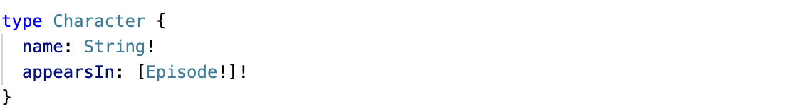

Every Field gets a type of its own (specified with `:`), it can be another custom Object Type or a built-in **Scalar type** such as `String`, `Int`, `Float`, `Boolean`, `ID` ([Reference](https://graphql.org/learn/schema/#scalar-types)). `ID` is a type that is supposed to indicate a unique identifier, while it is sent as String it is not intended to be human-readable.

Any field that is declared with a `!` implies that the field is **non-nullable field**, meaning that field always has to appear wherever the Object type it is in is returned.

`[]` implies a **list** (i.e. array). In above example every element of 'appearsIn' array is of 'Episode' object type.

Technically, the non-nullable field (`!`) and lists (`[]`) are called **type modifiers** as they give more details about the field's type.

##### Arguments

Every field can have zero or more arguments (specified in `()` after the field name), and the arguments have to be named. What this means is that if the request specifies this field, it also has to pass the arguments.

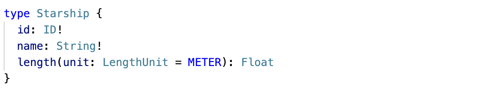

If a default value is given to the argument (using `=`) its a an optional argument. 

##### Custom scalar types

Its also possible to declare a custom scalar type, and the implementations should define how to serialize, desearialize, and validate it.

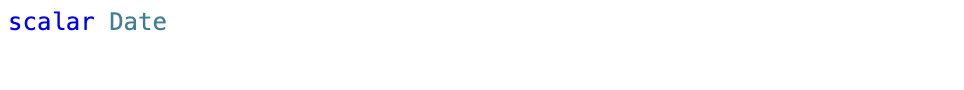

##### Enumeration type

Enums, that's it.

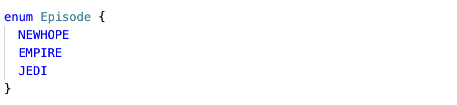

##### Interfaces

`interface` has a set of fields and any other object type that declares that it will implement that interface has to have those fields too. So basically same thing as protocols in Swift. The declaration by object type is done using `implements`.

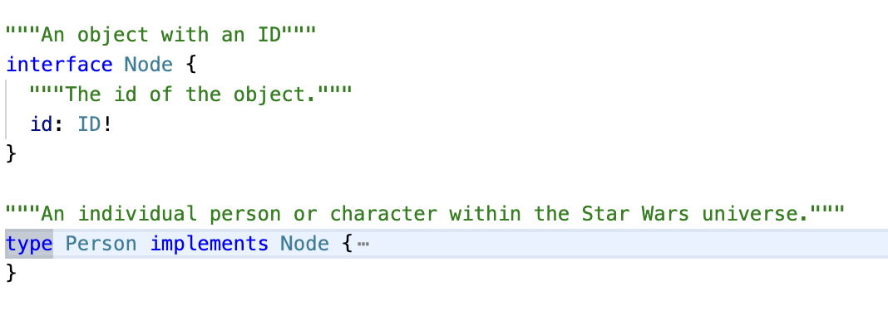

> inline fragments

##### Unions

`union` I think is basically an enum of custom object types. You can't create an enum out of interfaces or other unions.

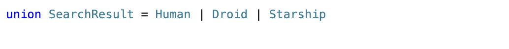

> inline fragments

##### Input types

 `input` types are the similar thing as cutsom object types i.e. `type` but can be passed as arguments in other field. They are particularly useful in mutations. Input object types can’t have arguments on their fields.

 The fields on an input object type can themselves refer to input object types.

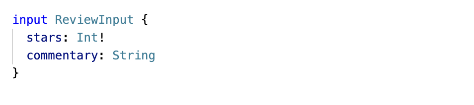

#### Requests: Queries and Mutations

GraphQL requests official reference ([link](https://graphql.org/learn/queries/))

##### Operation type and Operation name

Typically all outgoing requests have a syntax such as this (the LHS below). 'query' part is the operation type and 'HeroNameAndFriends' is the operation name. 

The operation type can be `query`, `mutation`, or `subscription`. Operation Name is just a name that you can give for better debugging. Providing the type is mandatory (unless using query shorthand syntax), and providing the name is optional (but recommended). 

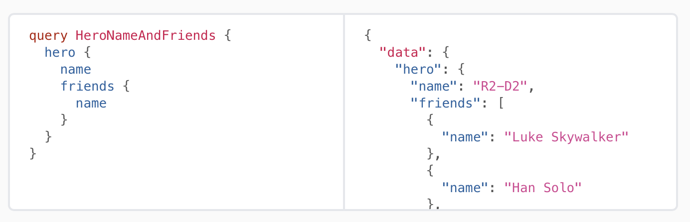

Providing operation type can be omitted if the query shorthand syntax is being used. In it the type is simply assumed to be `query`.

##### Passing variables to the operation

The way to do that is to specify that using `$variableNameInOperation: ArgType` and then pass `variableNameInOperation` as a different key in the overall JSON (i.e. outside the GraphQL request key). 'episode' is that variable in the below example. All variables must be either sclaras, enums, or input object types.

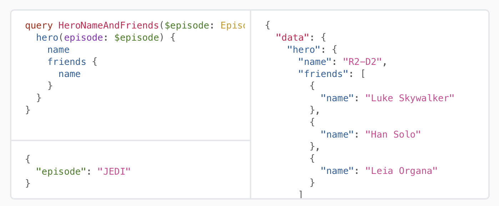

Another example, here 'cursor' is the variable.

##### Aliases

Aliases are handy when the request specifies a field twice, but with different arguments every time. In such a case by using them the request itself can have specific aliases specified to be used for the corresponding result. This makes things easier while parsing the result. In the request the field name needs to be preceded by the alias name followed by `:`.

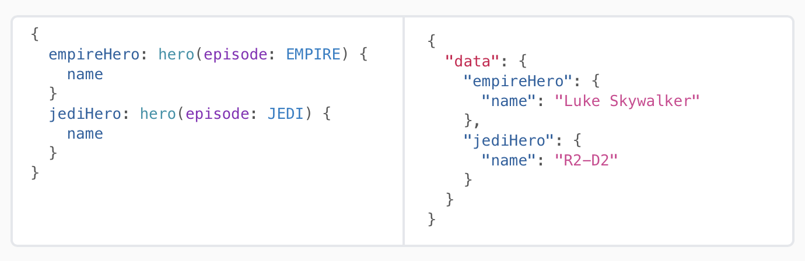

##### Fragments

`fragment` is a way to encapsulate certain fields in one entity in the request such that the fragment alone can be specified wherever needed instead of repeating all the fields everywhere. A fragment cannot refer to itself.

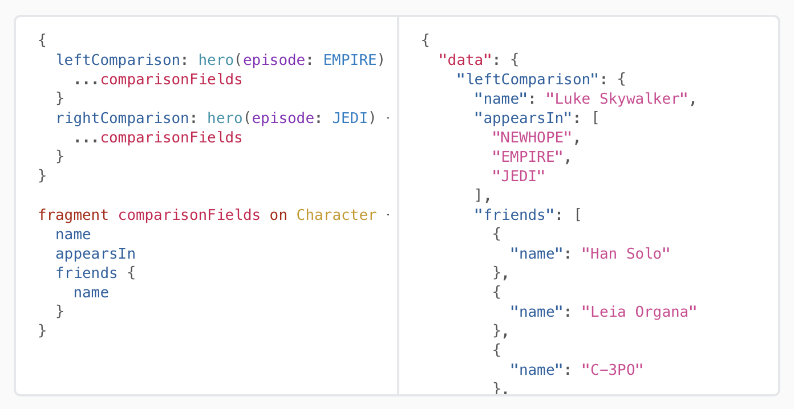

If some argument has been passed in the query or mutation, its also possible to pass that argument over to the fragment. Its done using the usual syntax `fieldX(argNameInField: $argNameInQueryOrMutation)`.

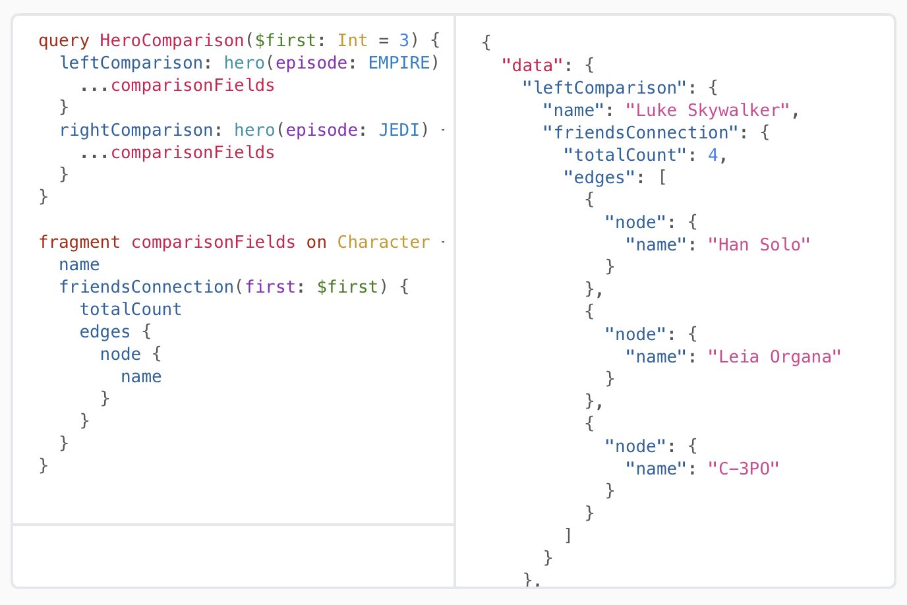

##### Inline Fragments

If you are querying a field that returns an interface or a union type, you will need to use inline fragments to access data on the underlying concrete type. `... on InterfaceOrEnumType{ fieldName }`.

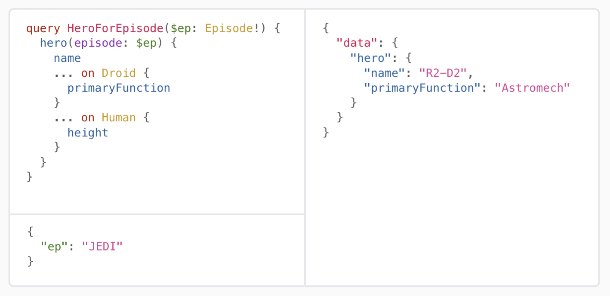

##### Directives

A `directive` can be attached to a field or fragment inclusion. The core GraphQL specification includes exactly two directives, which must be supported by any spec-compliant GraphQL server implementation

`@include(if: Boolean)` - Only include this field in the result if the argument is true.
`@skip(if: Boolean)` - Skip this field if the argument is true.

Server implementations may also add experimental features by defining completely new directives.

##### Mutations

The operation to update data.

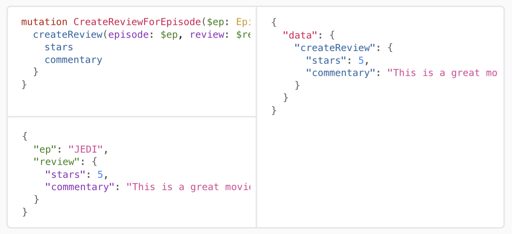

A mutation can contain multiple fields, just like a query. However, while query fields are executed in parallel, mutation fields run in series, one after the other. This means that if we send two incrementCredits mutations in one request, the first is guaranteed to finish before the second begins, ensuring that we don’t end up with a race condition with ourselves.

##### Pagination

Its quite possible that a request results in a response with a list that has so many items that it can't be served in one call (i.e. the typical pagination situation). GraphQL APIs typically tends to tackle this with certain structure and associated jargon.

The convention is to wrap the list node in a `xyzConnection` type which has a field called `edges` in which the individual nodes (i.e. edges) are returned with every node also having a `cursor` field which is a uniue identifier specifying that node. There is another pageInfo key which indicates things like whether the final node has been reached or if there are more nodes to return.

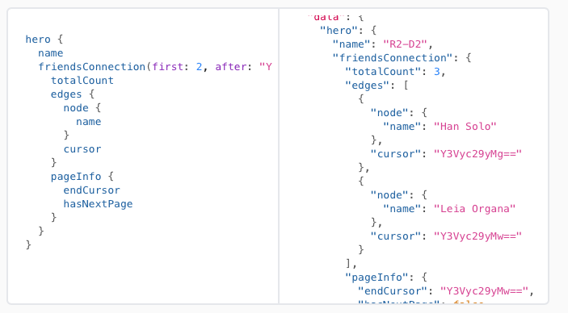

Official documentation ([link](https://graphql.org/learn/pagination/))