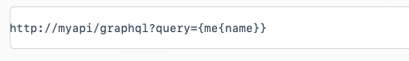
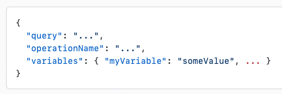
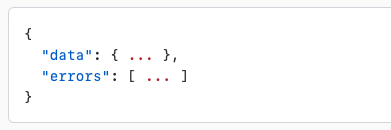

[toc]

##### Working with HTTP

Its common for GraphQL services to continue to work with HTTP. Typically they are either GET or (lot more commonly) POST. In case of GET the entire query goes in query strings, and in case of POST in the request payload.

| GET - Request in query string                                | POST - Request in payload                                    |
| ------------------------------------------------------------ | ------------------------------------------------------------ |
|  |  |

The response payload has the same structure regardless of it being GET or POST. In case of there being no errors, the 'errors' key should not be present.

##### Resolver functions

On server side,  each field in a GraphQL query as a function or method of the previous type which returns the next type. Each field on each type is backed by a function called the **resolver** which is provided by the GraphQL server developer. When a field is executed, the corresponding resolver is called to produce the next value. This continues until scalar values are reached. GraphQL queries always end at scalar values.

 A resolver function on server receives four arguments - `obj` (the previous object, which for a field on the root Query type is often not used), `
args` (the arguments provided to the field in the GraphQL query), `context` (A value which is provided to every resolver and holds important contextual information), `info` (a value which holds field-specific information relevant to the current query as well as the schema details).

> At the top level of every GraphQL server is a type that represents all of the possible entry points into the GraphQL API, it’s often called the **Root type** or the **Query type**.

Official documentation for execution ([link](https://graphql.org/learn/execution/))

##### Validation of requests

There exist very elaborate libararies for request validation on the server.

Official documentation for validation ([link](https://graphql.org/learn/validation/)) 

##### JSON (with GZIP)

It doesn't have to but usually all GraphQL services use JSON as their serialization format. Also, for better compression of data its recommended that the services use [GZIP](https://en.wikipedia.org/wiki/Gzip) and ask tehir clients to send the header `Accept-Encoding: gzip`. 

##### Versioning

Usually, versioning is not something that is done with GraphQL services. When there’s limited control over the data that’s returned from an API endpoint, any change can be considered a breaking change, and breaking changes require a new version.

GraphQL only returns the data that’s explicitly requested, so new capabilities can instead be added via new types and new fields on those types without creating a breaking change.

##### Batching and Caching

Purely a back-end implenetation detail. There are ways it should implement batching and caching and shouldn't hit the database too often with requests. Different techniques exist for it, one of them being Facebook's [DataLoader](https://github.com/graphql/dataloader).

##### 