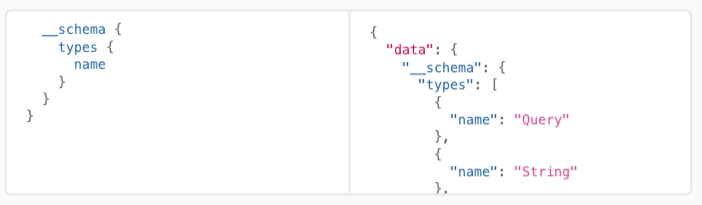

[toc]

##### Introspection system

Usually GraphQL implementations also provide an introspection system where the GraphQL API can be called and requests be made in such a way that the API returns details about the tasks/operations it supports, the types it deals with, etc. These are done by requesting fields such as `__schema`, `__type`, etc.

Official documentation ([link](https://graphql.org/learn/introspection/))

##### Resources

GraphQL theory - https://graphql.org/learn/  SDL reference - https://graphql.org/learn/queries/  GraphQL requests reference - https://graphql.org/learn/queries/  Official GraphQL specs (from server POV) - https://github.com/graphql/graphql-spec  

GraphQL basics (HowToGraphQL [videos](https://www.howtographql.com/basics/0-introduction/))  GraphQL vs REST comparison [AWS article](https://aws.amazon.com/compare/the-difference-between-graphql-and-rest/#:~:text=You%20can%20use%20GraphQL%20and,number%20of%20requests%20and%20responses)  

Apollo iOS basics - https://www.apollographql.com/docs/ios/  Apollo iOS demo project - https://github.com/apollographql/iOSTutorial/tree/main  

GraphQL tools - https://graphql.org/community/tools-and-libraries/ GraphQL iOS libraries - https://graphql.org/code/#swift-objective-c  GraphQL iOS [Shopify article](https://shopify.engineering/using-graphql-for-high-performing-mobile-applications)   

##### Misc.

Any more theory? - k codegen iOS app tutorial EASE 

