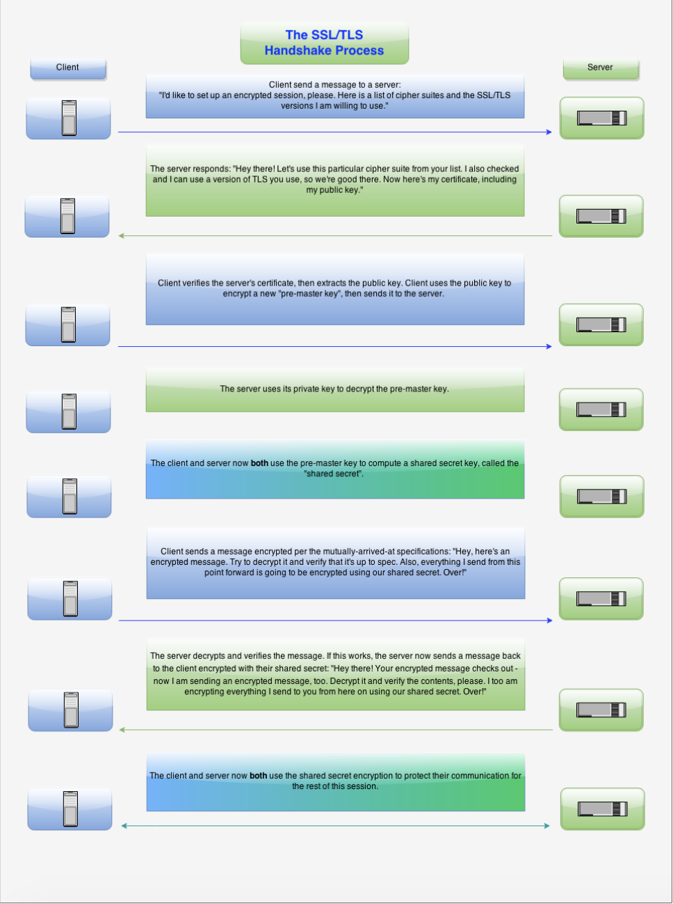
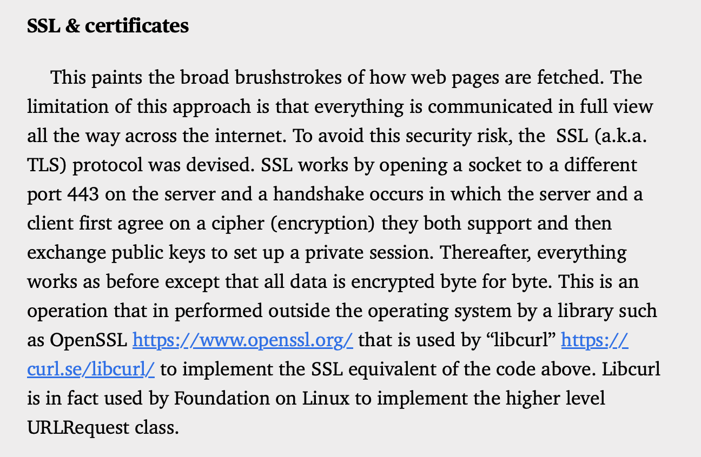

[toc]

#### SSL and TLS

Both `Secure Socket Layer (SSL)` and `Transport Layer Security (TLS)` are cryptographic protocols for securing tarffic on the web. TLS has now superseded SSL, but people still use the term SSL when they actually mean TLS instead.

##### Handshake

It uses both aymmetric and asymmetric algorithms. Asymmetric encryption is used for handshake, but thereafter symmetric encryption gets used as it is a lot quicker.

A typical handshake process in SSL/TLS. ([Wikipedia link](https://en.wikipedia.org/wiki/Transport_Layer_Security#:~:text=The%20handshake%20begins%20when%20a,the%20client%20of%20the%20decision.))

`Cipher suite` is a set of algorithms used during handshake process.

> SSL 2.0 had the made the mistake of not authenticating handshakes.

About SSL from Swift Secrets book -

> SSL happens on port 443. 

##### Certificates and Certificate  Authorities

A `certificate` contains plenty of things including public key and digital signature. Certificates are issued by `Certificate Authority (CA)`.  

Operating systems already come installed with a list of trusted CAs. The same CA alos signs the certificate for known servers like Facebook's, Apple's, etc. When a TLS cxlient connects to a server, the server produces a certificate chain. This chain eventually also contains a certificate signed by a trusted `Root Certificate Authority`. The client already has a copy of root CA and can verify the certificate chain.

In TLS, certificates are typically used to identifie the server.

`Client certificates` are where clients produce their own certificates to authenticate themselves to the server.

`Self signed certificate` is a certificate that is not signed by a CA. These too can be used, but are typically visually flagged when the websites using them are opened in browsers.

##### Possible attacks on TLS

They are grouped into 2 categories.

1. Attacks on the protocol itself, such as subverting CA mechanism.

2. Attacks on a particular implekemtation of cipher.

##### HTTP Strict Transport Security (HSTS)

It is a way for web servers to communicate that the data transfer should only be done a secure transport. It is done using a `Strict-Transport-Security` HTTP header.

##### Certificate Pinning

The client remembers the certificates (actualy a hash of the public key) itself and in subsequent connections, the older certificate in client is matched with the incoming certificate to ensure the server is authentic. Browsers originally implemented this by coming shipped with a list of certs form high profile websites. Its now very commonly used by mobile apps.

#### OpenPGP

A standard that describes a method for encrypting and signing messages. It mainly focuses on encrypting data at rest. `GPG` is its most popular implementation.

While TLS relies a lot on root certs to establish identity, OpenPGP relies on something called `Web of Trust`.

#### Off-the-record (OTR) messaging

A protocol for securing instant messaging communications.
