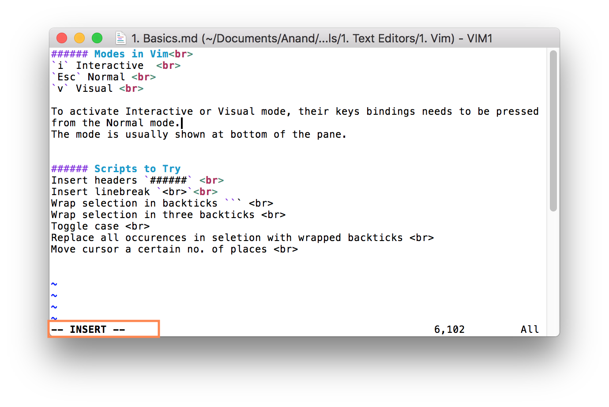

#### Modes in Vim<br>

`Esc` Normal <br>
`i` Interactive <br>
`v` Visual <br>
`Shift v` Visual linewise <br>
`Ctrl v` Visual block <br>

The mode is shown at bottom of the pane. <br>

To activate `Interactive` or `Visual` mode, their keys bindings needs to be pressed from the `Normal` mode.  

Visual mode can also be activated by clicking twice to select a word. <br>
Visual linewise mode can also be activated by clicking thrice to select the entire line.

#### Changing cursor position

`h` Left <br>
`j` Down <br>
`k` Up <br>
`l` Right <br>

`b` Start of current word (or start of prev word if already at start) <br>
`e` End of current word (or end of next word if already at end) <br>
`w` Start of next word <br>
> Any of above can also be prefixed with a number to do it that many times. For instance `3b` will go to the start of 3rd word (going backwards) from the current cursor position. In other words, `3b` is same as pressing `b` 3 times.

`0` Start of line <br>
`$` End of line <br>
`gg` Start of first line <br>
`(n) Shift g` - Start of line no. n (So `54G` will move the cursor to line no. 54.) <br>
`Shift g` Start of last line <br>

`#` Previous occurrence  of current word <br>
`*` Next occurrence of current word <br>

`%` Locate nearest (next?) parentheses (`(` `{` `[`) (in current line?) and go to its counterpart <br>
`fx` Next occurrence of character x in the current line
> This too can be prefixed with a number to directly go to nth occurrence of the specified character in the current line. For example `4fp` will go to 4th occurrence of `p` in the current line from the current cursor position.

#### Visual Modes

##### Visual plain mode

In `Visual plain` mode, only one character gets selected at a time. <br>

##### Visual linewise mode

In `Visual linewise` mode however, the entire line for every character currently in selection gets selected <br>

`d` Delete <br>
`U` Convert to upper case <br>
`u` Convert to lower case <br>
`~` Toggle case <br>

##### Visual block mode

In `Visual block` mode, first some block selections are made across multiple lines, and then all of them can be acted upon together.

Doing a regular `d` deletes the selection. <br>
Doing a `Shift I`, activates the Insert mode and then whatever is entered in one line gets prepended before the selection across all the lines on pressing `Esc`. <br>
Doing a `Shift A` does the same thing as `Shift I` but appends the new content instead of prepending. <br>

Select entire word without trailing whitespace - `viw` <br>
Select entire word with trailing whitespace ([link](https://stackoverflow.com/a/7267387/1135417)) - `vaw` <br>

#### Inserting directly from Normal Mode

`o` Inserts newline after the current line and activates Interactive mode <br>
`r` Replaces current character but does not activate Interactive mode <br>

`(n)i(anything) Esc` Inserts anything n times and activates Interactive mode

> So `3inow Esc` will enter 'now' 3 times

#### Searching

`/ something Ret` Moves the cursor to first occurrence of 'something' in file from the current cursor position. The next and previous set of occurrences can then be navigated using `n` and `N` respectively.

#### Editing content

`x` Delete <br>
`Shit x` Backspace <br>

`d` Cut <br>
`dw` Cut remaining portion of the word <br>
`y` Copy (yank) <br>
`p` Paste below current line <br>

#### Commands

`:w` Save <br>
`:q` Save and Quit <br>
`:q!` Quit without Saving <br>

#### Scripts to Try
Insert headers `####` <br>
Insert linebreak `<br>`<br>
Wrap selection in backticks ``` (https://stackoverflow.com/questions/2147875/what-vim-commands-can-be-used-to-quote-unquote-words)<br>
Wrap selection in three backticks <br>
Toggle case <br>
Replace all occurences in selection with wrapped backticks <br>
Move cursor a certain no. of places <br>
