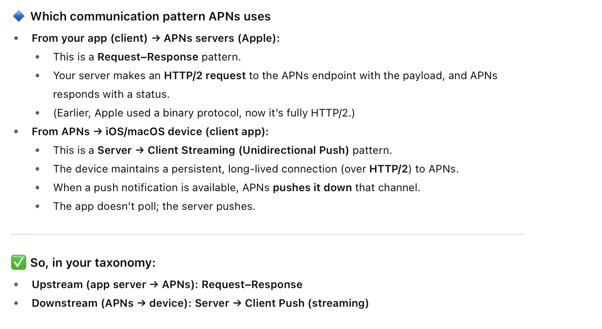

#### Patterns

1. **Request-Response** - Client makes a request, and server sends exactly one response, and the connection closes immediately after that. One-directional. The **usual API** calls fall under this.
2. **Server → Client Streaming (Unidirectional)** - The server sends (also referred as 'streams') multiple events to client over time. The connection is kept open the whole time. Usually Client makes an initial request, and that is how it starts. It too is one-directional, only one side responds with data after the initial call. **SSE** falls under this. Used for things like stock tickers, score updates, etc.
3. **Client →  Server Streaming (Unidirectional)** - Similar to above but in reverse. Client makes a request (opens a stream), and then sends multiple messages to server. The server responds only once the incoming stream has been confirmed to have finished. Used for things like uploading logs or telemetry data.
4. **Bidirectional Streaming/Full Duplex** - Both sides can continue to send messages over a connection that gets opened. **Websocket** connections fall under this. Used for things like chatting.
5. **Fire-and-Forget** - Client sends a message and does not expect any response. Less common now.
6. **Publish–Subscribe** - Server broadcasts messages to multiple subscribers. In a way its same as 'Server →  Client Streaming' but generalizes it to many clients together. Apache Kafka, Redies Pub/Sub are some examples of this.

#### Misc.

##### gRPC Server-Side Streaming

(Google) Remote Procedure Call. Its basically another 'Server → Client Streaming' pattern like SSE, except that it can also send raw binary (unlike SSE). Its a newer thing and needs HTTP/2, whereas SSE is supported even by HTTP/1.1. Also, unlike with SSE there is no automatic retry standard in it. 

Raw Binary basically implies bytes with no guarantee that they are valid text, and are more compact.

For example, 

```swift
0xDE 0xAD 0xBE 0xEF <- Raw binary 
"3q2+7w==" <-Base 64 encoding of raw binary
```

SSE can only send UTF-8, whereas gRPC can send raw binary as protobuf-encoded messages.

##### WebRTC

Another 'Client →  Server Streaming (Unidirectional)' pattern like WebSocket. Its used for bi-directional video streaming, file streaming, etc. (and not merely text chatting as in WebSocket). Its actually a collection of technologies, such as mandatory audio/video codecs, NAT traversal mechanisms, etc.

Its important to note that is uses something called UDP, and not TCP (which is what is used by WebSocket).

##### Apple Push Notifications

It employs a combination of 'Request–Response' and 'Server → Client Streaming (Unidirectional Push)'.



FWIW, **Google's Firebase Cloud Messaging (FCM)** too is similar.

##### Event Stream Subscription

It is a general term for the instances where the client subscribes to an event source, and the server pushes updates until unsubscribed. SSE, WebSocket, gRPC streaming, MQTT, AMQP, Kafka - basically all of them come under it.