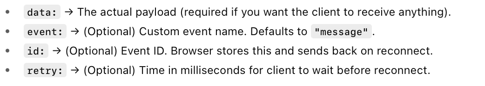

##### What is it

Server Sent Events. Simplly put, the client makes an initial request, the server sends (also referred as 'streams') multiple events to client over time. The connection is kept open the whole time. It is one-directional, only one side responds with data after the initial call. 

The corresponding content-type/MIME type is `text/event-stream`. Also, it can only send UTF-8 messages (i.e. characters within UTF-8).

JavaScript provides a client side interface for it in `EventSource` ([reference](https://developer.mozilla.org/en-US/docs/Web/API/EventSource)).

They are always GET calls.

> SSE works with HTTP/1.1 onwards, and was introduced with HTML5 (don't get fussy about 'HTML', HTML is a generic term meant to include general web updates even when they are not markup related.

##### Response format



Every field must be having a newline at its end. There should be an extra newline at the end.

For example, Minimal valid event with just one field and newline. 

> Pay attention to two newlines at end.

```swift
data: Hello client!


```

And example where more fields are sent.

```swift
id: 42
event: news
data: First line
data: Second line


```

A colon at the start typically means “comment”; ignored by the browser but keeps the stream alive.

```swift
: keep-alive


```


##### Auto-reconnection, Last-Event-ID header

In the textbook implementation, every SSE message from server should also include an `id` field.

```swift
id: 101
event: tick
data: hello
```

If the connection is dropped for any reason, the browser (i.e. client) should attempt to auto-reconnect and send the last received event-id as a request header called `Last-Event-ID`.

`EventSource` takes care of all this internally.

##### Closing the connection

At server side there is no set standard to indicate to client that it has sent the final message and the client too can now close the connection. If at all, it has to be expressed through one of the messages in a custom way which the client should understand and then handle.

From client, the connection can be closed by an EventSource interface, and it also happens automatically when the browser is closed. The server does get to know about it.

##### When to use SSE

For subscription like things, stock market or score updates.

A long running normal POST can be handled better by SSE. In the sense, let the POST respond with an ID and then have a GET SSE where that ID is sent. One advantage here is that in case of any timeouts, the client can automatically retry.