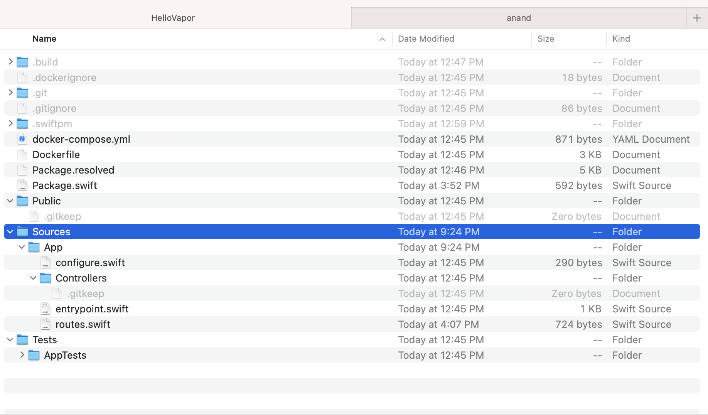
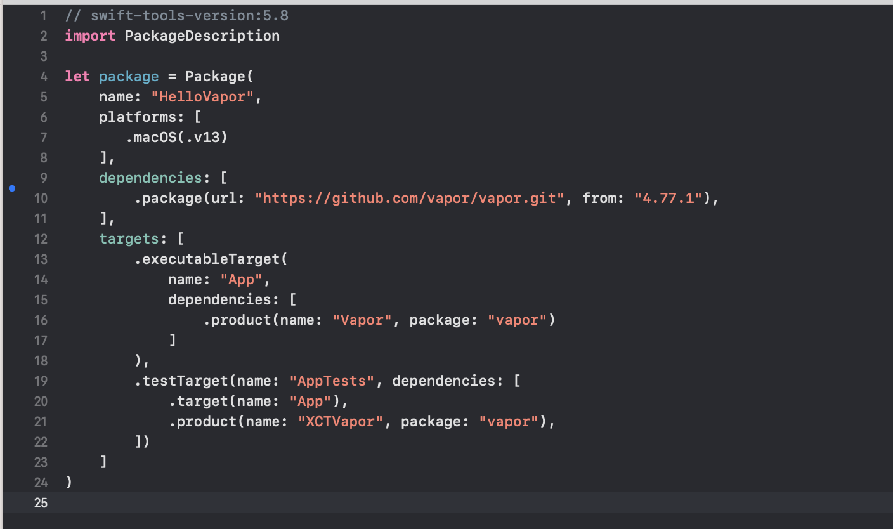
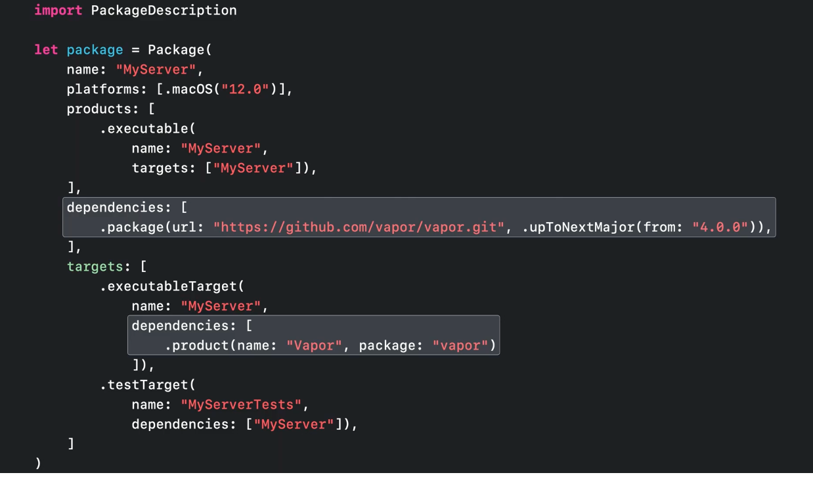
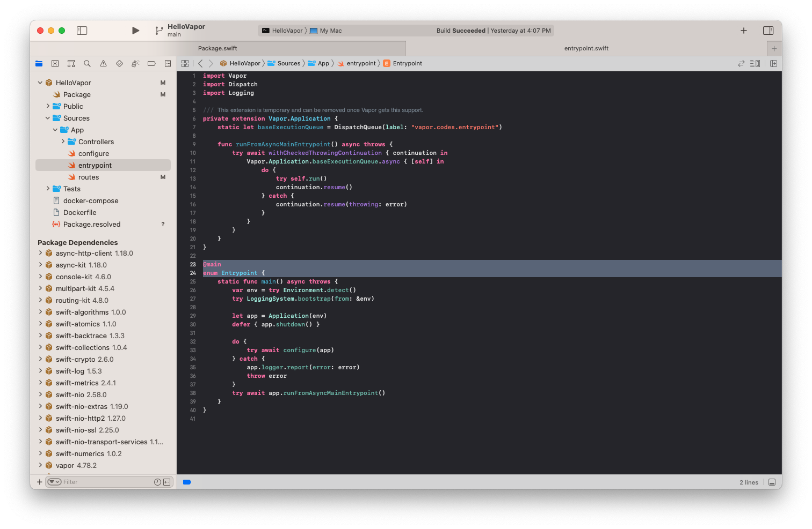
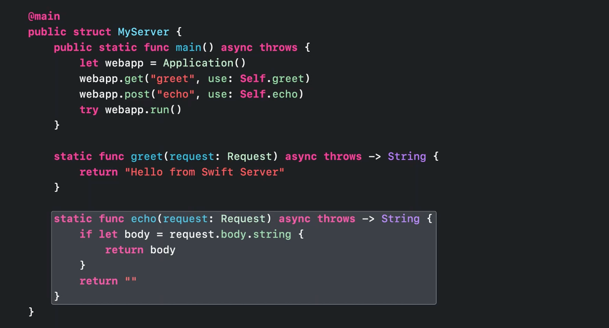
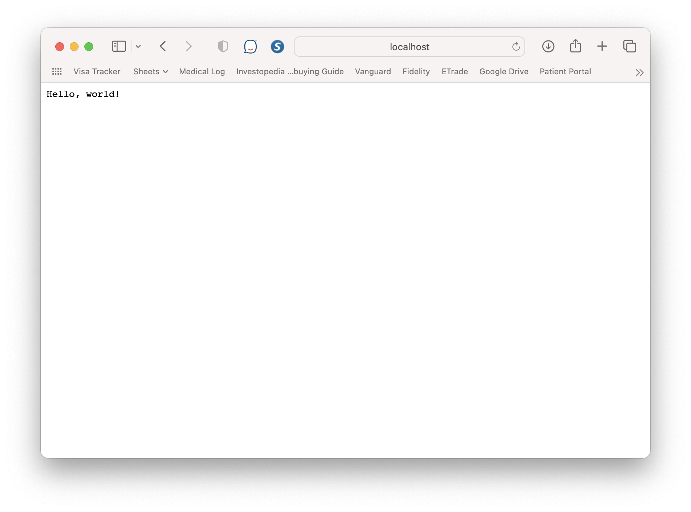
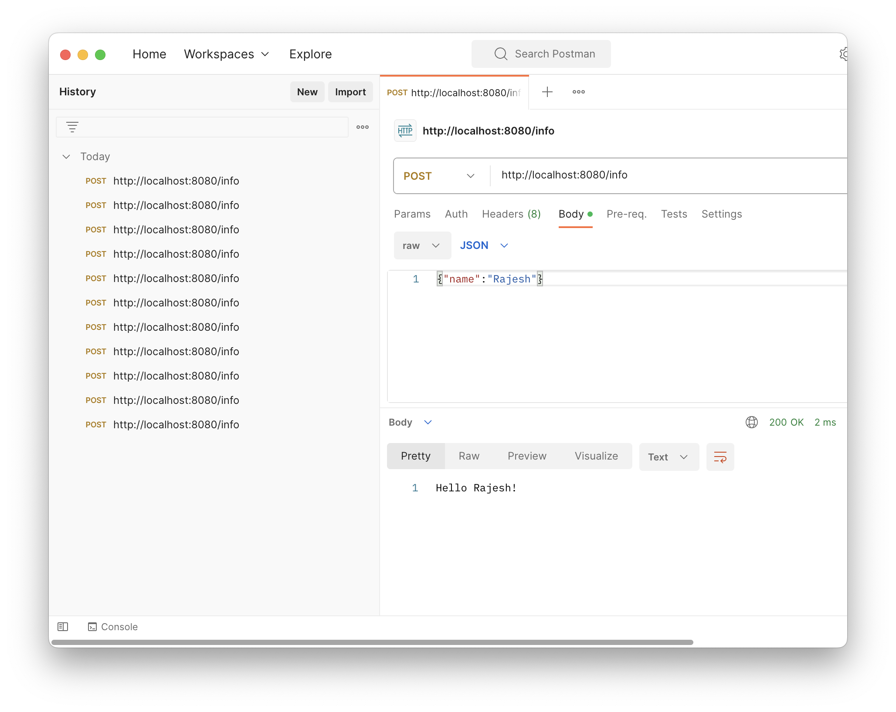
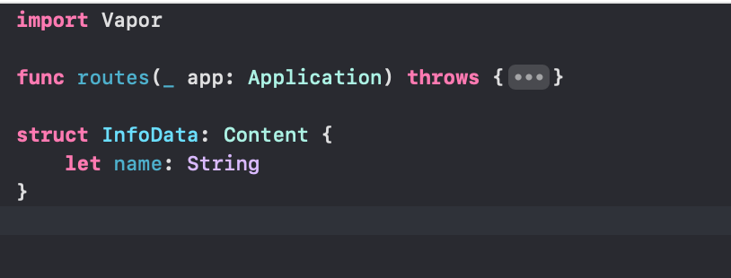

[toc]

##### Installing Vapor

One simple way is to install it using Homebrew.

```
brew install vapor
```

##### Creating a new project using command line

(Select no for any prompts)

```
vapor new HelloVapor
```

It creates a project with a file system that looks like this. 



And the manifest file looks as shown below. Notice how there is a dependency on Vapor, the platform is `.macOS`, and the target has an `.executableTarget`. (In the 'WWDC 2022 - Use Xcode for server-side development' video which has Vapor in the demo project, the generated manifest file also has a product of type `.executable`).

| Manifest file from 2020 Kodeco tutorial                      | Manifest file from 'WWDC 2022 - Use Xcode for server-side development' |
| ------------------------------------------------------------ | ------------------------------------------------------------ |
|  |  |


The `@main` is there in a generated struct named Entrypoint.

| Entry point from from 2020 Kodeco tutorial                   | Entry point from 'WWDC 2022 - Use Xcode for server-side development' |
| ------------------------------------------------------------ | ------------------------------------------------------------ |
|  |  |

> Its usng docker too, understand what that does.

##### Endpoints

They all seem to be configured in the **route handler**, i.e. App/routes.swift. There are methods like `app.get()`, `app.post()` for GET, POST, etc.


#####  How to test it

It can be tested with localhost. Just run the project on Xcode (have 'My Mac' as the Run Destination), or through SPM with `swift run` to ensure the server is running. Any incoming request can then even be debugged in Xcode with breakpoints, etc.

For testing cases where a request payload, etc. has to be sent (where browser can't be used) any REST client like Postman can be used. The URL is usually `http://localhost:8080/hello` (the path follows after domain)

| Testing with browser                                         | Testing with REST client                                     |
| ------------------------------------------------------------ | ------------------------------------------------------------ |
|  |  |

##### Interface

`Content` - A protocol used for parsing, conforms to Swift's Codable. 



