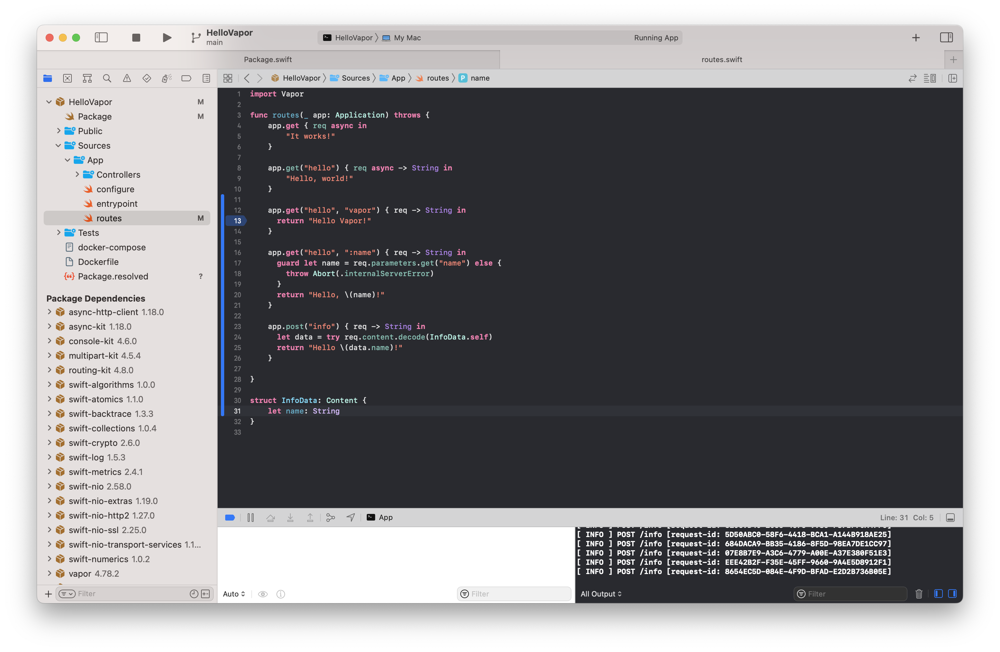
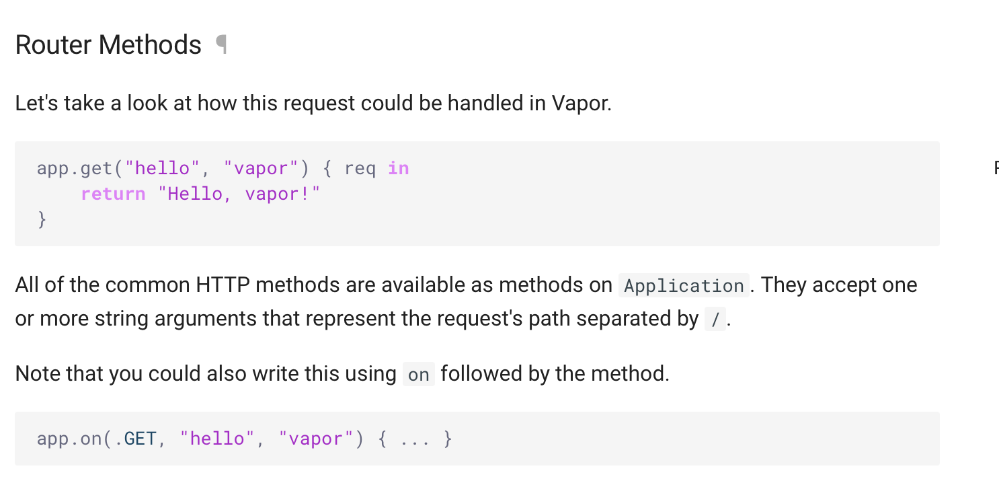
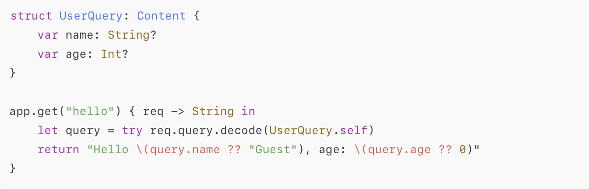

The supported routes are configured (along with their initial handling) in the **route handler**, i.e. `App/routes.swift`. There are methods like `app.get()`, `app.post()` for GET, POST, etc.

`app.get("str"){}` is trigerred when the incoming request is 'hostname/str'  `app.get("str1","str2"){}` is trigerred when the incoming request is 'hostname/str1/str2'  `app.get("str1",:name){}` is trigerred when the incoming request is 'hostname/str1/x' where x can be anything at all  

> With the above code snippet if 'hostname/str1/x/y' is received it is not serviced and none of the app.get closures above get called. However if an `app.get("str1":part1:part2)`  is implemented then its handler is called and the request does get serviced. So can that app.get function keep taking any number of arguments.

##### Documentation

Vapor documentation for above ([link](https://docs.vapor.codes/basics/routing/))  

> By using a path component prefixed with `:`, we indicate to the router that this is a dynamic component. Any string supplied here will now match this route.

##### Accessing request components

For an incoming call from a URL 'http://localhost:8080/hello/vapor?a=b',

req.url - Prints '/hello/vapor?a=b'. Type is **Vapor.URI**  req.headers - Prints all the request headers. Type is **NIOHTTP1.HTTPHeaders**

For getting the query parameters `required.query["parameterName"]` is supposed to be used but that doesn't work as Swift doesn't figure out the data type. As per ChatGPT a decoding should be done instead.

