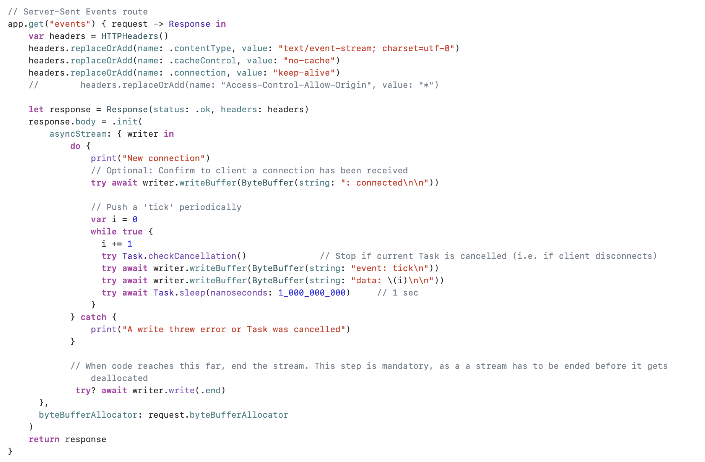
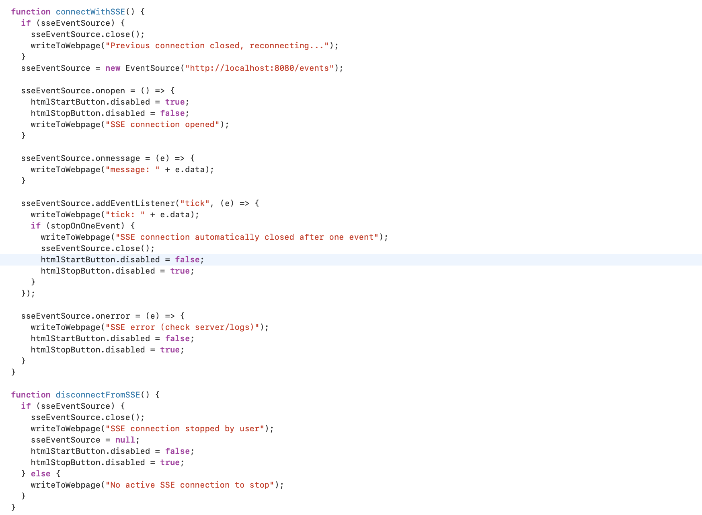
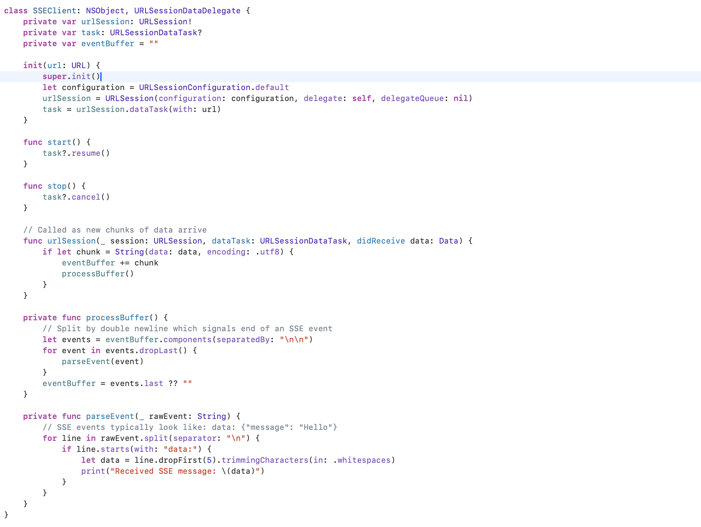

Test Projects - HelloVapor (server side using Vapor), TestWebConnections (iOS client)  

`app.get("events")` in `routes.swift` implements a SSE route. There is also a `test-web-connections.html` in the repo to test that using JS `EventSource` . 

##### Server side implementation with Vapor

Here is the server side code I have.

##### Client side implementation for web using JS

##### Client side implementation for iOS using plain URLSession

> What I need to try still -  If a server connection drops, how to have it automatically reconnect with an event-ID.  How to get the client to close the connection? Is it just normally like any URLSession, some `cancel()` method, etc.?