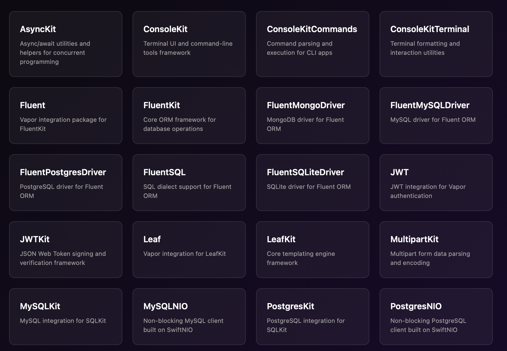
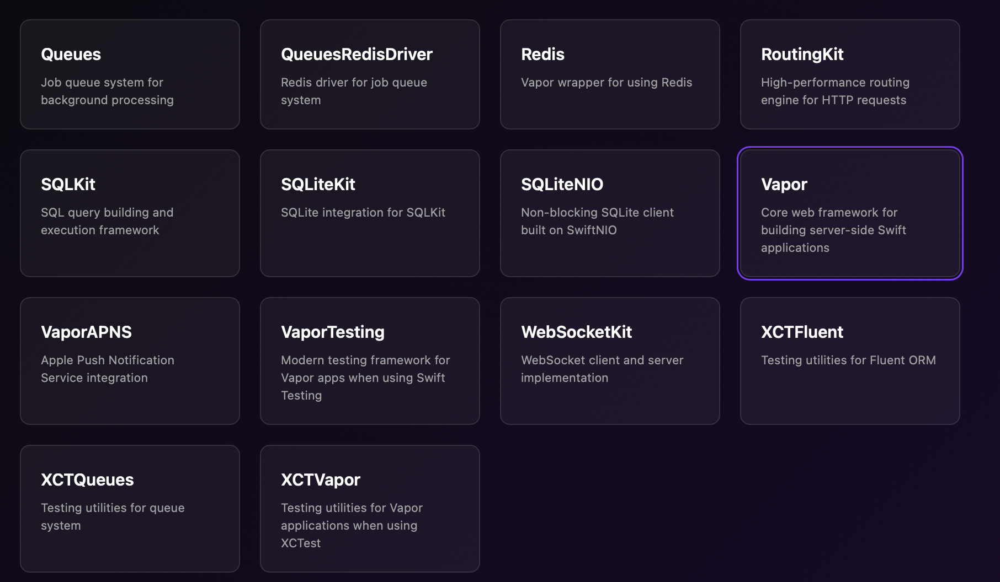

#####  Resources

[Official GH repo](https://github.com/vapor/vapor) [Official documentation](https://docs.vapor.codes)  

[Kodeco tutorial](https://www.kodeco.com/11555468-getting-started-with-server-side-swift-with-vapor-4#toc-anchor-009) [Swiftdev post](https://theswiftdev.com/beginners-guide-to-server-side-swift-using-vapor-4/) (has a section on deploying to cloud too, another on setting up reverse proxy using nginx, and more) [Server side Swift book by Tibor Bödges](https://theswiftdev.gumroad.com/l/practical-server-side-swift/rnw6evs) 

WWDC 2022 - Use Xcode for server-side development Test project - TestVapor2020 (actually wrote first in 2023)

[Documentation for entire ecosystem](https://api.vapor.codes)

|  |  |
| ------------------------------------------------------------ | ------------------------------------------------------------ |

