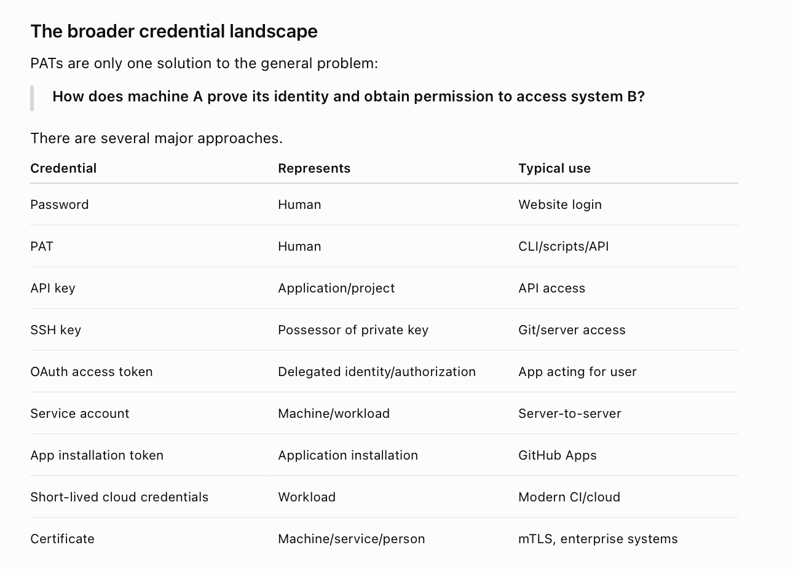
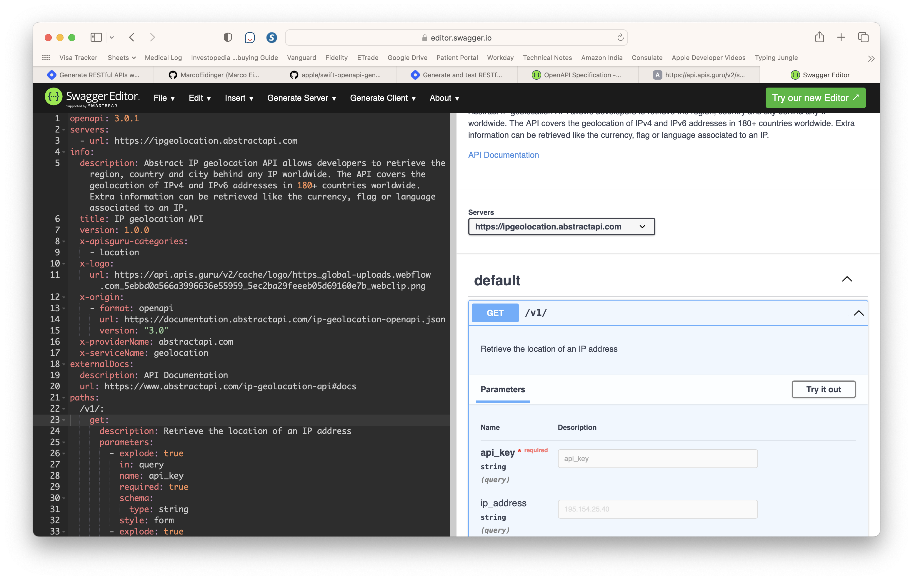
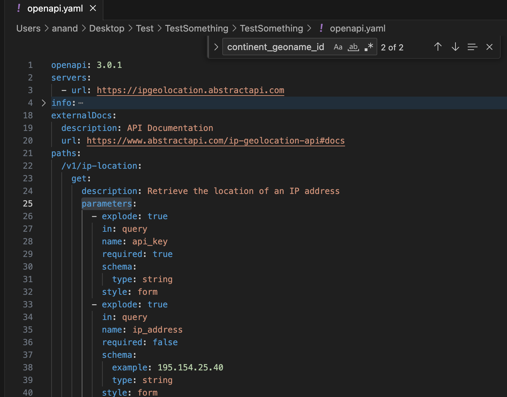
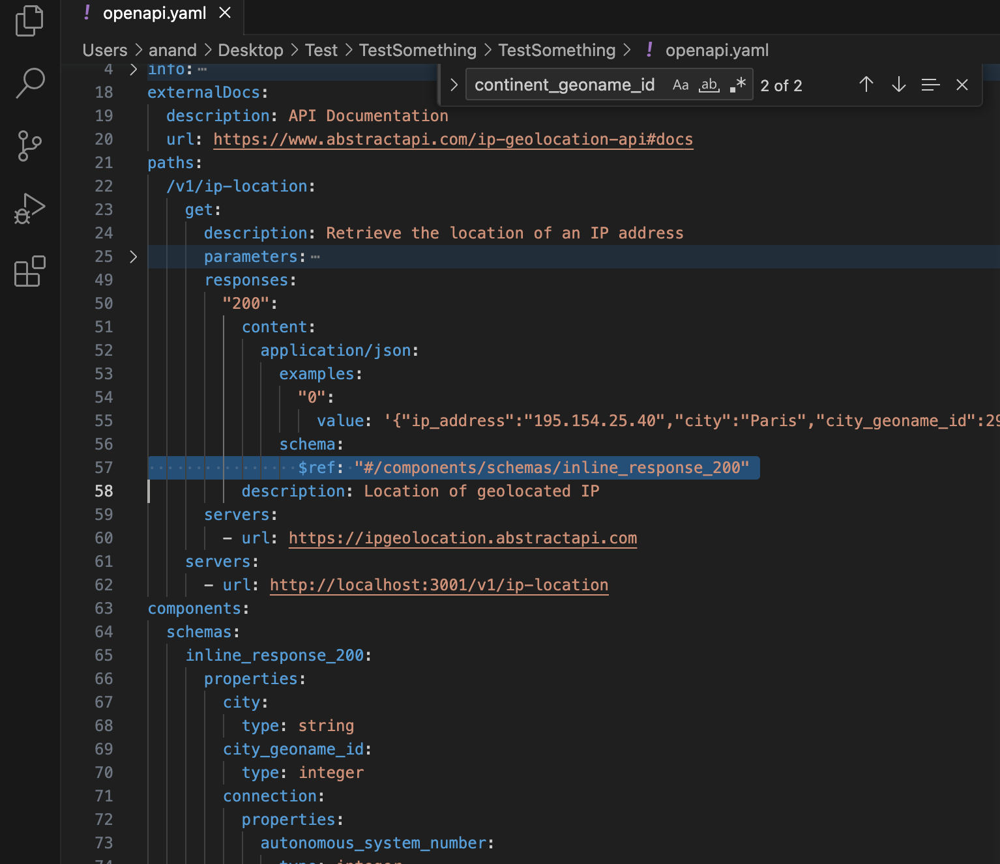

##### Security & Credentials

Security & Credentials landscape, PATs ([ChatGPT](https://chatgpt.com/c/6a887b8a-b850-83ea-8a74-f2ef234ace00))  SSH keys, SSO tokens, Service accounts ([ChatGPT](https://chatgpt.com/c/6a887c9d-edb0-83ea-ae62-fa69eb2e2b75))

##### OpenAPI

[OpenAPI](https://swagger.io/specification/) (previously known as Swagger) is a way to describe an API's specs, its typically represented in yaml but can be in json too. It has fields to explain the payloads as well as some sample JSON, etc.

The OpenAPI [spec](https://api.apis.guru/v2/specs/abstractapi.com/geolocation/1.0.0/openapi.yaml) for a sample public API (GetGeoLocation from IP address). This can be put in an [online Swagger editor](https://editor.swagger.io) to view a more beautified webpage for specs.

###### Available operations (paths)

`operations` - Lists various operations available. For example, one URL/host may have multiple operations. One called getXYZ, another called removeXYZ, etc.

###### Input parameters

`parameters` - This is where the input parameters can be specified.

###### Response payload schema

`responses.content.schema` tells the structure of the response payload. In the below example, the success response payload structure is declared in the schema 'inline_response_200'. This basically allows different schemas to be specified for different status codes.

