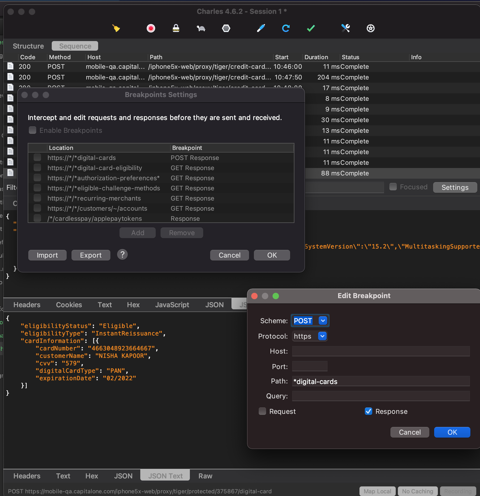
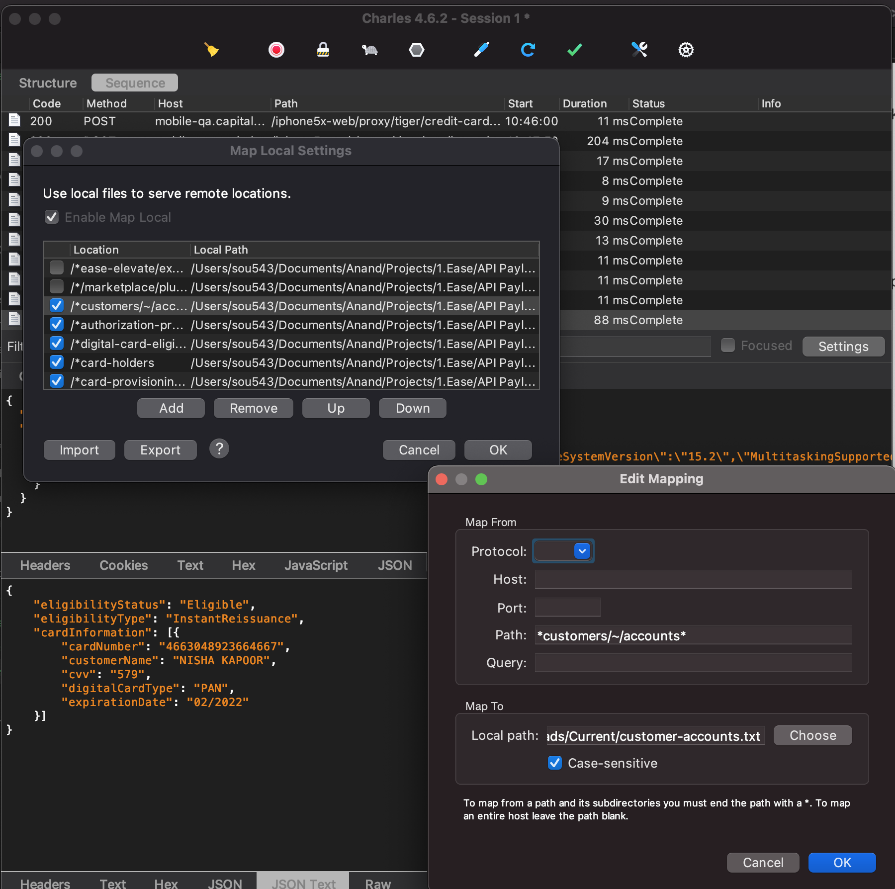
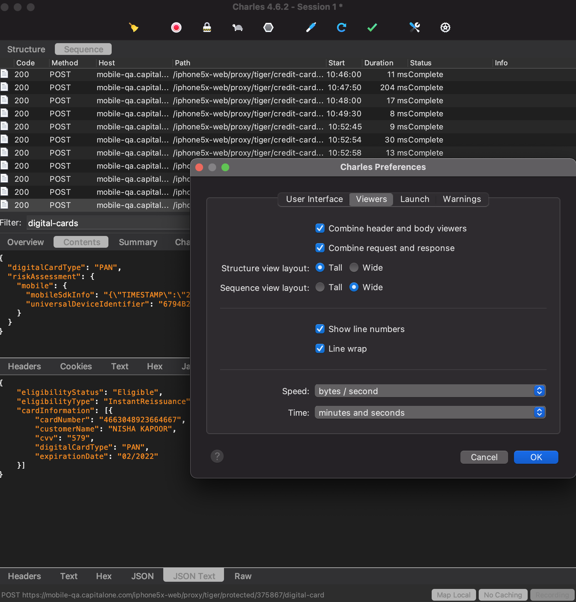
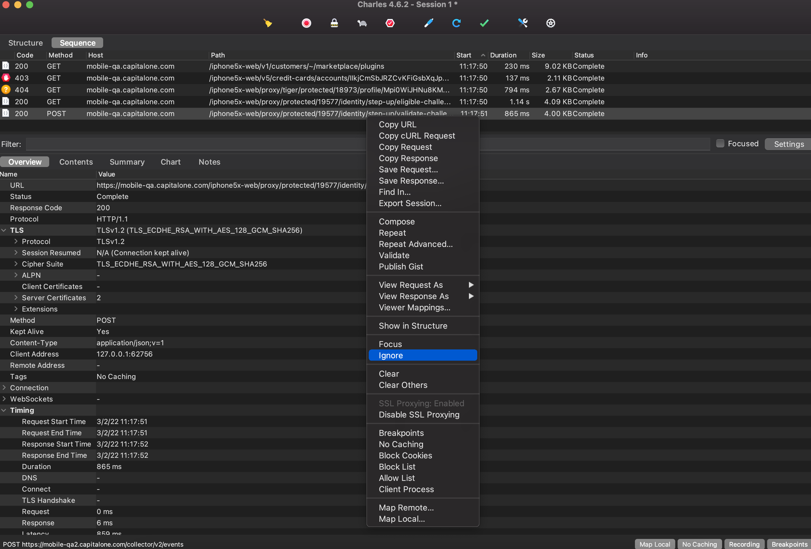
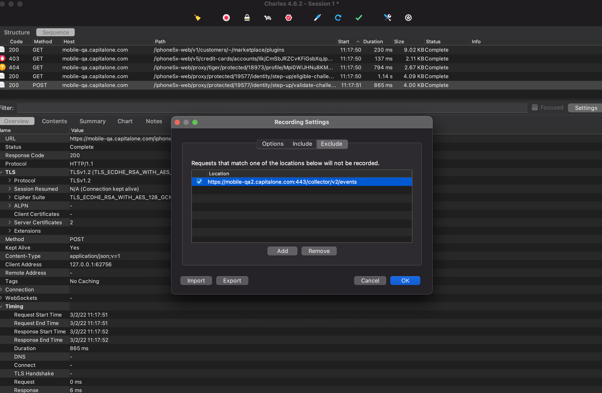

[toc]

#### Breakpoints

Charles Breakpoints (`Cmd + Shift + K`) can be used to visually intercept network calls and change any of its request/response aspects (headers, payload, status code, etc.).

#### Map Local

Map local (`Cmd + Option + L`) is kind of like breakpoints, can silently intercept and modify response payloads with locally stored payloads.

#### Modifying viewer

Its possible to view the request and response together in the same window. The option to enable this setting is pretty unintuitive. Its done from Preferences > Viewers > Combine request and response. And not from the menu option View which is otherwise used for most of the view related settings.

#### Ignore list

Traffic to particular URLs can be hidden altogether from the viewer. This can be done by either right clicking on a call in the viewer and selecting `Ignore`, or by adding the URL in `Proxy > Recording Settings > Exclude`. Thereafter the URL can be removed from the Ignore List through the same `Recording Settings` option.

Adding to Ignore List | Ignore List in Recording Settings
--- | ---
 | 
