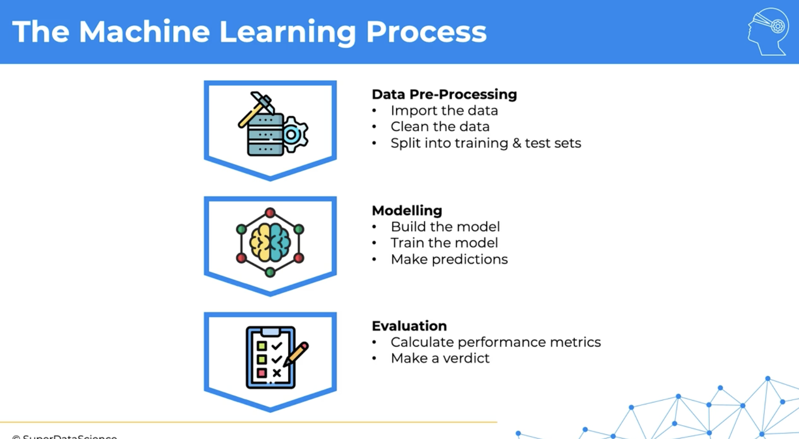
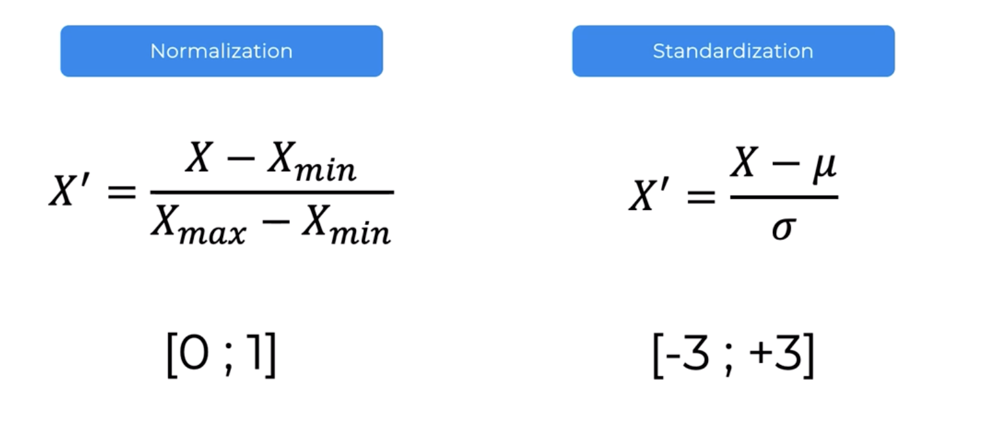

[toc]

##### Typical Steps

Typical steps in preprocessing - Import data, Clean data, Split into Training and Test sets

##### Feature Scaling

This is likely a part of cleaning the data.

`Feature Scaling` should be done after splitting the data into Training set and Testing set (and not before). The simple reason being that data in test set should not impact the feature scaling of training set in anyway. Training set needs to be totally oblivious of test set.

###### Two kinds - Normalization and Standardization

There are 2 main kinds of `Feature Scaling` - `Normalization`, and `Standardization`. (`μ` denotes mean/average, `σ` denotes standard deviation). Standardization usually works better in most scenarios.

