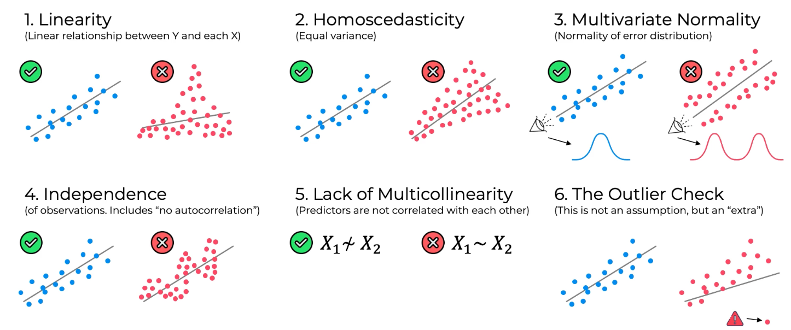
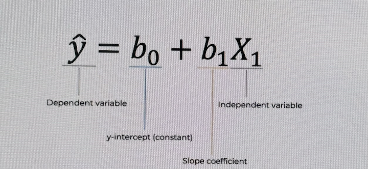
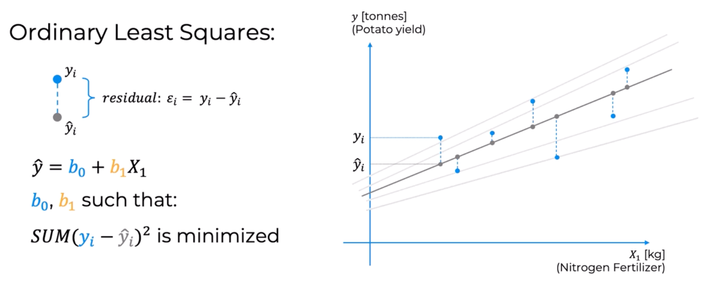
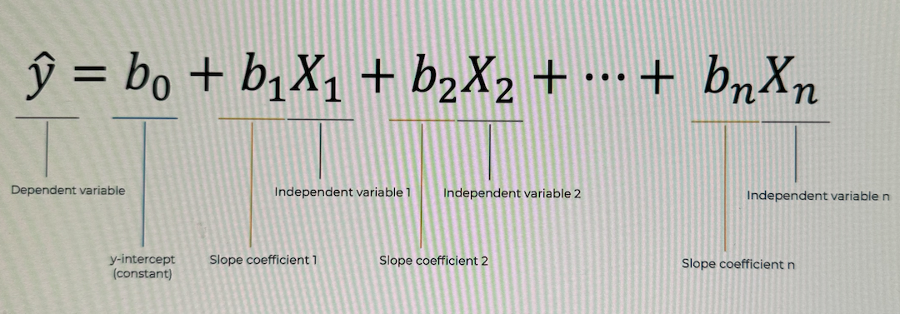
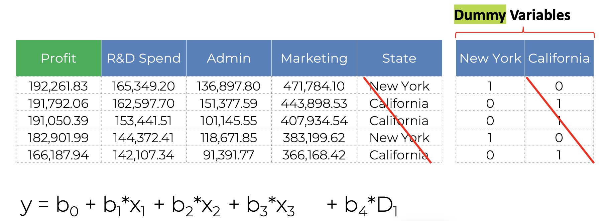
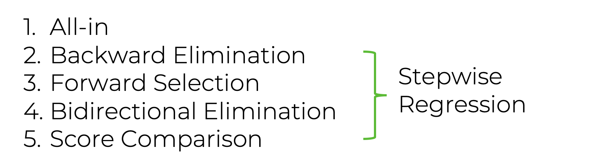
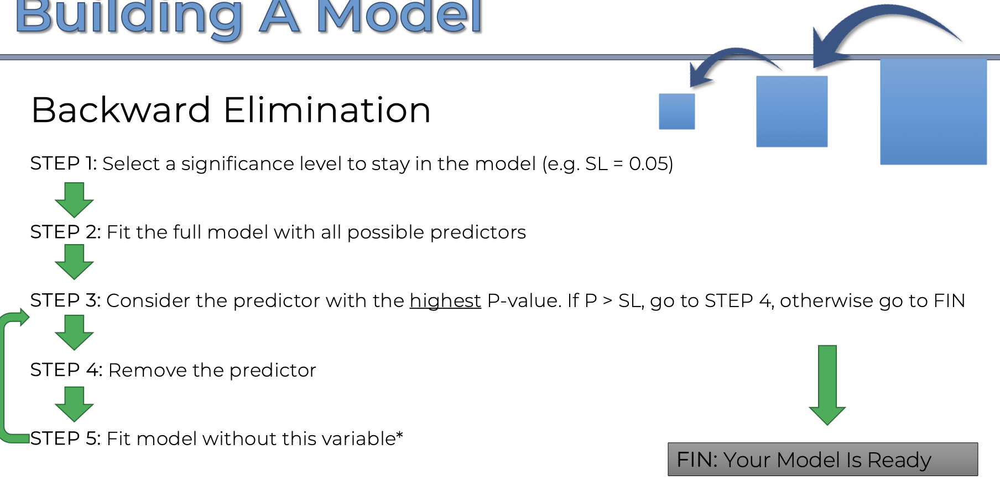
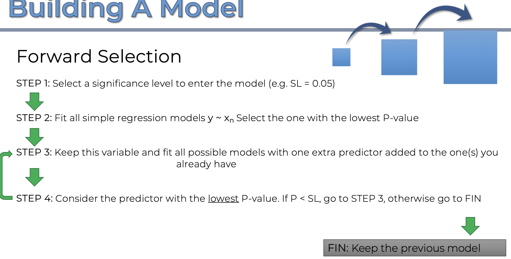
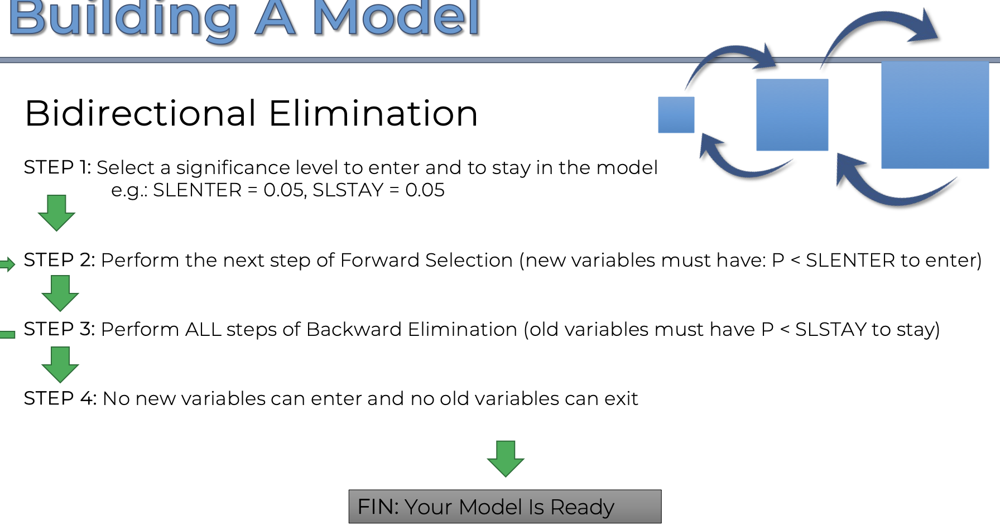

[toc]

##### Regression

Regression models (both linear and non-linear) are used for predicting a real value, like salary for example (its not something used for predicting a classification). If your independent variable is time, then you are forecasting future values, otherwise your model is predicting present but unknown values. Regression technique vary from Linear Regression to SVR and Random Forests Regression.

Independent variable ~ Feature  Dependent variable ~ Output, i.e. what is being predicted  

###### When to use Linear Regression

Following conditions must be met by the dataset.

1. Linear relationship between each independent variable and the dependent variable

2. Equal variance, the datapoints should not be tilted too much on any edge

3. Equal distribution throughout

4. Independence of observation, datapoints should not impact each other

5. Predictors can't be correlated with each other (how is it different from above?)

6. There should be any too outlier a datapoint

   

##### Simple Linear Regression

Used when there is just one feature involved.

###### Ordinary Least Squares

`Ordinary Least Squares` is a way if saying which regression line works best. If multiple regression lines are possible, then the line that yields the minium sum for the squares of the differences between the actual point and the point on regression line is the preferred line.

##### Multiple Linear Regression

###### Dummy variables

Dummy variables are the same thing as what is substituted for non-numeric features per one--hot shot method.

When dummy variables are needed, all of them need not be put in the equation (as it will lead to duplicity, one dummy variable that has value can help deduce others) and exactly one should be left out (if there are 5 dummy variables, include just 1). This is known as `Dummy Variable Trap`. If all dummy variables are included, the equation will wlays have somehing giving a 1 across the dummy variables (and the sum may always be 1?). Modern libraries already take care of avoiding dummy variable trap.

The phenomenon where one or several independent variables in a linear regression predict another is called `Multicollinearity`.

###### Statistical Significance

`Statistical Significance` is that subjective point at which the results become suspicious and a fair environment cannot be assumed. Say a coin is tossed 6 times and everytime its tails, the probability of that happening in a fair environment is ~1% and is anything happening that has a probability of less than 5% is considered suspicious then the statistical significance for it is 0.05. A fair environment is also what is termed as `null hypothesis`.

##### Five methods of building a (regression?) model

There are 5 different kinds of multiple linear regression models, which vary based on how many predictors )dependent variables) they account for. Modern libraries (such as Scikit-learn) even abstract this selection and chose one themselves.

The most common way of building a stepwsie regression model is Bidirectional Elimination.

`All-in` is when all the variables are included in the model.

`Backward Elimination` - A significance Level is decided. All variables/predictors are included to begin with, the predictor with the highest P-value and if its greater than the significance level then that predictor is removed, and the model is then rebuilt. This is the fastesy way.

`Forward Selection` - Similar to above, but predictors are added incrementally.

`Bidirectional Elimination` - Some kind of combination of the two above. This is also what is commonly known as `Stepwise Regression`.

`Score Comaprison` - All possible combinations of predictors are considered and then their scores are comapred. Even if there are 10 predictors, this will mean 1023 (2^10 -1) possible models to compare. This is not resource efficient.
