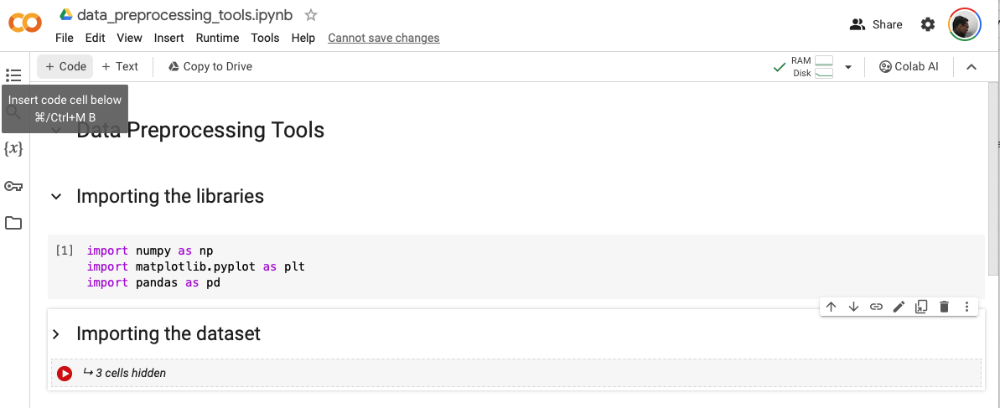
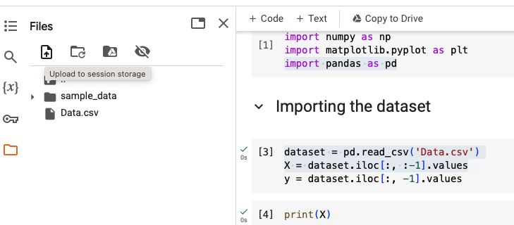

##### Inserting new code cells

`Code cells` are probably code blocks that can be run independently, even when the file has more code.

##### Uploading files

Use the 'Upload to session storage' option on the left side.

