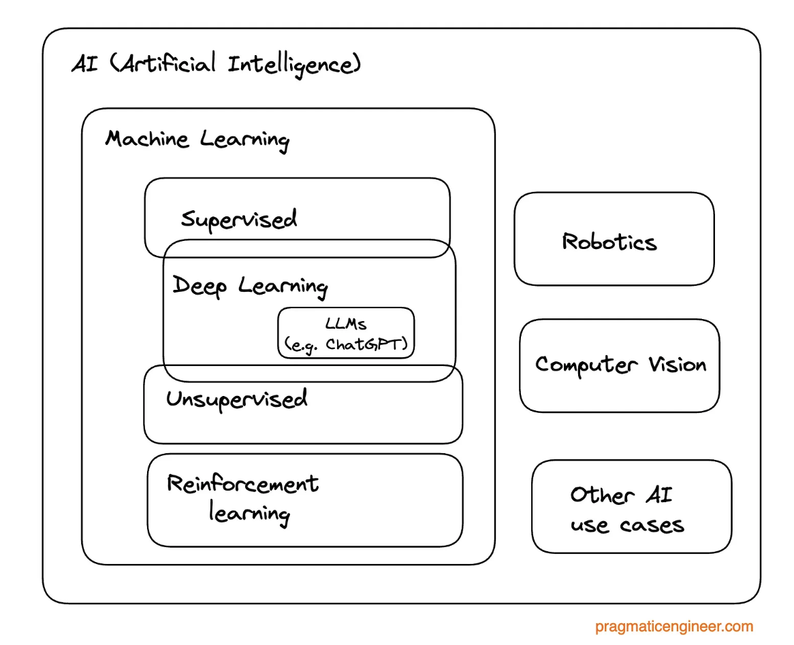

`Supervised Learning` - Classifying incoming data using known classification of old data. Machines are trained on labeled data. For example, credit card fraud model data in banks is a supervised learning model.

`Unsupervised Learning` - Machines explore unlabeled data and searh for hidden patterns within the data. The model finds a way of grouping data together patterns and outliers.  In companies, to prevent unauthorized users from gaining access to sensitive data, one of the mechamisms used is unspervised learning. The model clusters similar items (e.g. IP addresses, API access logs) together and flags anything far as outside clister. This is an unsupervised leaning approach as  there are no labels for unauthorized access or data exflitration events.

`Reinforcement Learning` - Involves trial and error. Reinforecement models are trained by learning through positive and/or negtive reinforecements. As the model learns, it receives rewards for completing the right tasks and negative consequences for compelting the wrong ones.

`Neural Networks` - Circuit of artificial connected neurons, can transmit signals to one another. Good at asks such as face recognition and understanding neural languages. Often used for natural language understanding too.

`Deep Learning` - Artificial neural networks with three or more layers of nodes.

`LLM` - Large Language Model

`Hadoop` - A framework to process large, distributed data sets across a network of computers. Allowed to process volumes of streaming log data that relational database infrastructure couldn’t usually handle. Outputs were text files in HDFS (a distributed file system that handles large data sets running on commodity hardware). Processing part done using the MapReduce programming model.

`Apache Pig` - A platform for analyzing large (HDFS?) data sets. Was built to make it easier to work with Hadoop’s MapReduce framework.

`Lambda architecture` - A way to process massive quantities of data (Big Data) by taking advantage of both batch and stream-processing methods. (Different thing from AWS Lambdas).

`ML platforms` - A collection of software components that create a systematic, automated way to take raw data, transform it, learn a model from it, and show results.

The practice of modern data science arose from statisticians who observed the amount of data being generated and processed required methods beyond the scope of academic statistics on a single machine. At this stage, there was a very split hierarchy -

1. Data engineers who built systems to process and manage data at scale. *Read more about [what data engineering is in this article](https://newsletter.pragmaticengineer.com/p/what-is-data-engineering).*
2. Data scientists who created the models.

This split became known as the ‘A/B divide in data science,’ A and B: analyst and builder. As companies began to understand and expand the use of ML, and the split between A and B data scientists became more refined, and the data engineer and data scientist roles subdivided into several new, even more specialized roles.

#### Streams of Machine Learning work

`Data engineering`: responsible for engineering the pipelines that bring and stream data.

`Analytics engineer`: Somewhere between data engineering and analysts, focuses on enforcing data movement between relational database and analytics tools.

`Data analysts/data scientist`: Analyze data for organizational needs, build dashboards.

`Researcher`: Build conceptual models, test them, responsible for research and scientific discovery.

`Machine learning engineer`: Focus on building the models and productionalizing them, regardless of model type: anything from simple linear regression to ChatGPT.

`MLOps` - Models need to be portable, low-latency, and be managed in a central place, which meant building systems and platforms on which to manage them. The term “MLOps” arose to define the boundaries of model management and operationalization. 

>  A data scientist needed to be a “person who is better at statistics than any software engineer and better at software engineering than any statistician.

In ML applications, we feed systems data, specify what the answers should look like and get the rules in the form of the model, which we then use to make new predictions for developing new product features.

AI is a blanket term for any technology using machines to perform human tasks.

Deep learning - Uses neural networks, of which large language models (LLMs) such as ChatGPT are a specific type, which work with language tasks to perform ML, and more generally, AI. 

With the explosive advances in generative AI, predictive text, and Transformer-based models, coupled with the growth of GPU-based computing, deep learning has started to make a dent in Big Tech and at leading companies in the tech industry. Despite this, no matter how buzzy AI is right now, it still only makes up a tiny – though rapidly growing – fraction of ML use-cases in industry.

Generative AI - Refers to a class of artificial intelligence algorithms and models that can generate new, original content such as images, text, audio, or video, rather than simply classifying or predicting existing data.

Transformer - Deep learning model that adopts the mechanism of self-attention, differentially weighting the significance of each part of the input (which includes the recursive output) data. It is used primarily in the fields of natural language processing (NLP) and computer vision (CV).