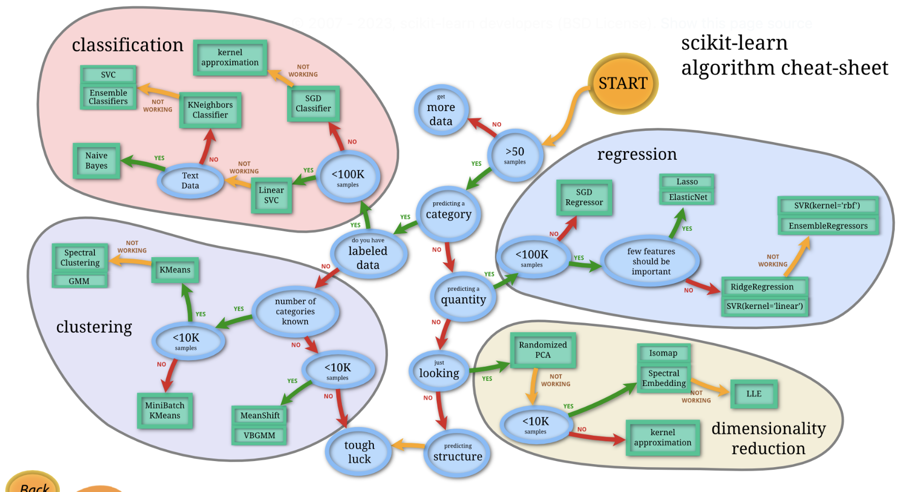
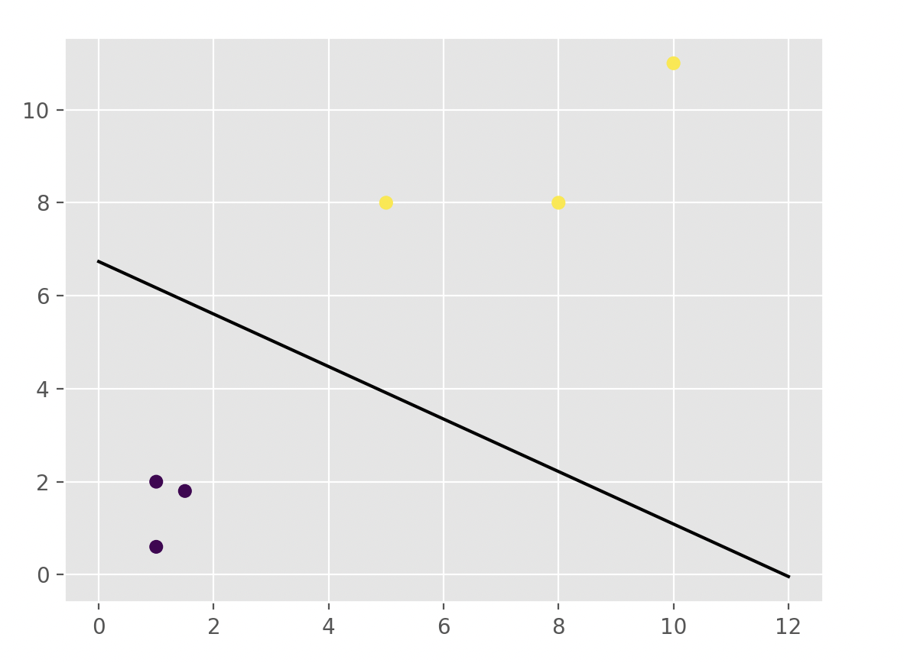
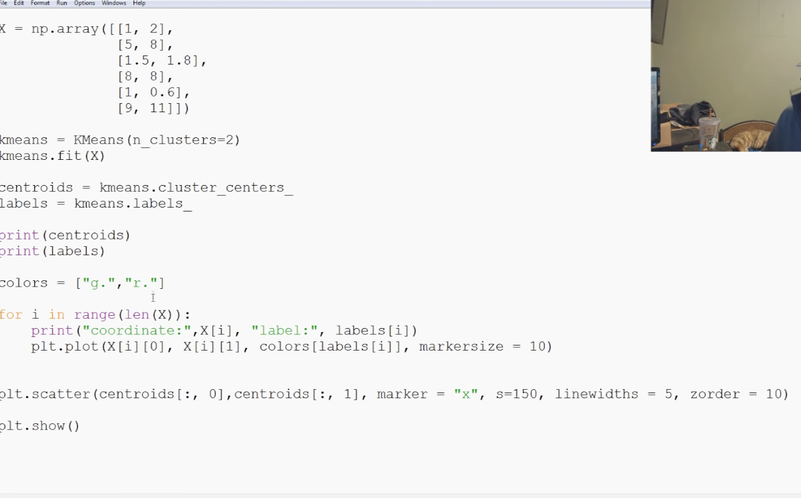
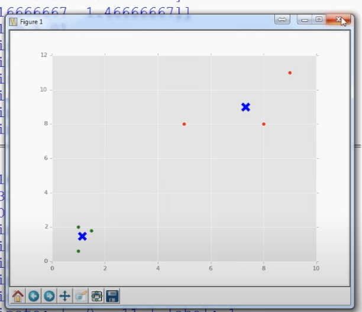
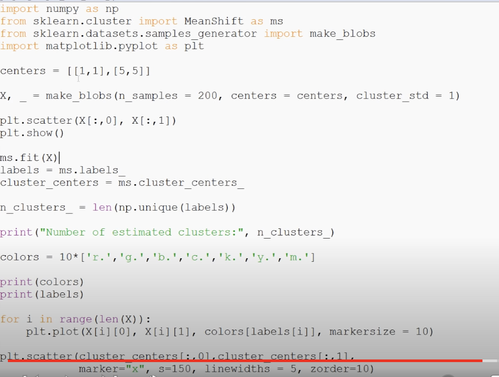
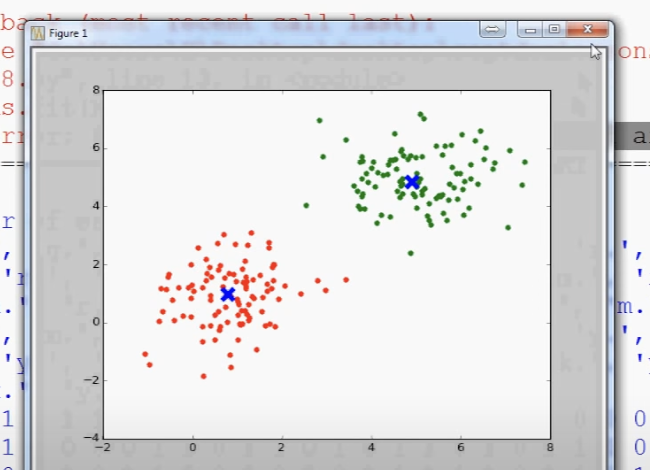

Udacity - Supervised Learning course
Coursera Machine Learning course

(Better start with a course that uses ML libraries instead of building libraries from scratch, Udacity Intro to ML)
Python

SciKit Learn
Try ML on a real world dataset
Code liner regression algorithm
Some NLP 

Neural Network
Udacity deep learning course
Stanford deep learning course

https://medium.com/learning-new-stuff/machine-learning-in-a-week-a0da25d59850#.tk6ft2kcg

https://medium.com/learning-new-stuff/machine-learning-in-a-year-cdb0b0ebd29c#.hhcb9fxk1

https://github.com/ZuzooVn/machine-learning-for-software-engineers

Andrew Ng's Coursera course <br>Sci-Kit tutotrials <br>Sentdex YT tutorials <br>Udacity's intro to ML <br>

------

Sentdex YouTube - Scikit-learn course

https://www.youtube.com/watch?v=EQZaSuK-PHs&list=PLQVvvaa0QuDd0flgGphKCej-9jp-QdzZ3&index=29

Chapter 1 - Says how new algorithms rarely need to be written, most of ML is extracting and structiring data <br>Chapter 2 - Predicts digit: Uses `svm` to train using provided data (i.e. does a 'fitting'), and can then predict on a new input <br>Chapter 3 - Basics of stocks stats, D/E ratio<br>Chapter 4 - Lists files in a folder<br>Chapter 5 - Extracting a feature: Extracts data from local files using plain `split`<br>Chapter 6 - Structuring data: Writes exctraced data from local files into one single csv using `Pandas` <br>Chapter 7 - Adds another feature, i.e. stock price and S&P500 price <br>Chapter 8 - Adds another computed column that tracks percentage change <br>Chapter 9 - Plot graphs using data frames <br>Chapter 10 - Labelling data, i.e. based on some calculation give it a label <br>Chapter 11 - Using SVC to predict based on model trained with normalized labeled data, drawing graph <br>Chapter 12 - Gets lot more data from every stock's local files, i.e. lot more dimensions/features to work with <br>Chapter 13 - Does linear SVC on two features with every datapoint having a label <br>Chapter 14 - Uses all the ~35 features, labeled data, Runs SVC with a traing set, tests with a test set, and checks accuracy <br>Chapter 15 - (Skimmed) Randomizes training and testing set <br>Chapter 16 - (Skimmed) Fetching historical sock prices for one stock using a module that makes API calls <br>Chapter 17 - (Skimmed) Does the above for all stocks <br>

----

```
pip install matplotlib
pip install numpy
pip install -U scikit-learn
```

module not found - Install module using pip, set a project interpreter in project settings.

SciKit learn comes with sample datasets. 

The digits dataset consists of 8x8 pixel images of digits. The `images` attribute of the dataset stores 8x8 arrays of grayscale values for each image. The `target` attribute of the dataset stores the digit each image represents

Normalizing data ~ Standardizing data, i.e. getting all the data to be in some sort of uniform scale (usually between -1 and 1).

SciKit diagram for chosing the right estimator (algorithm?) - https://scikit-learn.org/stable/tutorial/machine_learning_map/index.html




Debt/equity

https://pandas.pydata.org

Data points are normalized and given scaled values (usually between -1 and 1, or even better 0 and 1, the less the variance the smaller the scale). Each of these points are then assigned a category, i.e. they are labelled.

```
x = np.array([[1, 2], [5, 8], [1.5, 1.8], [8, 8], [1, 0.6], [10, 11]])  // Normalized datapoints
y = [0, 1, 0, 1, 0, 1]  // Labeling (i.e. classification of) data

clf = svm.SVC(kernel='linear', C=1.0)
clf.fit(x, y)  // Training happens here
print(clf.predict([[0.58, 10.76]]))  // Prediction happens here
```

Code that can draw a graph for above data points, with the line fitting them . Not usually needed, as invariably there are more than just 2 features (i.e. every element in x) and graphs can't be drawn if there are more than 3 dimensions (3rd dimension is still possible with color, etc.).

```
w = clf.coef_[0]
a = -w[0]/w[1]
xx = np.linspace(0, 12)
yy = a * xx - clf.intercept_[0] / w[1]
h0 = plt.plot(xx, yy, 'k-', label="non weighted div")
plt.scatter(x[:, 0], x[:, 1], c=y)
plt.show()
plt.legend()
```



This type of ML algorithm where datapoints is gets divided into different points, the algorithm is called SVC (Support-Vector Classification) and the scikit module it is in is called SVM. 


Preprocessing module preprocesses data before its used for training.

----

Important snippets - 

```
# Train usng svm, then predict, show test jpg

clf = svm.SVC(gamma=0.001, C=100)  # gamma low implies accuracy but time
x, y = digits.data[:-10], digits.target[:-10]
clf.fit(x, y)  # This is where the training is happening based on the passed data
clf.predict([digits.data[-1]])

plt.imshow(digits.images[-1], cmap=plt.cm.gray_r, interpolation="nearest")
plt.show()
```

```
# Train usng svm, then predict, draw a scatter plot with the line that fits (seperates) the training data points

clf = svm.SVC(kernel='linear', C=1.0)
clf.fit(x, y)
print(clf.predict([[0.58, 10.76]]))

w = clf.coef_[0]
a = -w[0]/w[1]
xx = np.linspace(0, 12)
yy = a * xx - clf.intercept_[0] / w[1]
h0 = plt.plot(xx, yy, 'k-', label="non weighted div")
plt.scatter(x[:, 0], x[:, 1], c=y)
plt.show()
plt.legend()
```

Unsupervised learning ~ Clustering. Flat vs hierarchical clustering, in the latter the algorithm decides how many clusters/labels should there be. Note that as opposed to supervised learning, in unsupervised learning the algorithm itself decides what is a reasonable way to decide clusters/labels.

Flat clustering example






Hierarchical clustering example




