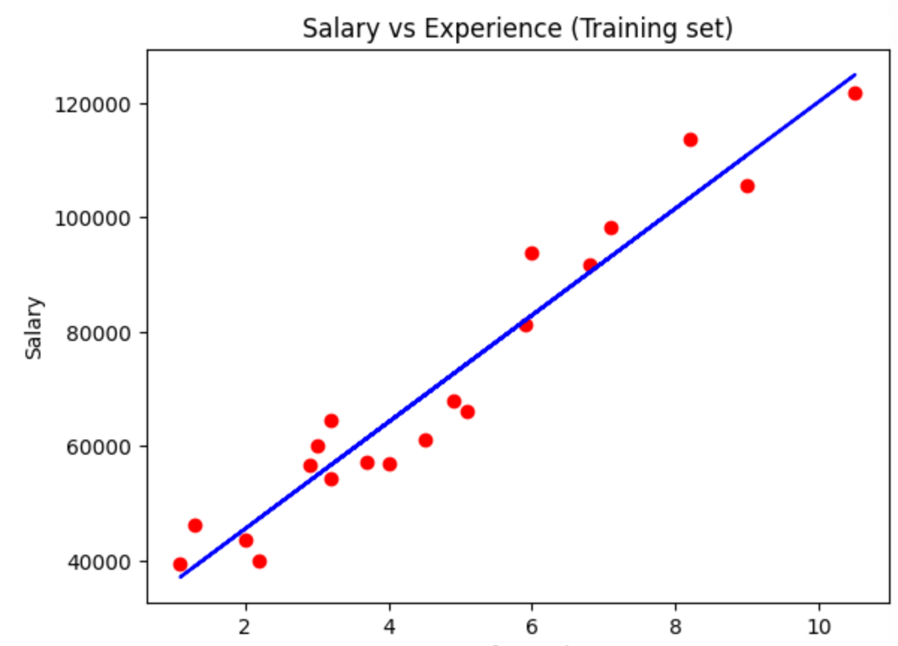

##### Drawing a scatter graph and straight line

`scatter()` draws scatter points. `plot()` draws a straight line.

```
import matplotlib.pyplot as plt

plt.scatter(X_train, y_train, color = 'red')   # Plots scatter points
plt.plot(X_train, regressor.predict(X_train), color = 'blue')  # Draws a straight line
plt.title('Salary vs Experience (Training set)')
plt.xlabel('Years of Experience')
plt.ylabel('Salary')
plt.show()
```

