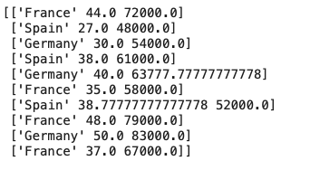
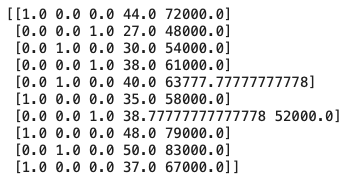
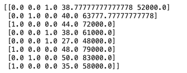
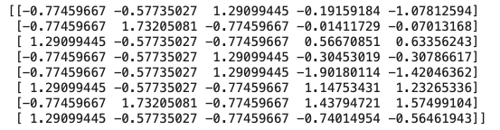

[toc]

#### Data Preprocessing

##### Imputing data where data is missing (`impute.SimpleImputer `)

> Impute: [FINANCE] assign (a value) to something by inference from the value of the products or processes to which it contributes.

[Reference](https://scikit-learn.org/stable/modules/impute.html)

Here missing numerical data (represented by numpy `nan`) will be replaced by the average of remaining data in that column.

```
from sklearn.impute import SimpleImputer
imputer = SimpleImputer(missing_values=np.nan, strategy='mean')
imputer.fit(X[:, 1:3])
X[:, 1:3] = imputer.transform(X[:, 1:3])
```

##### One Hot Encoding (`preprocessing.OneHotEncoder`)

>One-hot: In digital circuits and machine learning, a one-hot is a group of bits among which the legal combinations of values are only those with a single high bit and all the others low. These are probably also what are known as `Dummy variables`.

Its a way of representing strings with numbers. Say a column of type string has 3 distinct values across all its rows, then these values can be numerically represented using 001, 010, 100. These are also called binary vectors.

`ColumnTransformer` here is the library used to transform the column, `OneHotEncoder` is used to get the one-hot encoder. `[0]` in the third argument of transformers here represents the indexes of the columns that need to one-hot encoded. `passhthrough` (i..e accept as they are) in the second remainder argument indicates what should be done with the remaining columns that are not being encoded.

```
from sklearn.compose import ColumnTransformer
from sklearn.preprocessing import OneHotEncoder
ct = ColumnTransformer(transformers=[('encoder', OneHotEncoder(), [0])], remainder='passthrough')
X = np.array(ct.fit_transform(X))
```

| Before One-hot encoding                                      | After One-hot encoding                                       |
| ------------------------------------------------------------ | ------------------------------------------------------------ |
|  |  |

##### LabelEncoder (`preprocessing.LabelEncoder`)

`LabelEncoder` encodes binary strings into numerical values.

```
from sklearn.preprocessing import LabelEncoder
le = LabelEncoder()
y = le.fit_transform(y)
```

##### Splitting data into Training set and Test set (`model_selection.train_test_split`)

`random_state` here implies randomness.

```
from sklearn.model_selection import train_test_split
X_train, X_test, y_train, y_test = train_test_split(X, y, test_size = 0.2, random_state = 1)
```

##### Feature Scaling (`preprocessing.StandardScaler`)

This does standardization feature scaling. Note that the method used for training set is `fit_transform()` whereas the method used  for test set is `transform()`. Fit is the part where the mean, standard deviation, etc. are calculated and transform is where the scaling is done. In test set fresh mean and standard deviation should not be calculated and the scaling should be done sollely based on what was already calculated with training set.

Also, one-hot encoded values need not be normalized (even if in the below example they have been).

```
from sklearn.preprocessing import StandardScaler
sc = StandardScaler()
X_train = sc.fit_transform(X_train)
X_test = sc.transform(X_test)
```

| `X_train` before standardization                             | `X_train` after standardization                              |
| ------------------------------------------------------------ | ------------------------------------------------------------ |
|  |  |

#### Simple Linear Regression (`linear_model.LinearRegression`) 

##### Training Simple Linear Regression Model and Predicting 

Training is done with `fit()` and prediction with `predict()`.

```
from sklearn.linear_model import LinearRegression
regressor = LinearRegression()
regressor.fit(X_train, y_train)
y_pred = regressor.predict(X_test)
```

##### Training Multiple Linear Regression Model and Predicting

Its the same API, training is done with `fit()` and prediction with `predict()`.

```
from sklearn.linear_model import LinearRegression
regressor = LinearRegression()
regressor.fit(X_train, y_train)

y_pred = regressor.predict(X_test)
np.set_printoptions(precision=2)
print(np.concatenate((y_pred.reshape(len(y_pred),1), y_test.reshape(len(y_test),1)),1))
```

The `reshape()` above merely displays the array in vertical fashion instead of horizontal. The last line is printing the predicted result and actual test data result side by side for comparison..

