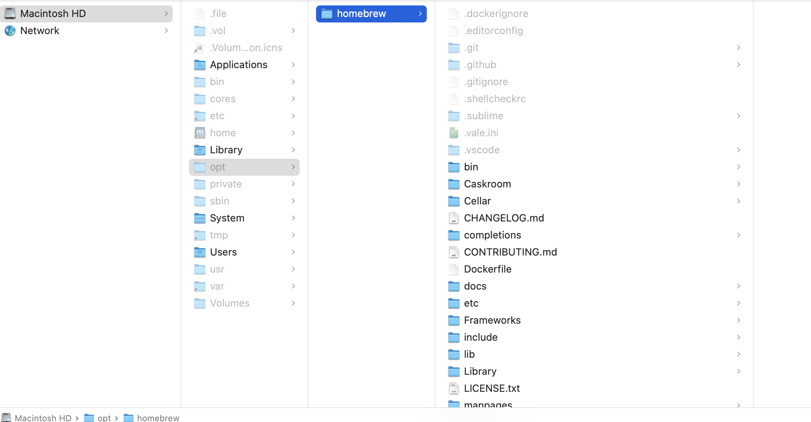
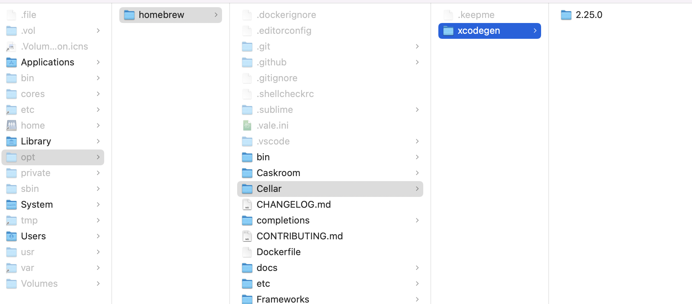

#### What is it

`Homebrew` is a software package meneger for macOS. The name is intended to suggest the idea of building (installing?) software on the Mac depending on the user's taste.

`Homebrew Cask` builds upon Homebrew and focuses on the installation of GUI applications and 'taps' dedicated to specific areas or programming languages like PHP.

`Homebrew Formulae` is an online package browser for Homebrew, i.e. a list of all packages avilable for installation via Homebrew. List of all core packages (i.e. ones available via `Core tap`) are avilable via `/api/formula.json` ([link](https://formulae.brew.sh/formula/)), and list of all Homebrew cask packages (i.e. ones available via `Core tap`) are available via `/api/cask.json` ([link](https://formulae.brew.sh/cask/)).

Homebrew is written in `Ruby`.

#### How to install Homebrew

```
/bin/bash -c "$(curl -fsSL https://raw.githubusercontent.com/Homebrew/install/HEAD/install.sh)"
```

This script installs Homebrew to its preferred prefix (`/usr/local` for macOS Intel, `/opt/homebrew` for Apple Silicon and `/home/linuxbrew/.linuxbrew` for Linux) and hence there is no need to sudo when `brew install` is done.

Once installed, you can see a `homebrew` folder in `/opt/homebrew` (on Apple Silicon systems).



Also, after installation a message is given that ''/opt/homebrew/bin is not in your PATH' and it can be put there by running these commands.
```
echo 'eval "$(/opt/homebrew/bin/brew shellenv)"' >> /Users/anandkumar/.zprofile
eval "$(/opt/homebrew/bin/brew shellenv)"
```

> In UNIX, `/usr/local` is supposed to be the place to install files built by the administrator and `/opt` is supposed to be a directory for installing unbundled packages. In other words, `/usr/local` is for self, inhouse, compiled and maintained software and `/opt` is for non-self, external, prepackaged binary/application bundle installation area.

Homebrew installs your RubyGems with gem and their dependencies with brew.

#### Basic terms and directories

As packages are installed, they get placed in `/opt/homebrew/Cellar/` directory. The precise version of a given package is called `keg`. Loosely speaking a package is called `rack`, its corresponding diretory has one or more versioned kegs. Cellar directory has various racks placed in it. So 'Cellar > Racks > Kegs'.



Casks are placed in `/Caskroom/` directory.

#### Basic commands

Installing a package/formula.
```
$ brew install xcodegen   // xcodegen is the formula name
```

Uninstall a package/formula.
```
$ brew uninstall xcodegen
```

List all the installed formulae.
```
% brew list
==> Formulae
xcodegen
```

> Research these
```
$ brew update
$ brew upgrade  // Update all installed packages?
$ brew create https://foo.com/bar-1.0.tgz
$ brew edit wget
$ brew install --cask firefox
$ brew create --cask foo
```

[Link](https://docs.brew.sh/Manpage#commands)
