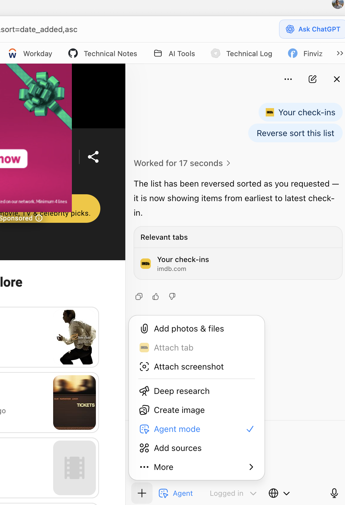
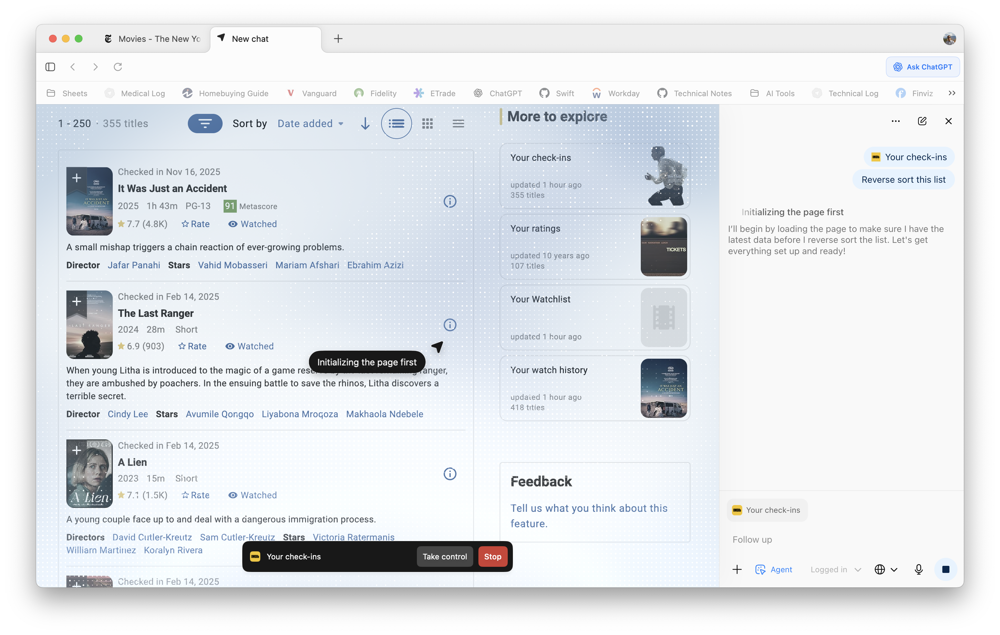
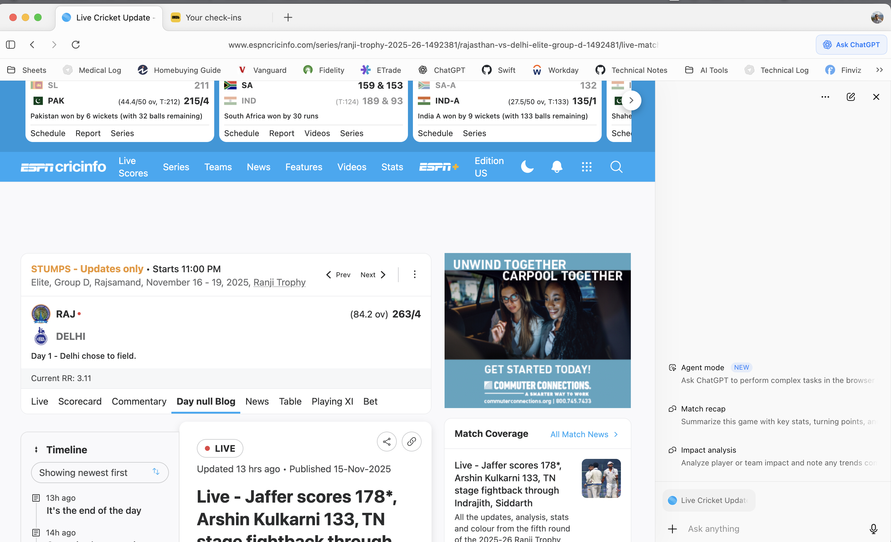
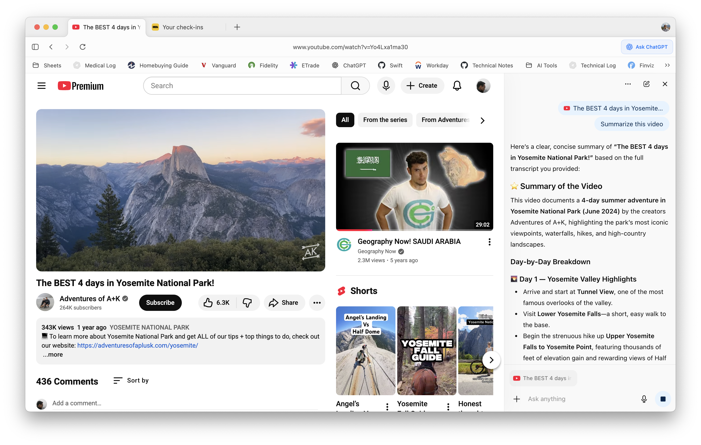
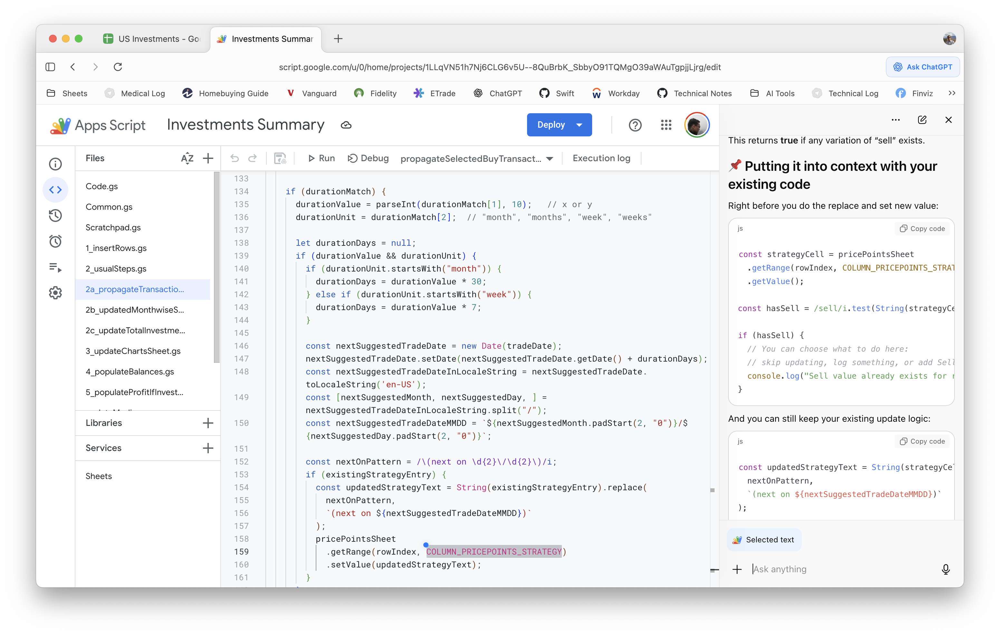
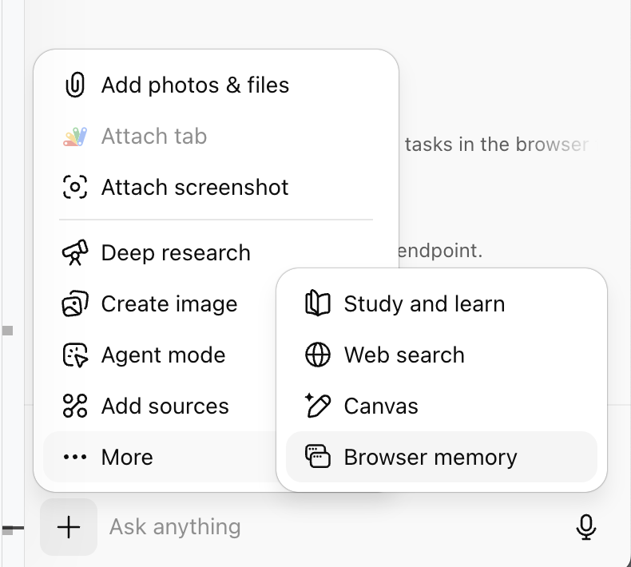

[toc]

### Atlas

Introduction video ([YouTube link](https://www.youtube.com/watch?v=8UWKxJbjriY))

#### Features/How to Use

Access chat using 'Ask ChatGPT' button 

Sidebar for normal ChatGPT

Regular internet access

Activate Agend Mode using + button in chat sidebar.

#### Use Cases

##### Perform actions using Agent Mode

Has to be consciously activated, but was able to successfully use it to add a movie to my Check-ins list in IMDB. Took 2 min, but it did that. Clearer the instructions (preferably even saying what page and what button), the sooner it happens.

| 1. Activate Agent mode                                       | 2. Give the command (blue overlay shows)                     |
| ------------------------------------------------------------ | ------------------------------------------------------------ |
|  |  |

There are also 'Logged in' and 'Logged out' modes which probably decide should the actions be done with a user session or without.

##### Summarize webpages

The webpage's name should show up as a chip, this indicates that ChatGPT has been able to generate the context. And then it can be asked to summarize pretty easily. Is often even an automatic suggestion prompt.

##### Summarize YouTube videos

Very handy, it mostly does that through the downloaded transcripts.

##### Live coding

For Google sheets scripting, it was particularly useful as its a web IDE and ChatGPT can work directly without needing to be fed code. 

> I also tried this with Agent mode, but that's clunky as it literally tries to simulate taps and key strokes and takes a lot of time for what it could have done lot more easily by simply modifying the text as in a AI assisted IDE.

#### Next

What are each of these options and what are their practical use cases

