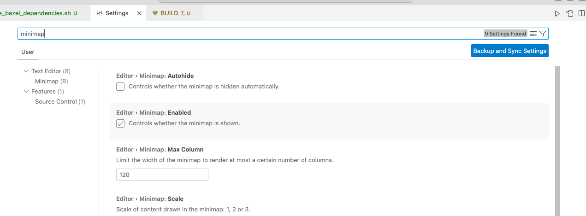

##### Region folding

A third party extension (from [maptz](https://marketplace.visualstudio.com/items?itemName=maptz.regionfolder)) can be used for it. With it code folding can be done across any custom region using the syntax `// #region REGION_NAME` and `//endregion`. This patten in fact is same across all languages, just that the initial characters should be the standard comments syntax for that language.

In Visual Studio's settings.json (accessible using the gear icon for the extension), an entry must be created appropriately for the applicable language (it is not present by default) and it must be ensured that it has the right characters for the comment syntax.

The keyboard shortcut to wrap any bunch of code in a region is to select the lines, and then type `Ctl M Ctl R`.

##### Default folding strategy

Its possible to set a default folding strategy when unknown, for example indent based on indentation.

##### Show/Hide Editor Minimap

| Minimap                                                      | Setting to show/hide it                                      |
| ------------------------------------------------------------ | ------------------------------------------------------------ |
|  |  |

##### 