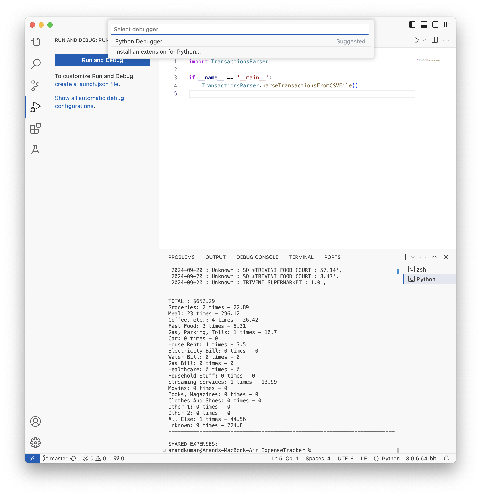
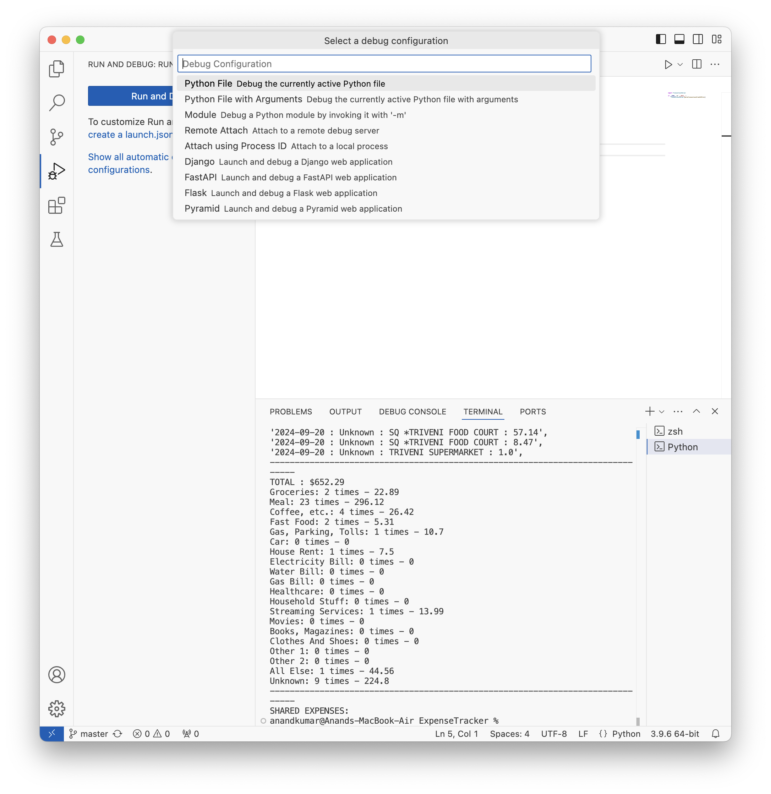
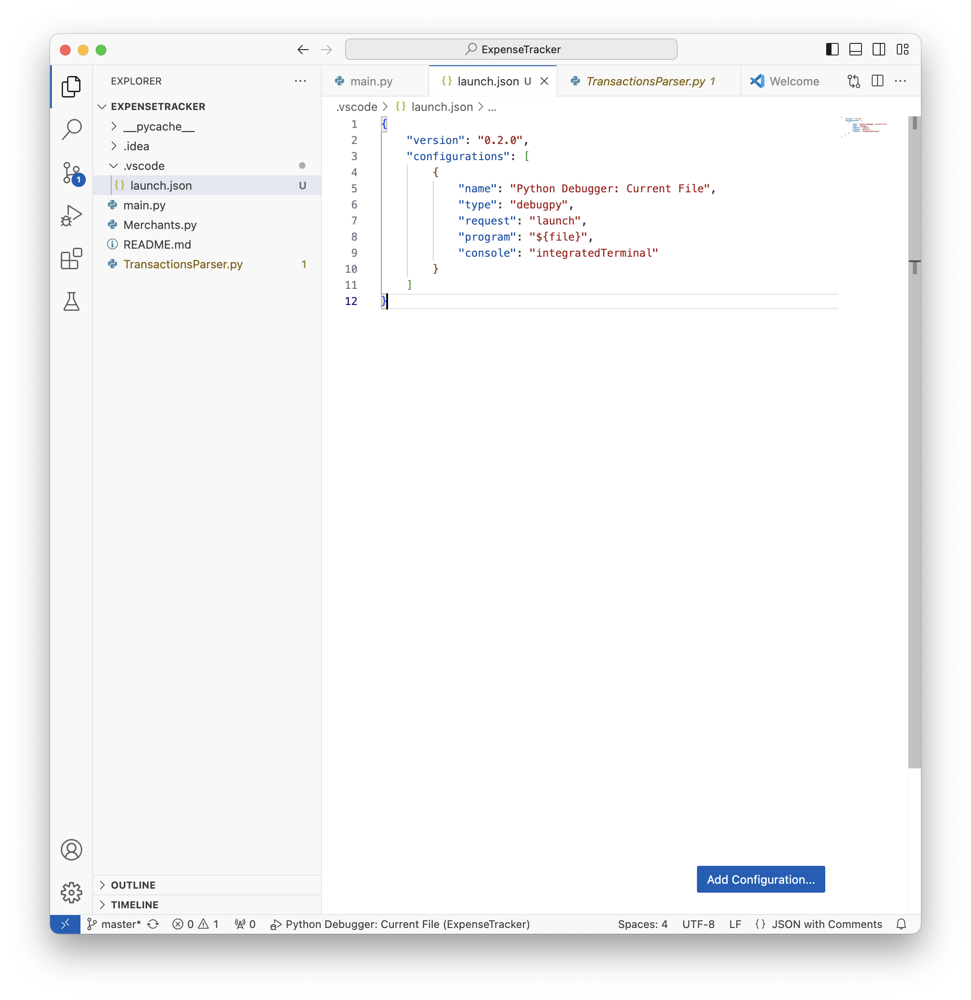

##### Debugging

[Documentation](https://code.visualstudio.com/docs/editor/debugging)

If no `launch.json` has been created so far, the 'Run Start View' is shown in 'Run and Debug View'. When Run and Debug button is tapped.

| Step 1 - Select a debugger ('Python debugger' here)          | Step 2 - Select a configuration ('Currently active Python file' here) | Step 3 - launch.json created                                 |
| ------------------------------------------------------------ | ------------------------------------------------------------ | ------------------------------------------------------------ |
|  |  |  |

Essentially, `launch.json` file has configurations listed in it. Once created, debugging can be done.

