[toc]

### GitHub Copilot

[GitHub's Copilot documentation](https://docs.github.com/en/copilot/using-github-copilot/getting-code-suggestions-in-your-ide-with-github-copilot?tool=vscode)  [Visual Studio's Copilot documentation](https://code.visualstudio.com/docs/copilot/getting-started-chat)

#### Configuring

Copilot can be used from CLI as well as IDE, and whether this should be possible or not can be configured in GitHub.

The Copilot button in the Activity Bar at bottom brings up the Copilot menu, and should have status: Ready if it is all set.

| Copilot policies to select in GitHub                         | Copilot button in the Activity Bar at bottom                 |
| ------------------------------------------------------------ | ------------------------------------------------------------ |
| 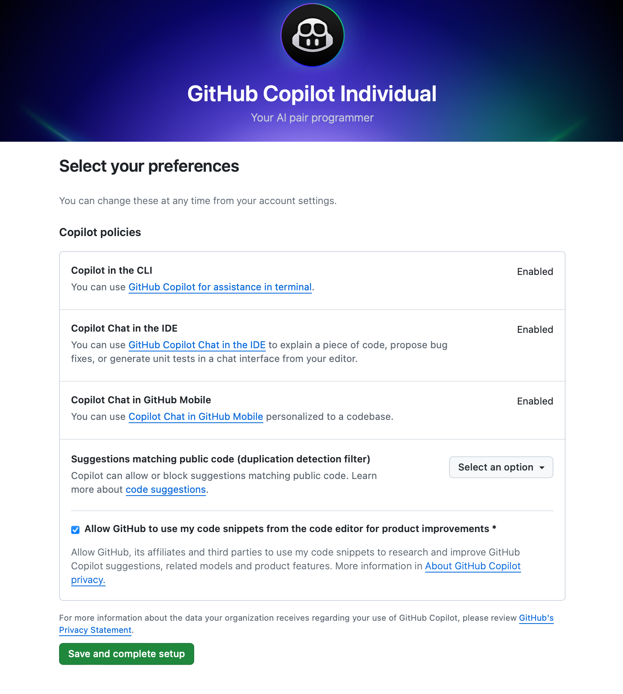 | 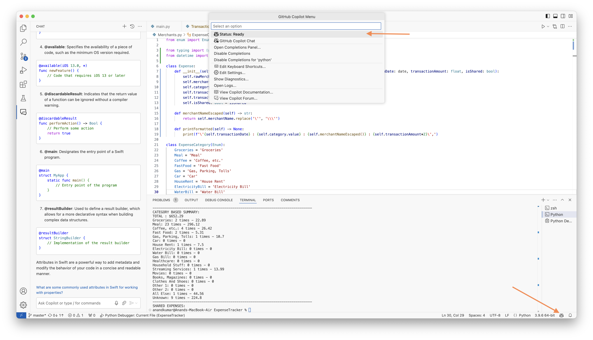 |

#### Chat View

Accessed by tapping the Copilot button in Activity Bar at bottom and selecting Github Copilot Chat in the command palette. Can also be brought up with keyboard shortcut `Cmd Ctrl I`.

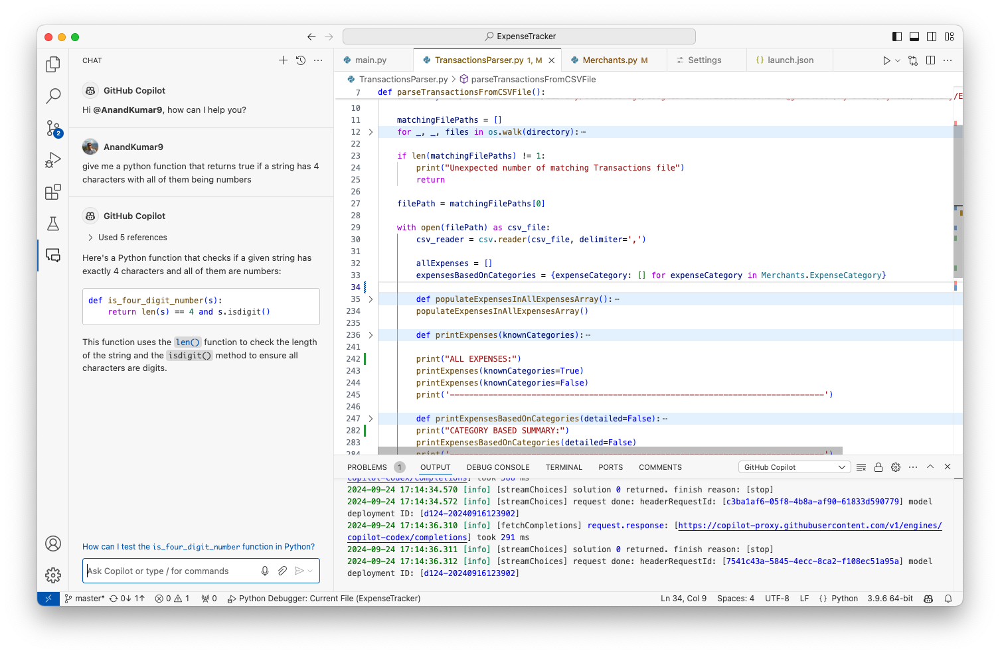

Its also possible to select some code in the editor, and ask questions pertaining to that in the Chat pane.

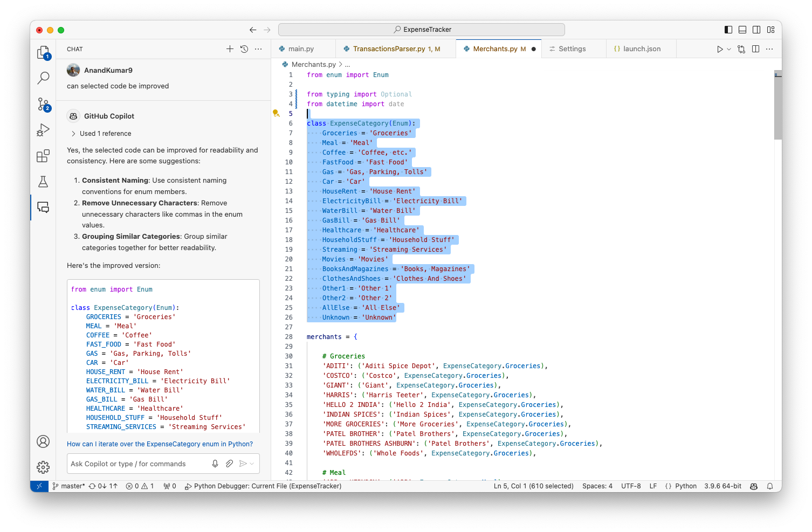

##### Slash commands (`/`)

[Reference](https://code.visualstudio.com/docs/copilot/copilot-chat#_slash-commands)

There are several special commands that exist which are a shorthand for some commonly used instructions. They are qualified with `/` and just typing that key can show all the available commands

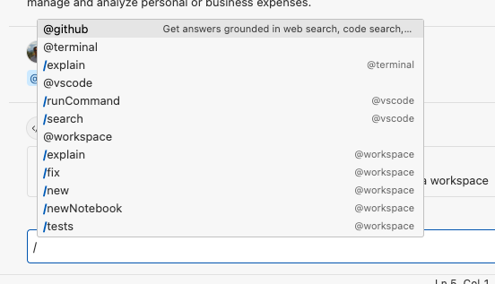

##### @workspace

Its a 'chat participant' that seems to answer based on entire sourcecode and not just the current file. For example, the below command returns better results with `@workspace` than without it. Typically (without it) Copilot just looks at currently opened files in the editor. Note that without it, Copilot will not search across entire workspace. Note that the same can also be achieved with `#workpace` chat context.

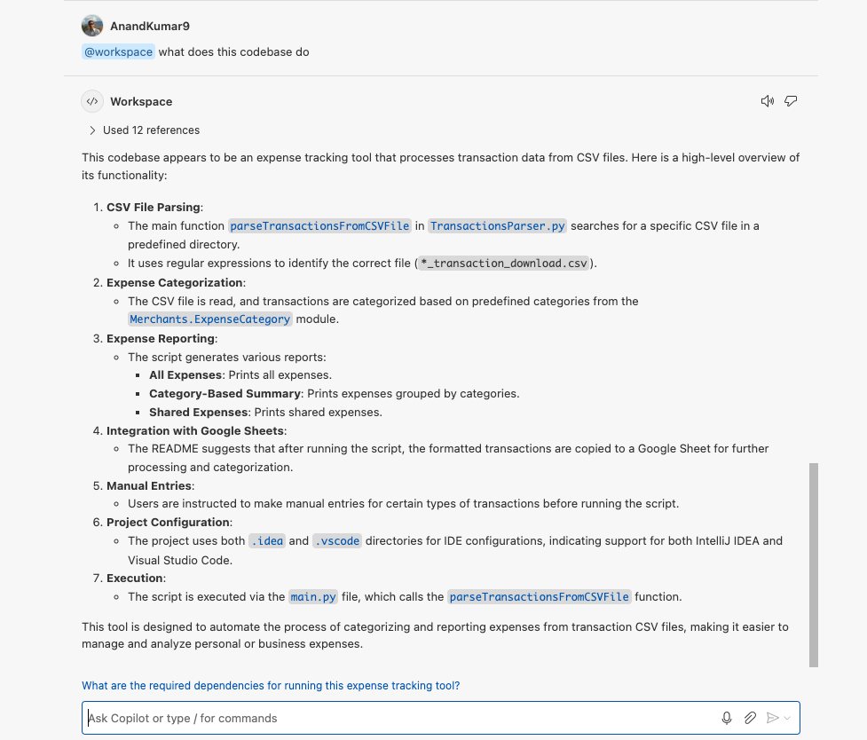

##### /new

In the below example new project altogether will be created (there will be prompts to select folder, etc.). It automatically injects `@workspace /new` as the entire command.

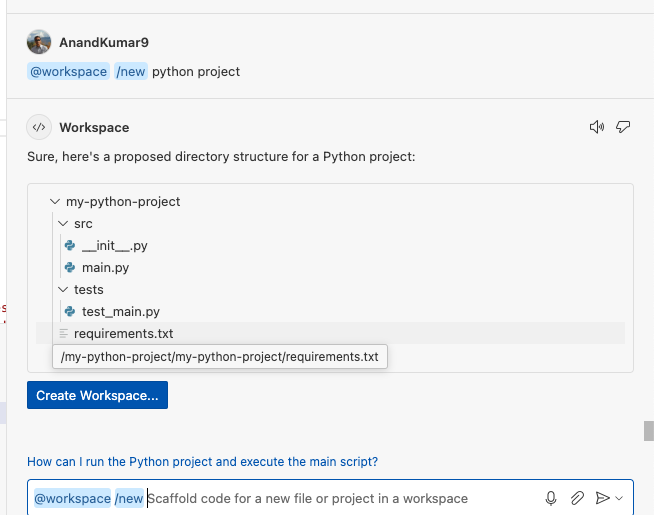

##### Chat context

Chat participants, such as `@workspace` or `@vscode`, can contribute chat variables that contain domain-specific context. You can reference a chat variable in your chat prompt by using the `#` symbol. ([Reference](https://code.visualstudio.com/docs/copilot/copilot-chat#_chat-context))

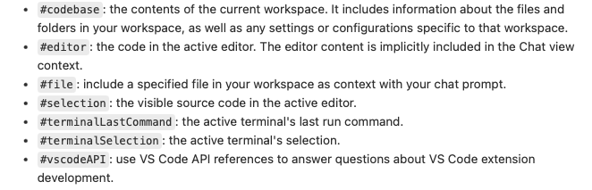

Instead of using the `#` symbol, you can also add context to your chat message by using the Attach Context button in the Chat view

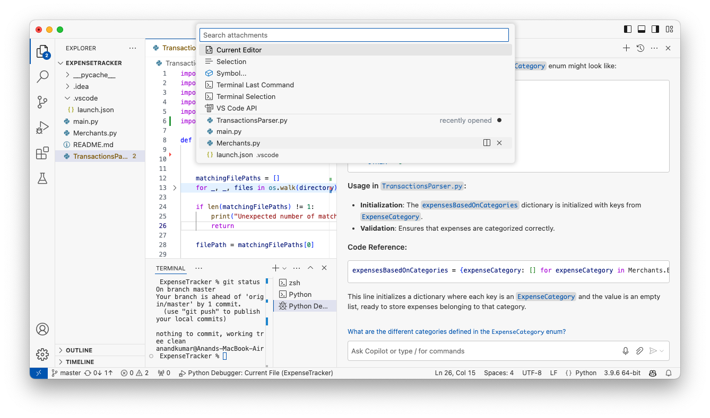

`#file:` for example can be used to search within a specified file.

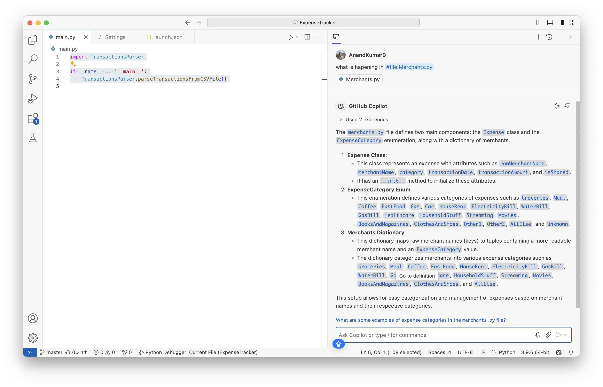

#### Inline Chat

Inline chat - Place the cursor at the required line in code and press `Cmd I`

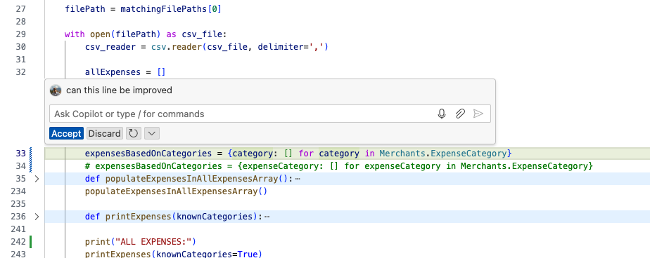

#### Autosuggest (Inline completions)

Anytime some code is written, Copilot automatically suggests further code for it (in gray dimmed text) based on code that is already in the file (for example, the suggested code for Merchant class below). To accept the suggestion, tab should be pressed. 

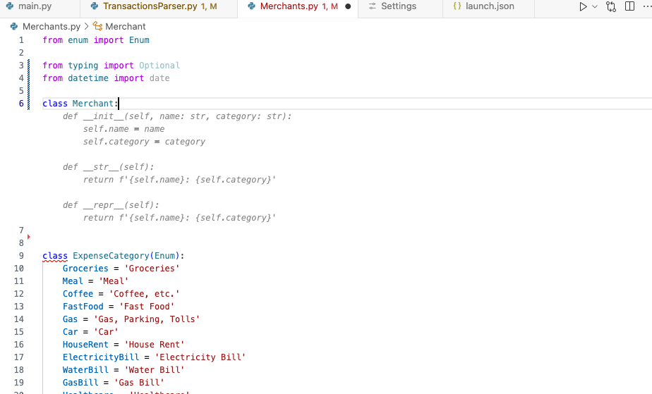

Note that the exact suggestion may vary everytime, all the suggestions are shown when hovering over the suggestion.

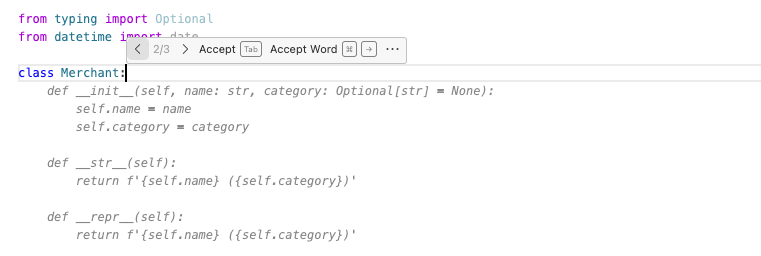

If needed, inline sugestions can be paused on a per language basis using the command palette.

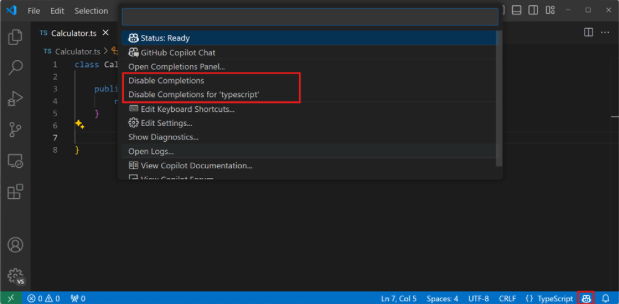

#### Suggestions from code comments

Its also possible to generate some code from comments (type comments and press enter, every line of code appears one by one).

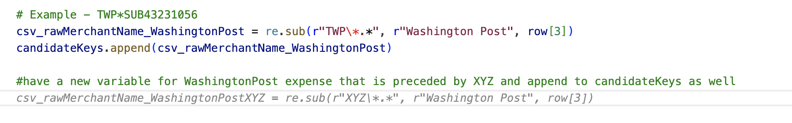

#### Sparkle icon

When there is some error in the code, Copilot can automatically squiggle a red line underneath it or even bring up a Sparkle icon with options to correct or explain it. The options shown here are also called **Smart Actions**.

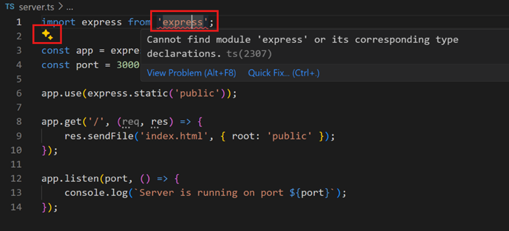
