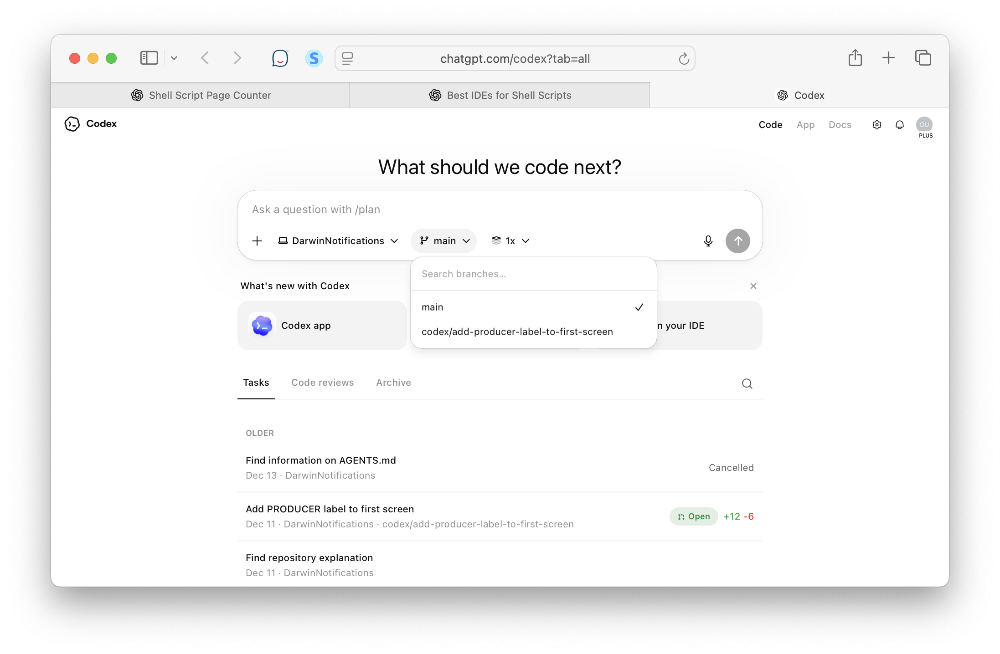
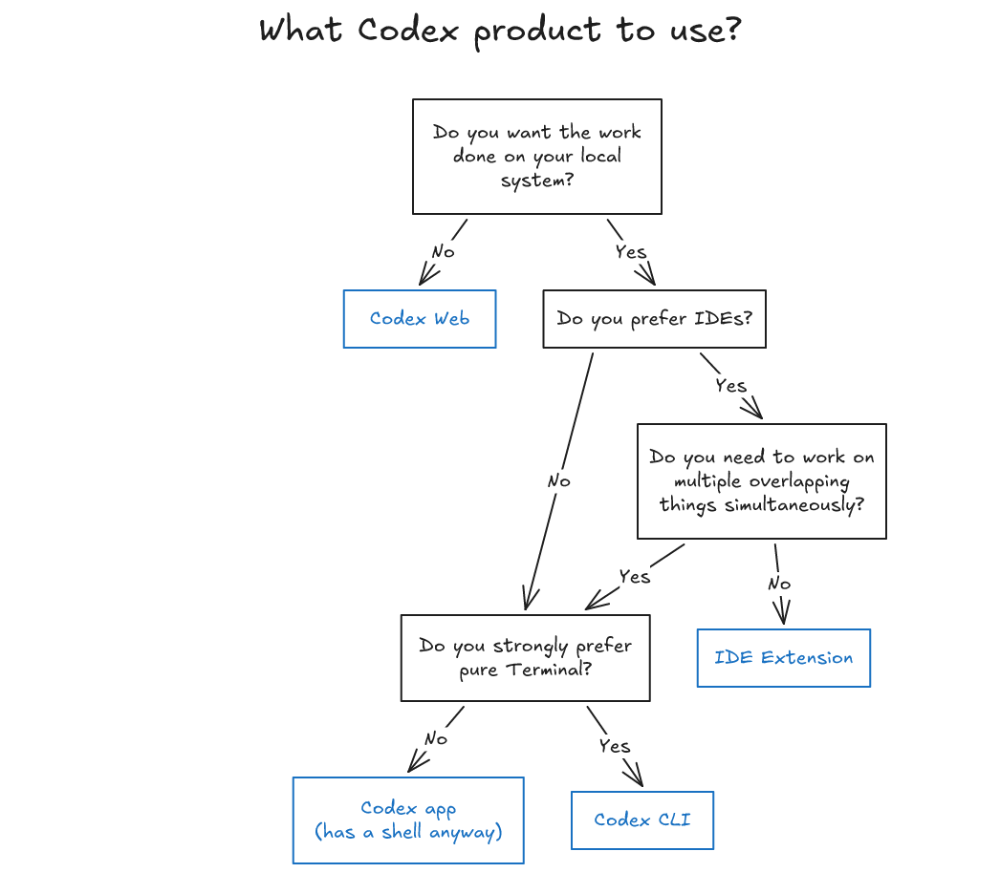

[toc]

##### Entry Points

It can be used through various means

**1. Codex app** - A macOS app.  Can do everything i.e. spawn new agents, etc.

**2. Codex CLI** - Installable through npm/Homebrew. Basically just like Claude Code (built in Rust FYI). Launched through `codex` command. Has commands for spawning agents, resuming sessions, etc. [Reference](https://developers.openai.com/codex/cli).

**3. IDE plugins** - Visual Studio, Cursor, Windsurf

**4. Codex Web** (previously known as **Codex Cloud**) - Can be configured by enabling GH connector. Clones the GH repo in a 'Codex environment' and you give it tasks to do.

##### What mode is usually used

IDE extension is invariably the most efficient way, esp. for local development. 

> Keep in mind though that technically you can still work on multiple things simultaneously with IDE extensions too, just have multiple sessions running. Also, these capabilities keep evolving. For example, now there is even a dropdown in the IDE extension that lets you specify that the task should be run in cloud.

##### Misc.

###### AGENTS.md

`Agents.md` is a file Codex Web uses as a **guide for how the AI agent should operate inside your repo**.
 It defines what actions Codex can take (build, test, run scripts), what commands are safe, and how the project is structured.
 Codex reads it to understand the repo’s automation rules and workflow.  It’s basically a **manifest describing the agent’s capabilities and limits**.  You can customize it to shape how Codex behaves in your project.

