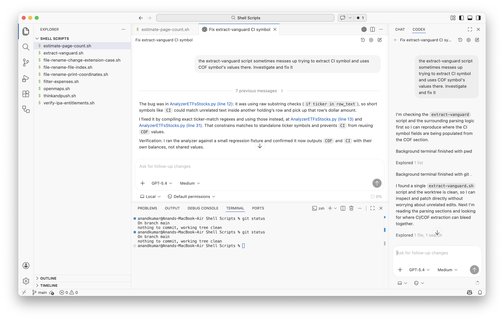
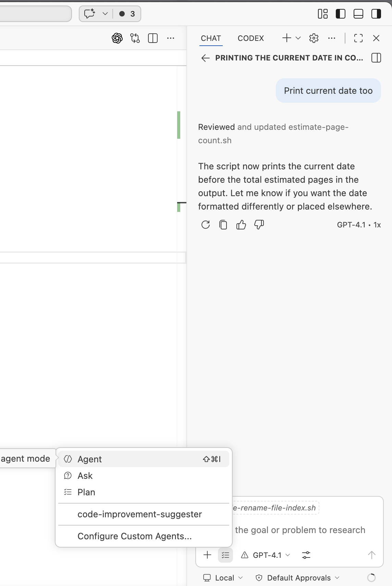

[toc]

Its available on 3 IDEs - Visual Studio, Cursor, Windsurf

#### Visual Studio

##### Codex Tab

Once the extension is installed, it shows up on the as new tab on the right sidebar.

> Note that if you just open a file and try to get Codex to modify it, it will tell you to first 'Add a project to use Codex'. All it means is that you need to open the folder (that contains the file) in Visual Studio.

Keep in mind that The extension once installed, shows up as another tab in the right sidebar as **Codex**. Plainly put (even in Agent mode) Chat can't make changes without asking, but Codex can. The **Chat** tab is unrelated and editor-native.

##### Chat Modes (Agent/Ask/Plan)

The **Chat** tab is editor-native and is present even if you don't install the Codex extension. You can select models from there (it comes bundled with some common ones). It has 3 modes, with the default being Agent mode. Also, any configured agents (from any tool) too show up there.

Note that you can have multiple sessions going using the 'New Chat' button.
