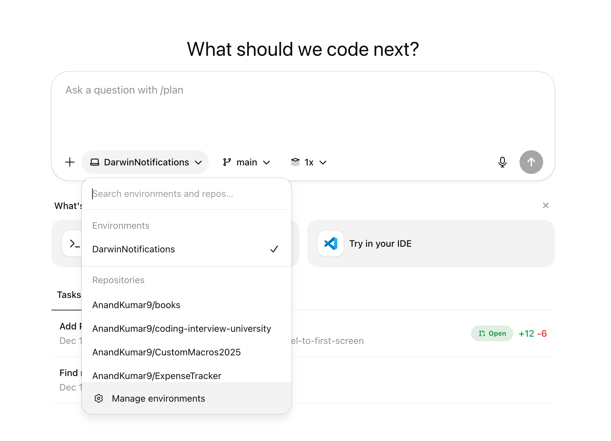
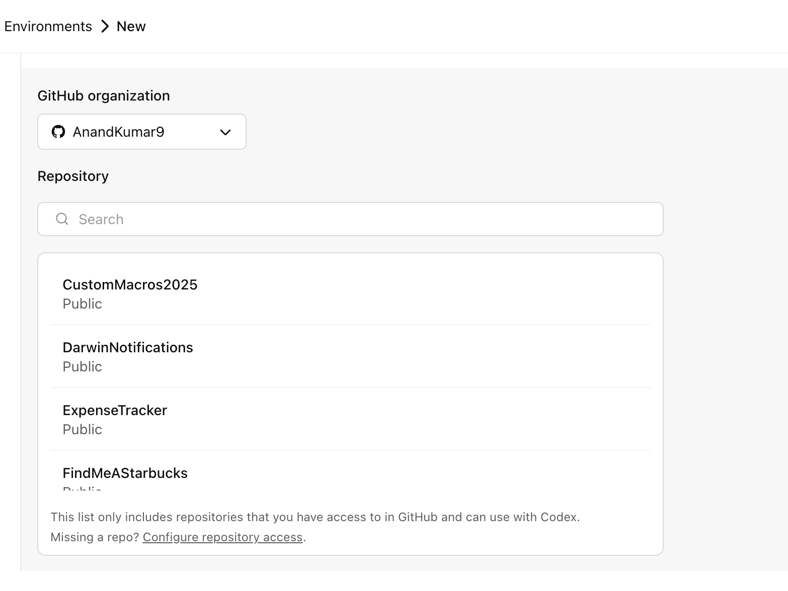
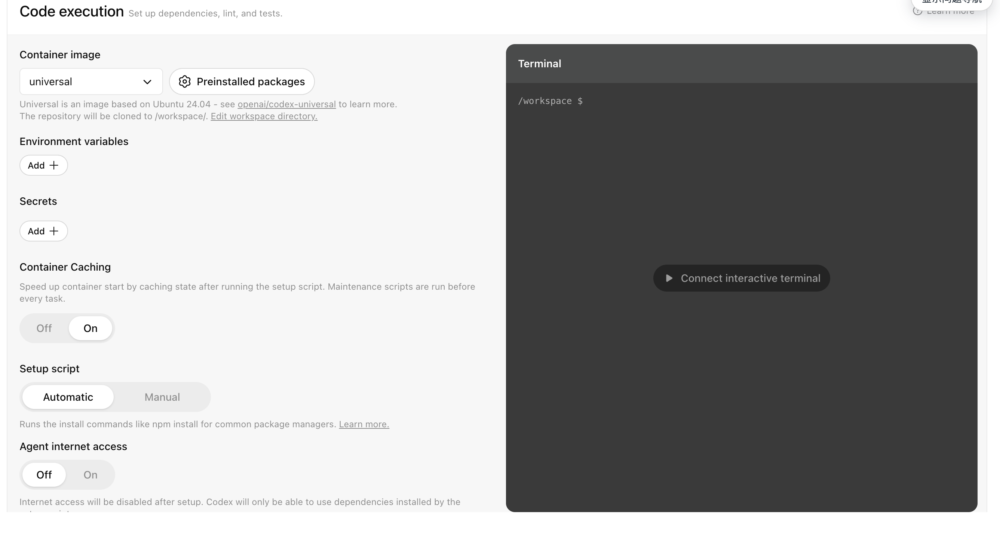
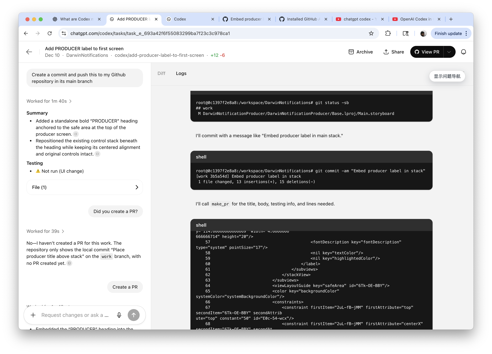
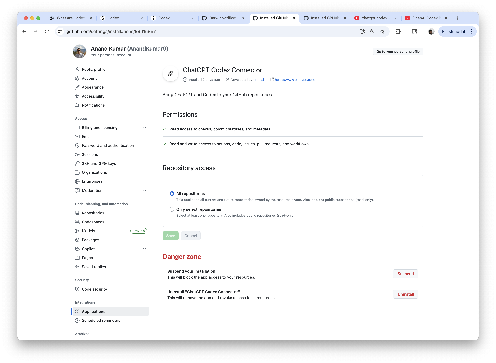
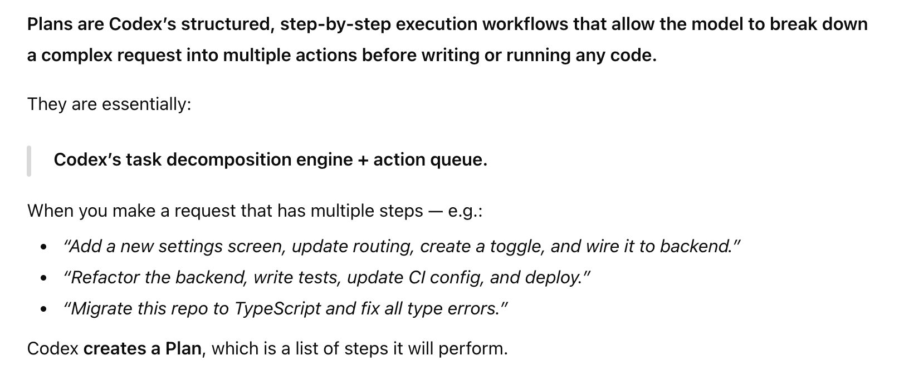
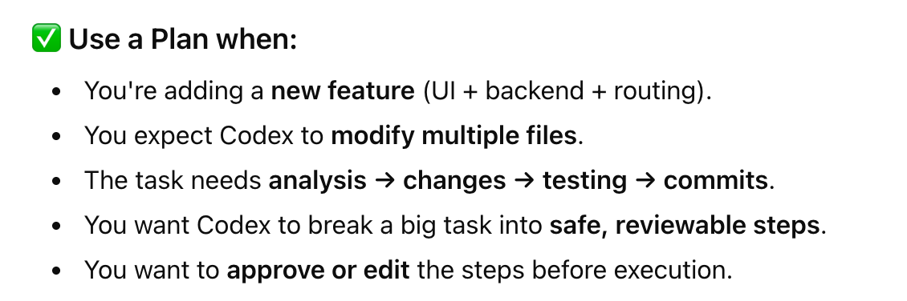
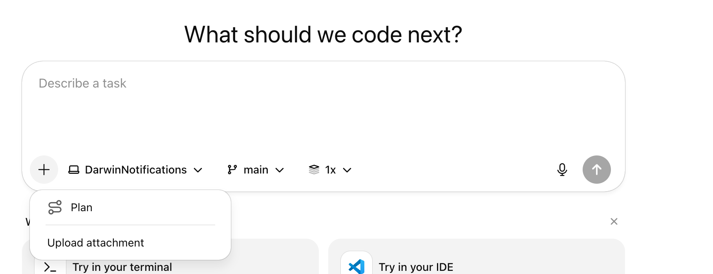

[toc]

#### Codex Web

What it essentially does is that it can connect to GitHub, checkout repositories to a cloud container, answer questions, make changes and commit and raise PRs.

> It should be treated as code related chat assistant only, its not a fully powered thing like 'Codex Cloud'.

By default it only does static code analysis, for it to run something the Task has to say that explicitly. 

Also, during task execution by default internet access is disabled, limiting the agent’s interaction solely to the code explicitly provided via GitHub repositories and pre-installed dependencies configured by the user via a setup script. The agent cannot access external websites, APIs, or other services.

##### Selecting the GH repo and branch

The **GitHub Connector** has to be on in Settings, and then you can select the repo and the branch you want it to work with.

> The '1x, 2x, ..' options control how many alternative code responses Codex generates at once

##### Environment and Container Image

The code runs in a containerized environment. Environments can be created and managed in 'ChatGPT Codex Settings > Environment'. In the settings, the Container Image can also be configured along with the environment variables, secrets, etc. that it should have. There is access to a shell terminal too to run some scripts.

Every environment has some default runtimes (Python, Node.js, etc.) already available and also have some packages (NumPy, Node packages, etc.) preinstalled.

Once the codex session ends (or at ~1 hr of inactivity), the environment is reset and the code cleared automatically.

| Specify GH repo                                              | Specify image, secrets, internet access, etc.                |
| ------------------------------------------------------------ | ------------------------------------------------------------ |
|  |  |

[Documentation](https://developers.openai.com/codex/cloud/environments)

##### Pushing changes and opening PRs

Specific instructions need to be given for that, just an instruction to make some change will not do those.

##### Github settings

Codex Web connects to Github as an Application (using GitHub OAuth) and shows up under 'GitHub > Profile > Settings > Integrations > Applications'.

> It shows up under 'Installed GH apps' in GH, which is supposed to mean that it is a full fledged bot, but then when I told Codex Web to create a PR, the PR author was indeed me. So may need to research more on how exactly various types of GH apps work.  The various kinds of GH apps are briefly explained in '/09. Version Control/GitHub Tricks.md'

##### Plans

##### Resources

[ChatGPT link](https://chatgpt.com/c/693a21f2-29e4-8330-8f1d-bb91e513ba28)  [Developers Digest 2025 YT video](https://www.youtube.com/watch?v=Kd0QGZMy_tA)

#### Codex Cloud

A full IDE in web, where new files too can be added to the repository and there is indeed a navigable files manager. 

> Its not available to all Plus users just yet. Once there, a 'New Project' button will show up (on Codex Web?).