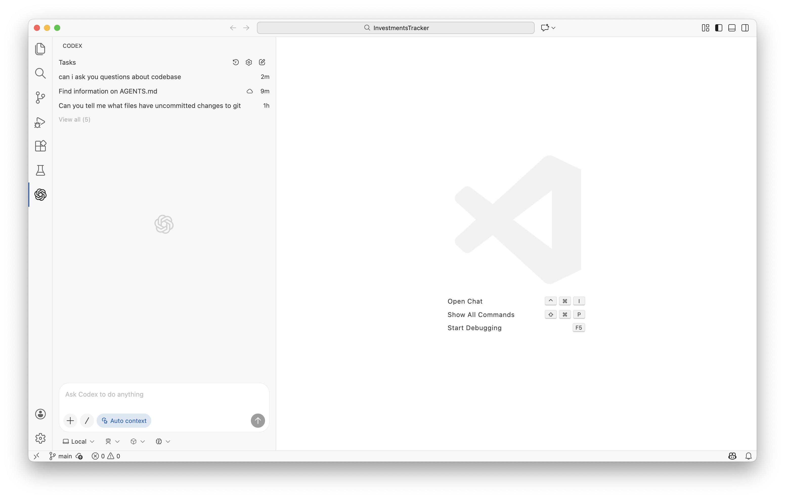
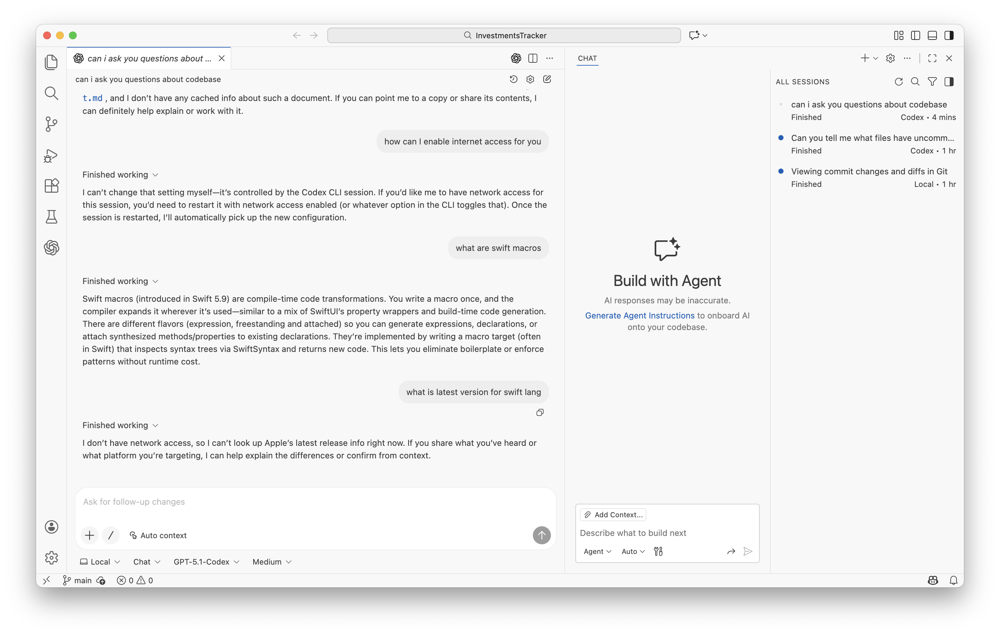

Its available on 3 IDEs - Visual Studio, Cursor, Windsurf

##### Visual Studio

Once the extension is installed, it shows up on the left sidebar

| Codex extension (Left Sidebar)                               | Codex chat (Cmd Ctrl I)                                      |
| ------------------------------------------------------------ | ------------------------------------------------------------ |
|  |  |

