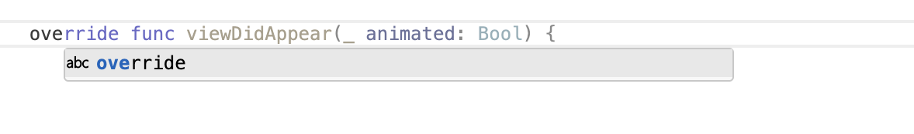
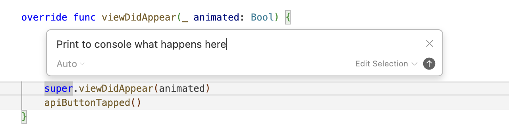
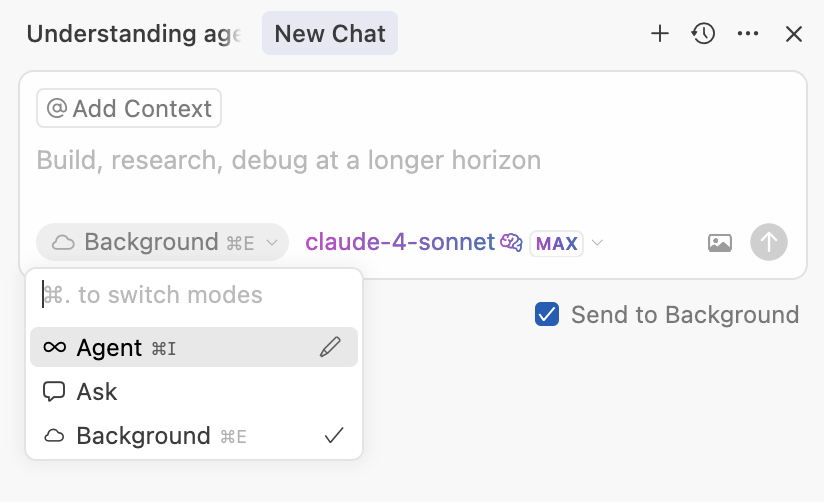

#### Different modes of interaction

There are 3 basic ways to interact with Cursor.

1. **Tab** - Autocomplete suggestion in the editor as you type. Uses Cursor's inhouse model. Press '**tab**' key to accept any suggestion that shows up.
2. **Inline Edit** - Select a code snippet and press '**Cmd K**' to tell Cursor how to edit that snippet.
3. **Chat** - Things that happen in a separate Chatting like side-pane. There are 3 sub-modes here.
   1. **Agent** - Possibly the most famous thing in various AI IDEs, comes up with '**Cmd I**'. Based on what you say it can modify multiple files together. There is also an option in the chat window to select the model to be used. ([Documentation](https://docs.cursor.com/en/tab/overview))
   2. **Ask** - General research type questions to get answers for. ([Documentation](https://docs.cursor.com/en/agent/overview))
   3. **Background**  - Comes up with '**Cmd E**'. Used to do Agent like things which would take a long time and you'd rather it happens remotely in a different branch that you can see once's done. It clones the repo into a remote virtual machine, and then makes the changes there. ([Documentation](https://docs.cursor.com/en/background-agent))

| Tab                                                          | Inline Edit                                                  | Background                                                   |
| ------------------------------------------------------------ | ------------------------------------------------------------ | ------------------------------------------------------------ |
|  |  |  |

#### Codebase Indexing

Cursor indexes all files except those in ignore files (e.g. `.gitignore`, `.cursorignore`).

General index settings and status are accessible through 'Cursor settings > Indexing & Docs'.

