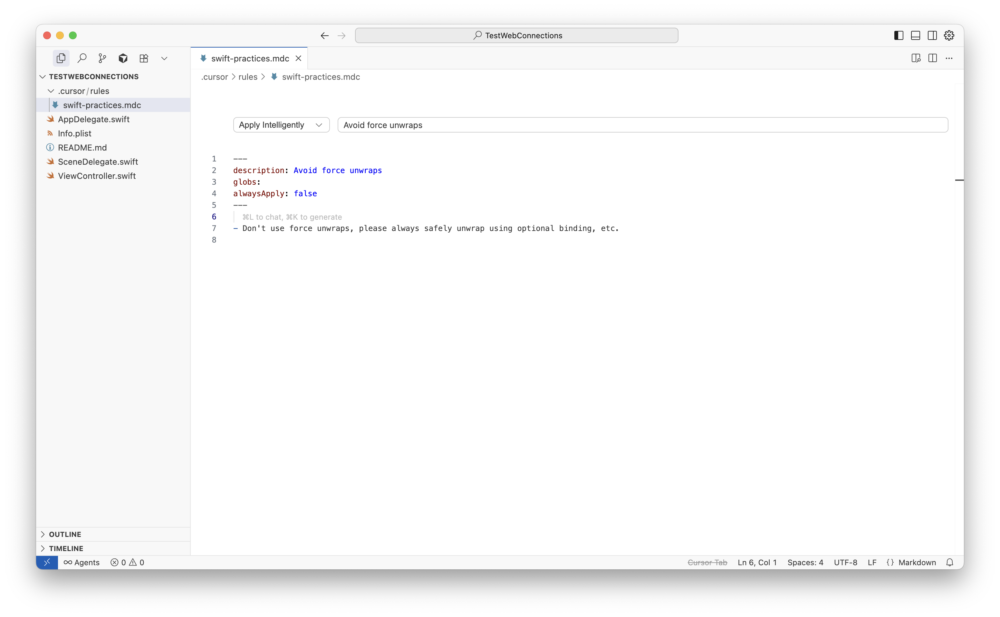
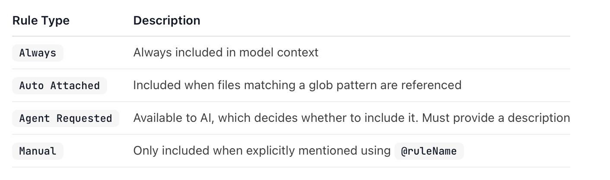

[Documentation](https://docs.cursor.com/en/context/rules) 

#### What is it

Basically a bunch of instructions to Cursor to help it make changes based on your preferences. They are put in **.mdc** files in  **.cursor/rules** folder, are specific to the current project (**Project Rules**), and look something like this.

New rule files can be created through 'Command Palette (Cmd Shift P) > File: New Cursor Rule'.

#### Rule Type dropdown

#### User Rules

There are also **User rules** that are global preferences defined in 'Cursor Settings > Rules & Memoris > User Rules' that apply across all projects.

#### Misc.

Sample Cursor Rules for iOS project ([link](https://github.com/brunogama/ios-cursor-rules/tree/main/.cursor/rules))