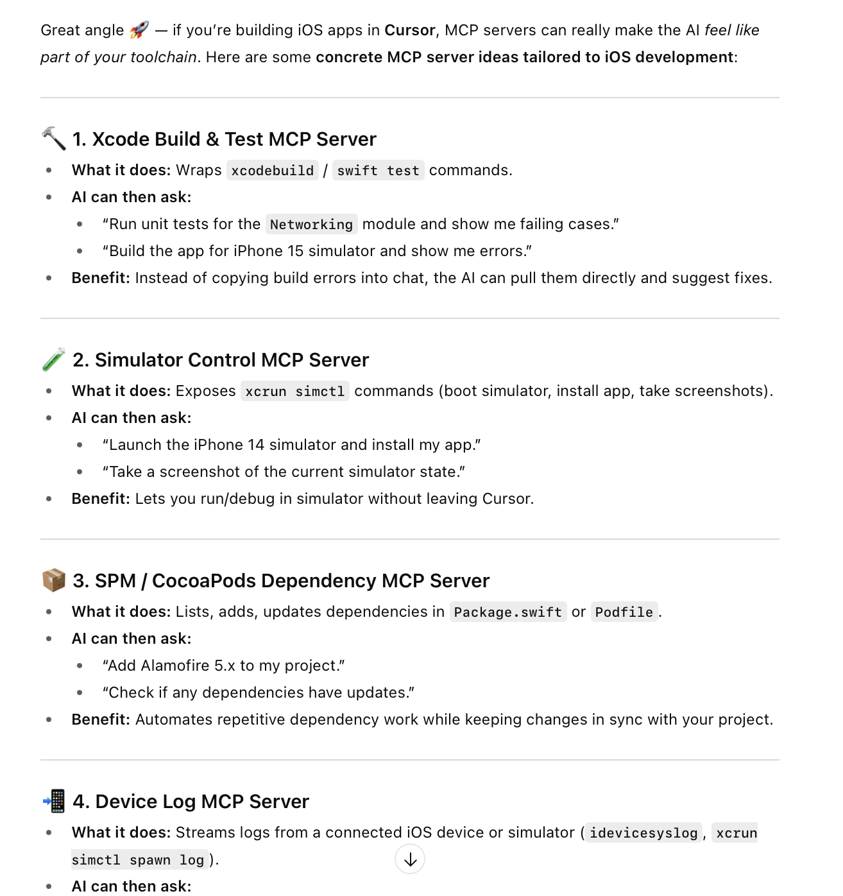
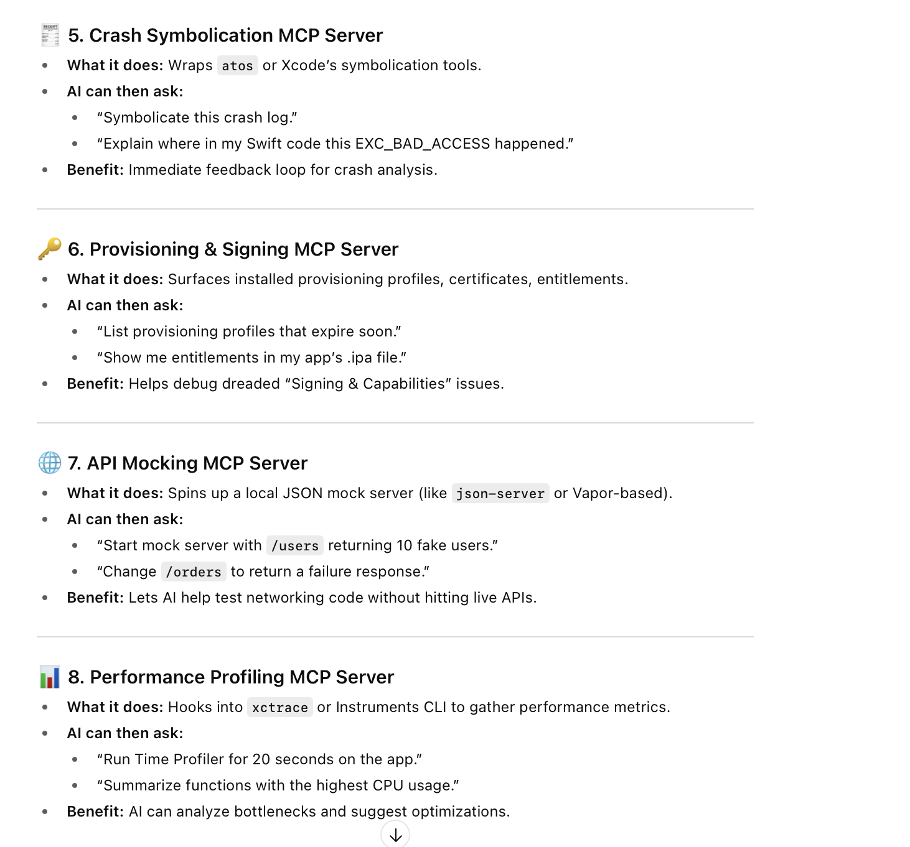
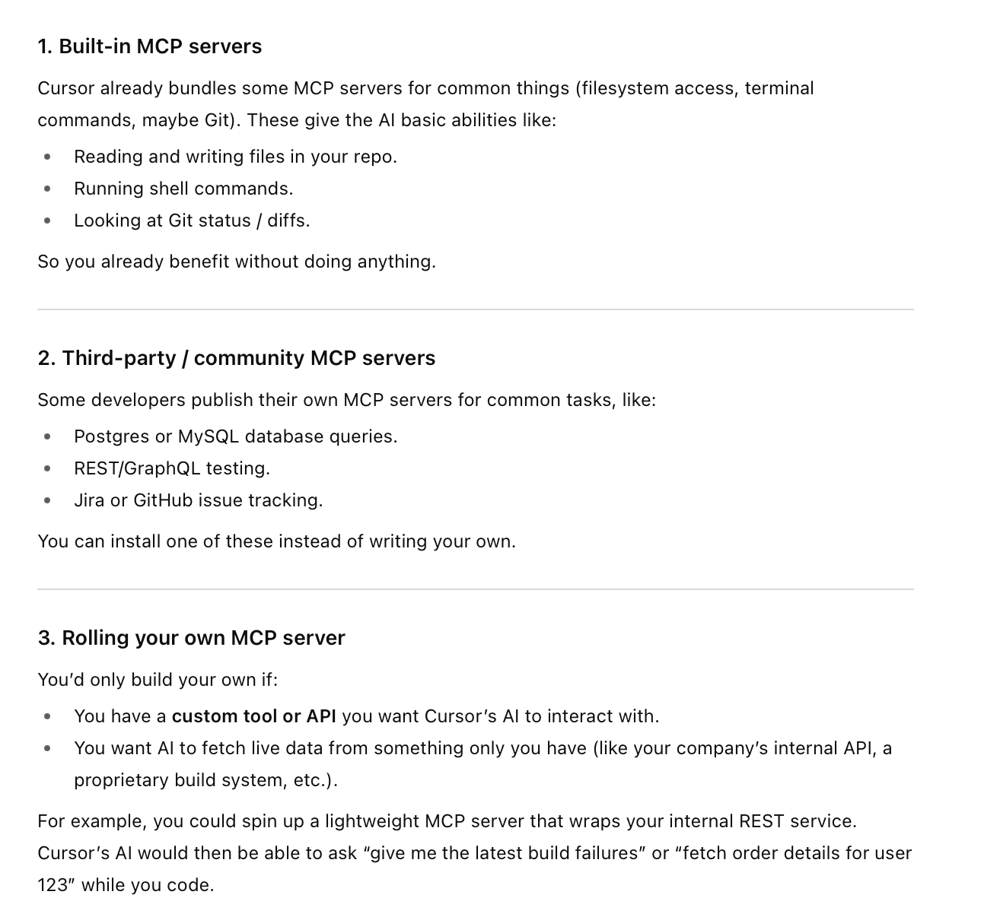
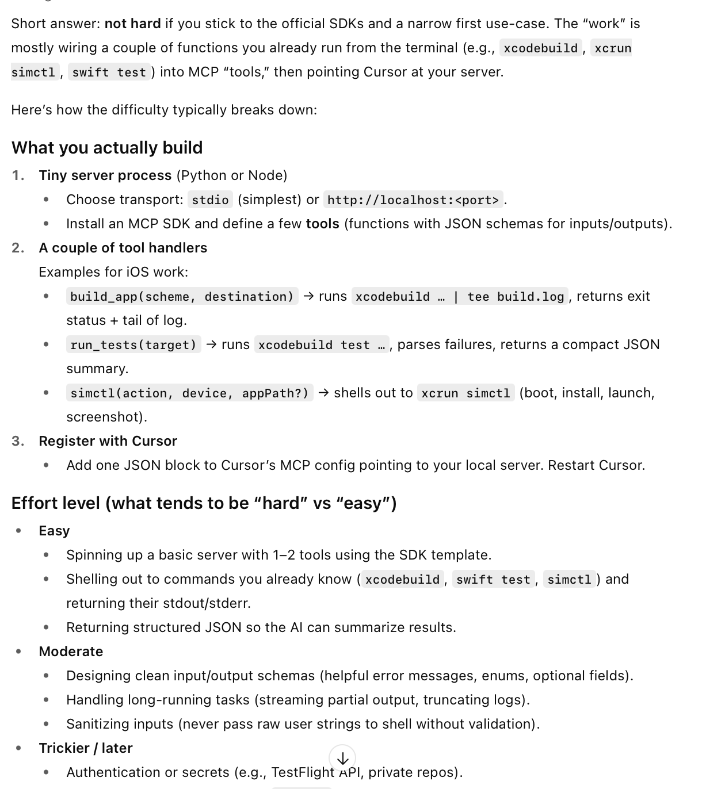
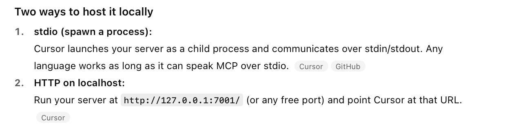

[toc]

Simply put, **Model Context Protocol (MCP) servers** are needed by AI systems to get things they can't do all by themselves. This isn't just fetching live data (like the current weather from a Weather API) but even details from some other codebase/solution (like the schema of a database elsewhere in the system).

#### Examples of MCP servers

Per ChatGPT- 

#### MCP servers - Community/Custom

While very often MCP servers are already available on the internet for several common things, a custom server can still be created pretty easily and stored in localhost.

Per ChatGPT - 

#### How to create MCP servers

Per ChatGPT

#### Hosting Locally

#### Configuring Cursor with MCP servers

[Documentation](https://docs.cursor.com/en/context/mcp)