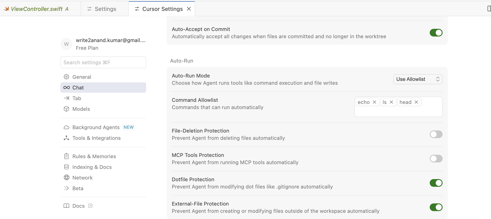
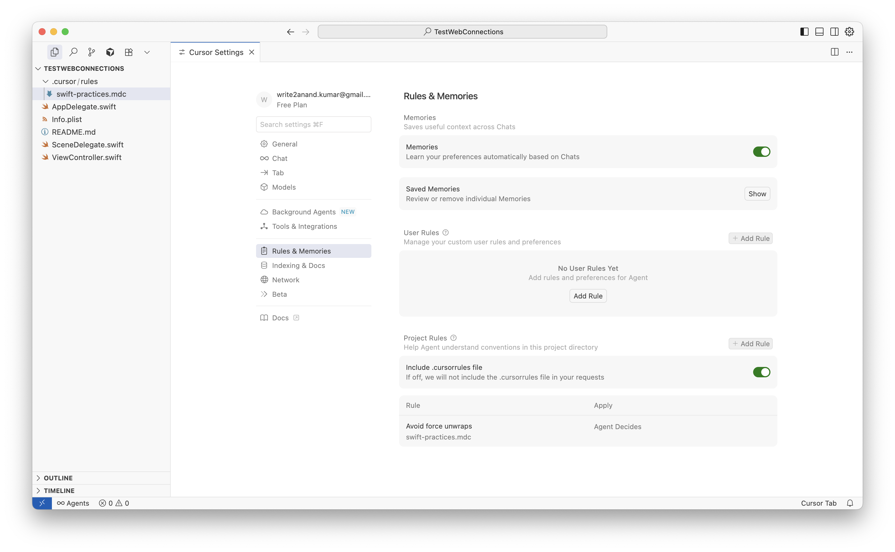
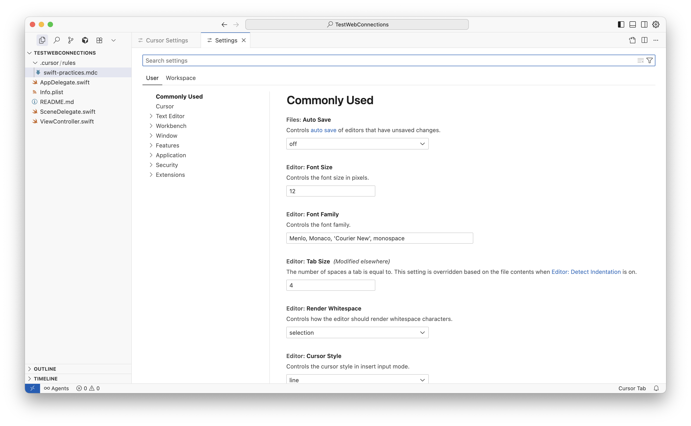
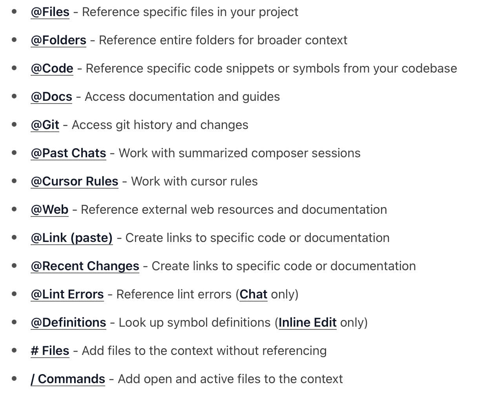
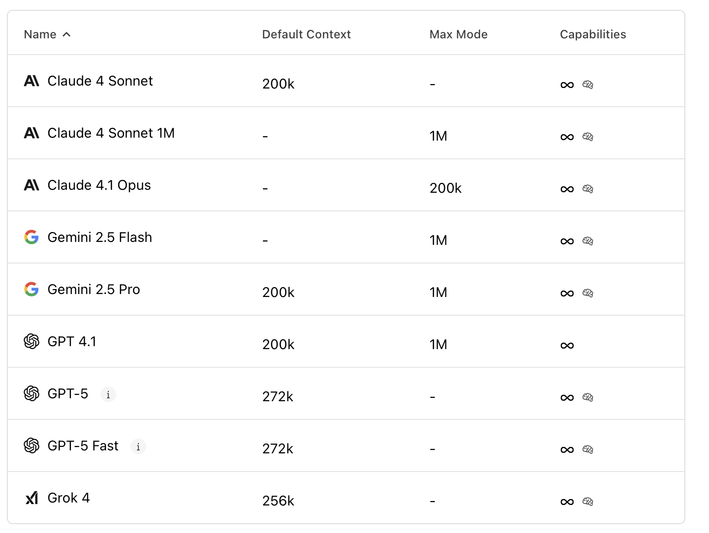
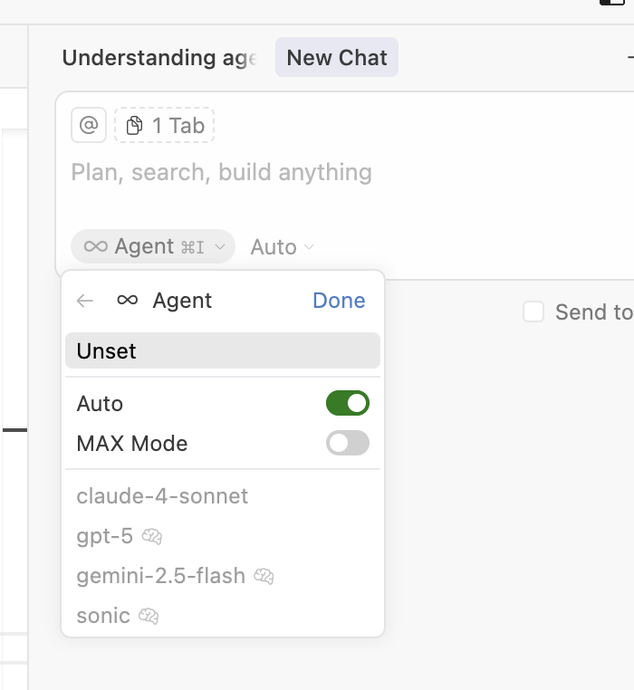
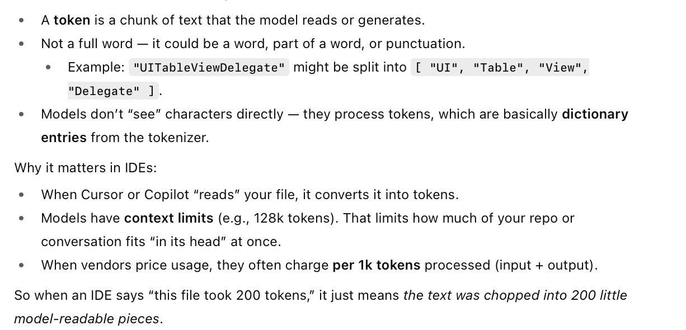

[toc]

##### Command Allowlist

The shell commands that Cursor is allowed to run automatically without asking for permission. These are accessible in 'Cursor Settings > Chat > Command Allowlist'.

##### Cursor Settings

Cursor Settings (**Cmd Shift J**) is something different from normal app settings (**Cmd ,**).

| Cursor Settings                                              | Normal Settings                                              |
| ------------------------------------------------------------ | ------------------------------------------------------------ |
|  |  |

##### @ symbols

All the **@ symbols** ([link](https://docs.cursor.com/en/context/@-symbols/overview))

##### Selecting Model

Several models are available (as of mid-2025) ([link](https://docs.cursor.com/en/models))

The model to be used can be set from the Chat window.

##### Tokens

In the world of AI/LLM, tokens are basicaly chunks that a code or training set, etc. gets divided into. There is not set rule which can say a token is x number of words, etc.

