[toc]

##### Installation

The simplest way to install the shell program is to use Homebrew.

```
brew install claude-code
```

##### Launching Claude

Launch with **claude**.  It can also be suffixed with `--resume` or `--continue` options to resume a particular session or simply continue the previous one.

##### First time setup

1. Select light/dark mode 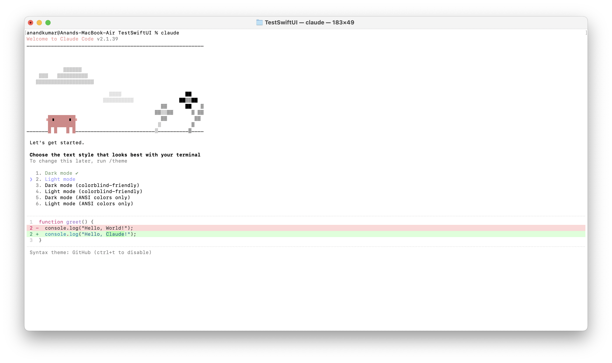
2. Select login method. I chose option 1 (requires at least Pro account)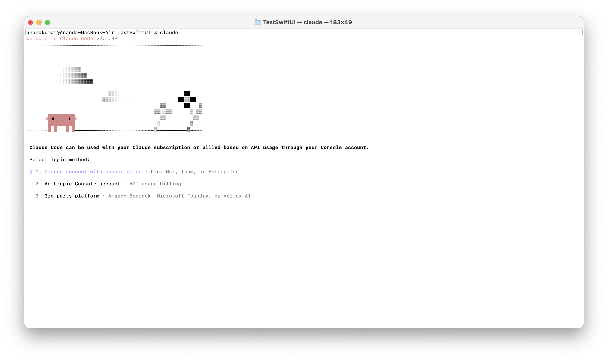
3. Confirm terminal settings 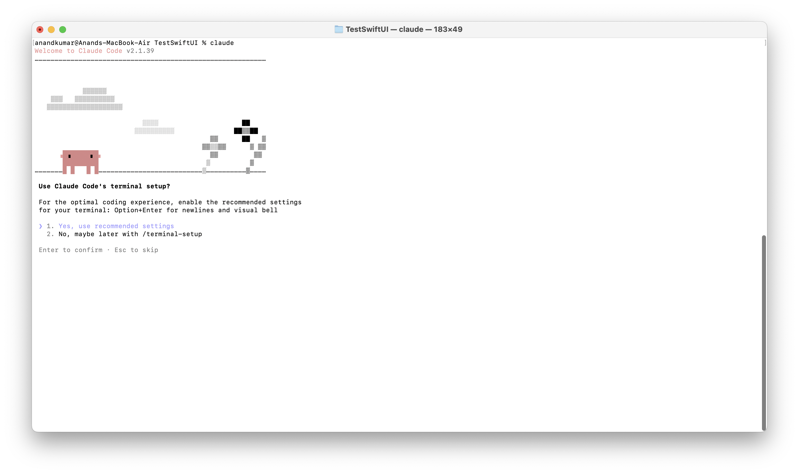
4. Confirm workspace (folder) access 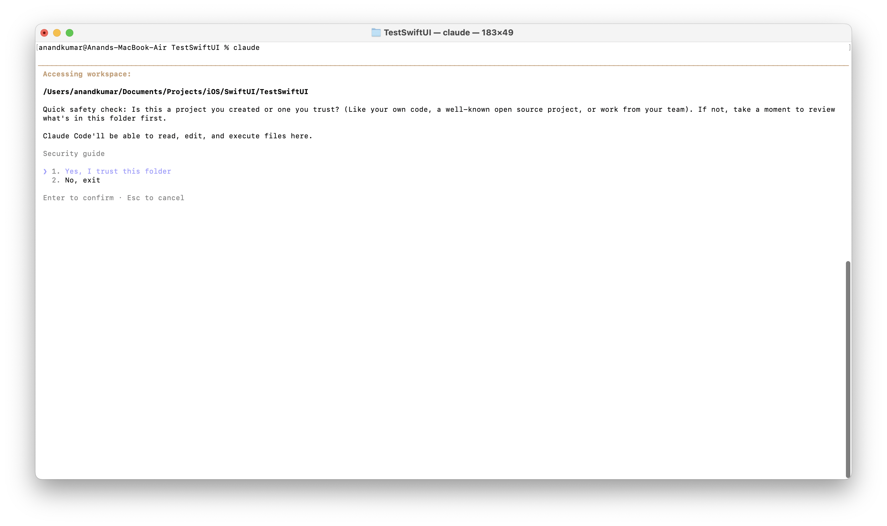

##### Three types of logins

|  | Type | Description |
| --- | --- | --- |
| 1 | Usual Claude account with subscription | Used for the normal interactive sessions |
| 2 | Anthropic Console account | Used for direct API access, for example if you want your CICD to directly talk with Claude in case of failures |
| 3 | 3rd-party platform (Amazon Bedrock, Microsoft Foundry, etc.) | Used by organizations, Claude is hosted in a 3rd party cloud and all the billing happens through it. |


##### Exiting Claude

**/exit** to exit the Claude REPL, or enter `Ctrl + C` twice.

##### Editing modes (Default, Auto-Accept Edits, Plan)

There are ~3 **editing modes** for working in a session. Default (confirmation seeked every time for edits), Auto-accept all edits,  Plan mode. You cycle between them using '**Shift + Tab**'. 

> In **Plan mode**, Claude uses read-only tools only, creating a plan you can approve before execution

| Mode                   | Screenshot                                                   |
| ---------------------- | ------------------------------------------------------------ |
| Default Mode           | 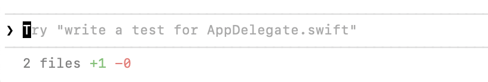 |
| Auto-Accept Edits Mode | 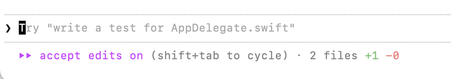 |
| Plan Mode              | 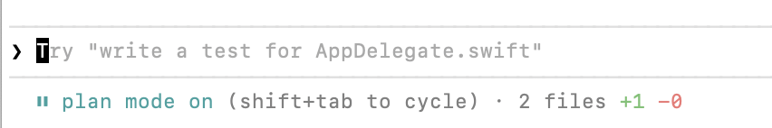 |

The current Editing mode is shown in the status line.

##### Plan Mode

The thing with **Plan Mode** (one of the modes above) is that you tell Claude what it wants, it takes a minute or so and shows you a detailed description (and not just code) of what changes it intends to make. Its commonly referrd to as **~Safe code analysis**. ([Documentation](https://code.claude.com/docs/en/common-workflows#use-plan-mode-for-safe-code-analysis))

Over here, I gave a prompt saying what I want to do and it came up with a detailed description and code.

| Prompt                                                       | Plan (Description)                                           |
| ------------------------------------------------------------ | ------------------------------------------------------------ |
| 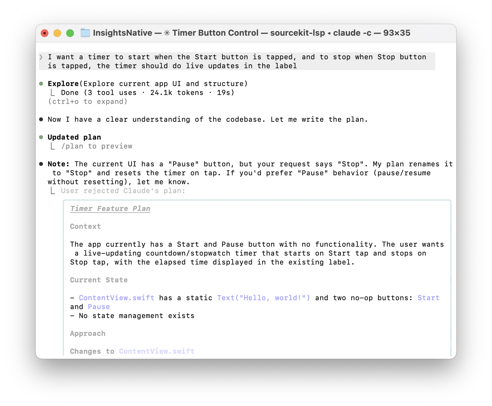 | 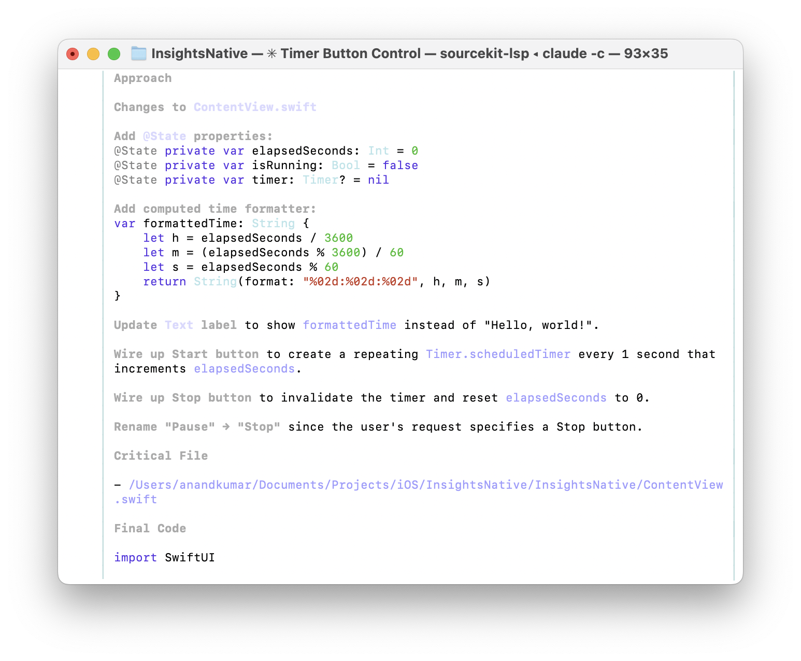 |

And then it finally asks what to do. Note that the 'clear context' in first option merely implies the conversation history for that session being cleared, and nothing more invasive than that.

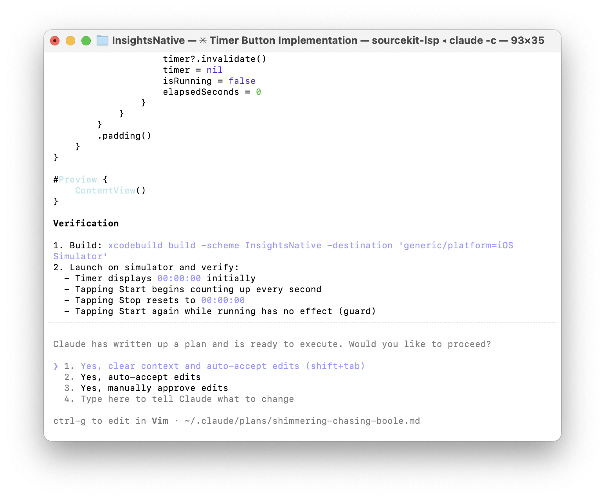

##### Entering Bash mode

Just prefix the command with !

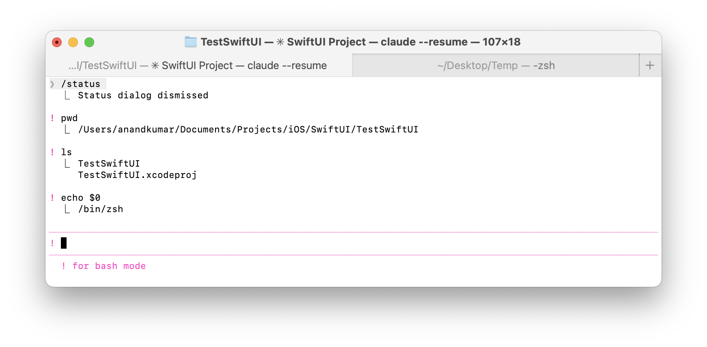

##### Exporting session conversation history

Can be done with **/export**. It exports the history to clipboard or to a file in current directory.

##### Models

| Model  | Description                        |
| ------ | ---------------------------------- |
| Haiku  | Fast                               |
| Opus   | In between (has a 'Fast' mode too) |
| Sonnet | Slow, best for complex tasks       |

For a given session, it can be changed by **/model**. 

> The tricky thing is that while **/model** is only supposed to change current session's model, it lately seems to be changing the global profile level default model too (can be verified by doing a **/config** right after which is supposed to show global config settings).

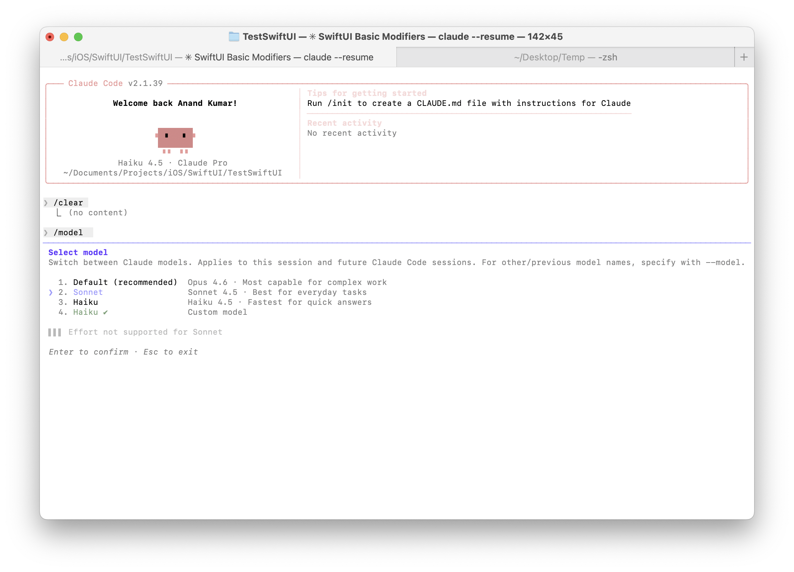

Opus has a **Fast Mode** too that can be toggled on using **/fast**, it uses the same Opus model but doesn't go as deep and returns responses lot faster. It requires Claude's **extra usage** mode to be enabled (a paid plan to keep going even account usage limit has been hit, can be opted in at [this](https://support.claude.com/en/articles/12429409-extra-usage-for-paid-claude-plans) link which is also reachable through **/extra-usage**). BTW, **/upgrade** is the slash command for a shortcut to upgrading your plan.

In fact there is yet another option called **Thinking Mode** in **/config** which applies to all the models and can let you further tweak between fast and extended reasoning.

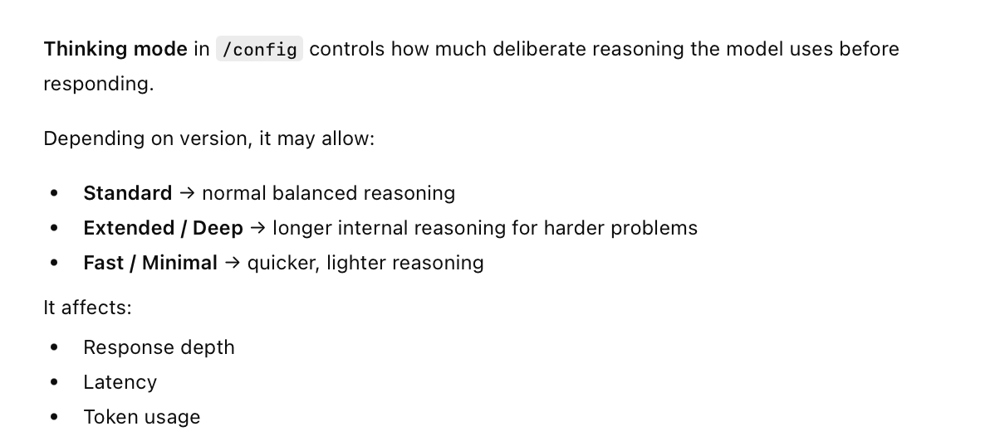

##### Changing settings and configurations

**/config** can be used to change plenty of settings and configs.

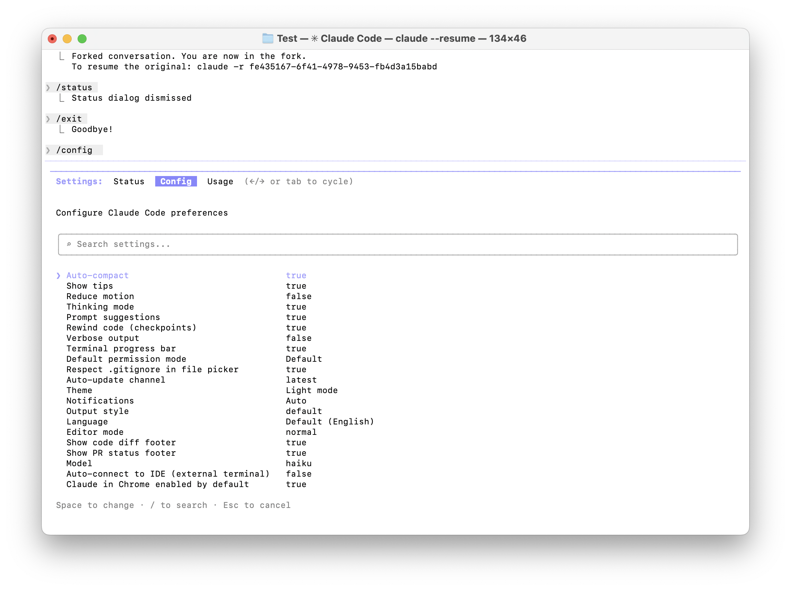


##### Some Theory

What any instruction goes through is something known as  **Agentic Loop**. Its powered by two components - **Models** (they provide the algorithm, etc.) and **Tools** (bash, internet search, file system, etc.).

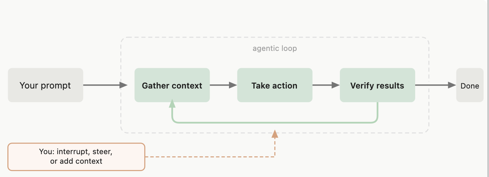


##### Misc.

The proper name for the usual interactive Claude session is **Claude REPL**.
