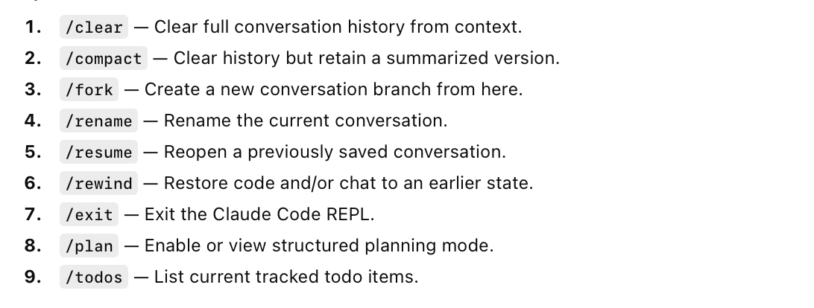
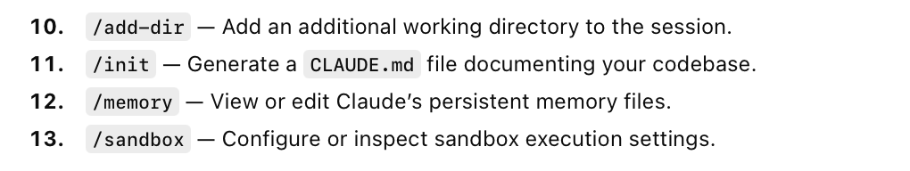
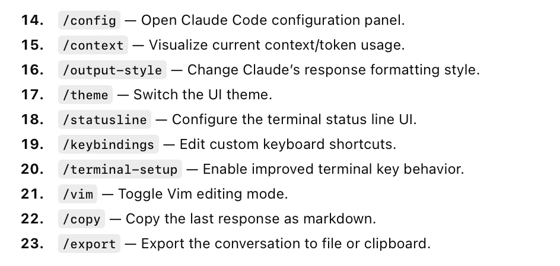
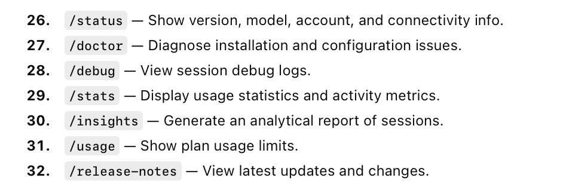
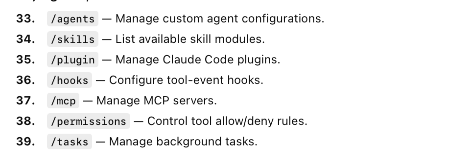
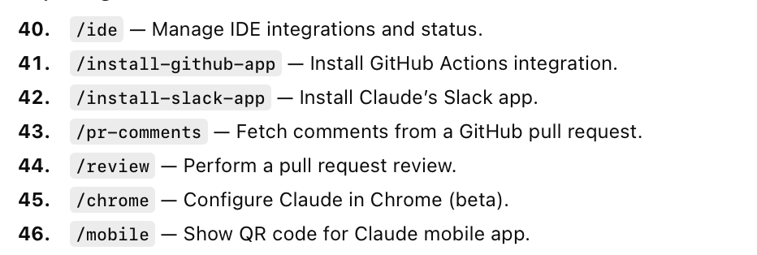
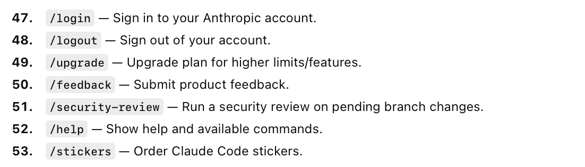

[toc]

#### Slash commands

As of Opus 4.6 (Feb 2026), there are 53 built-in slash commands.

> There is no clear online reference listing them all,  the way I got these was to tpe '/' in Claude REPL and copy all the commands from auto-complete, and then used ChatGPT for groupings.

##### Session related

##### Workspace and Memory

##### Config, UI & UX

##### Models & Performance

##### Diagnostics & Telemetry

##### Agents, Tools & Extensions

##### Integrations

##### Account, Billing & Misc

