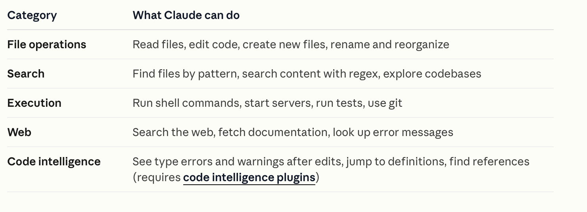
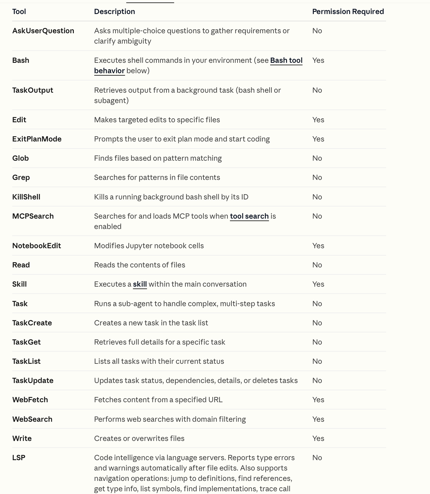

[toc]

##### Tool Categories

Claude uses some dedicated built-in tools for specific things. These tools fall into the following broad categories.

##### Tools used by Claude

[Reference](https://code.claude.com/docs/en/settings#tools-available-to-claude)

> Notice how **LSP** is a dedicated tool that brings in programming language-specific knowledge.

