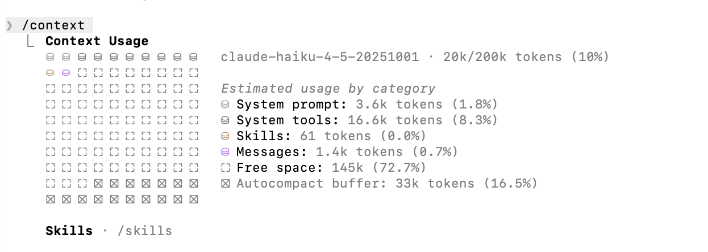
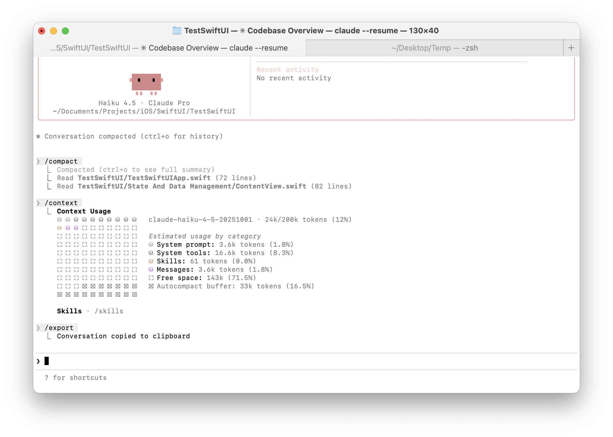
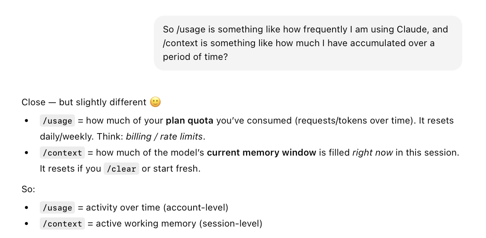

[toc]

##### Context Window

The context window is the maximum amount of text (measured in tokens) the model can 'see' at once. It includes the conversation history as well as all file snippets Claude has loaded. When the window fills up, older content gets dropped or compacted.

The size of current context window (and the amount remaining) can be checked using **/context**. In the below example 20k out of the 200k allowed tokens have been used. The total allowed token is called **Length Limit**

**/compact** can be used to condense the context window, it clears up things it can. This can be tested by checking context window size, doing a /compact, and checking context window size again. It does reduce. Compaction also clears up the conversation history.

In the below example, context window was 14% before compaction. Also, the exported conversation after compaction indeed did not have the older conversation from before compaction. 

> `/compact <message>` can control what is preserved during compaction and not condensed.

**Autocompaction** happens when your context window gets close to full and the context window is compacted automatically to create space.

**/clear** clears up the conversation history from the context window

Skills load on demand, i.e. while their descriptions can be seen right away their full content loads in CW only when used. And even that initial description load can be turned off by the setting `disable-model-invocation: true` in the skill's manifest file.

Also, any subagent that is run creates its own fresh CW and doesn't take up space in actual session's CW.

##### Account Usage

/context and **/usage** are different things. The former says how much resources is current session taking on your local. The latter says how frequently your Claude account has queried Claude. They both have their own limits, the former's is called Length Limit and the latter's **Usage Limit**. ([link](https://support.claude.com/en/articles/11647753-understanding-usage-and-length-limits))