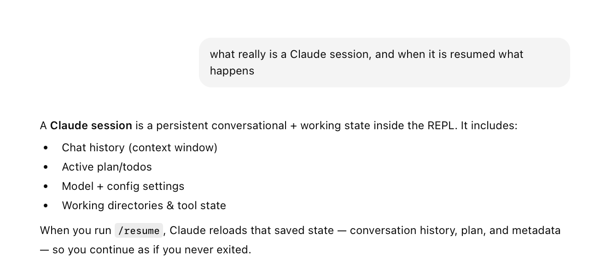
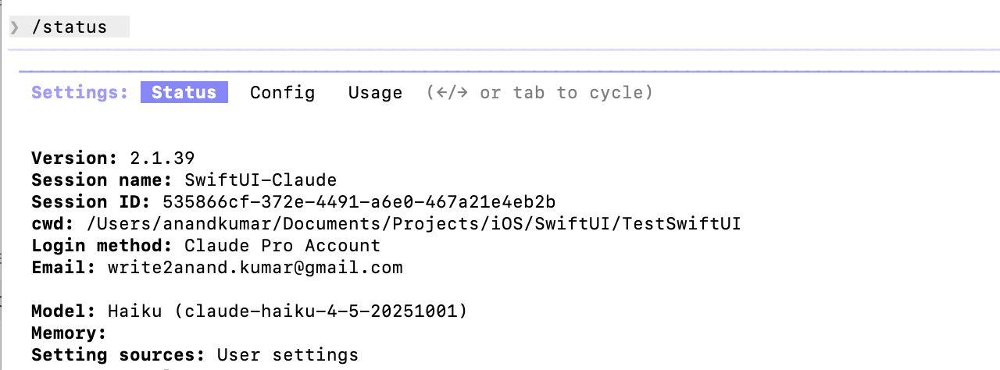
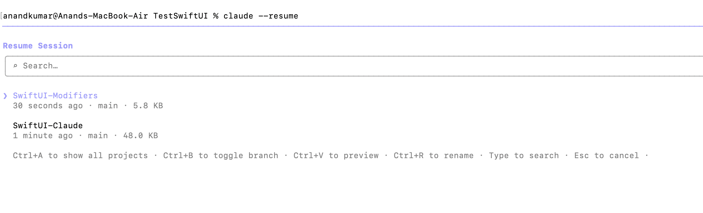
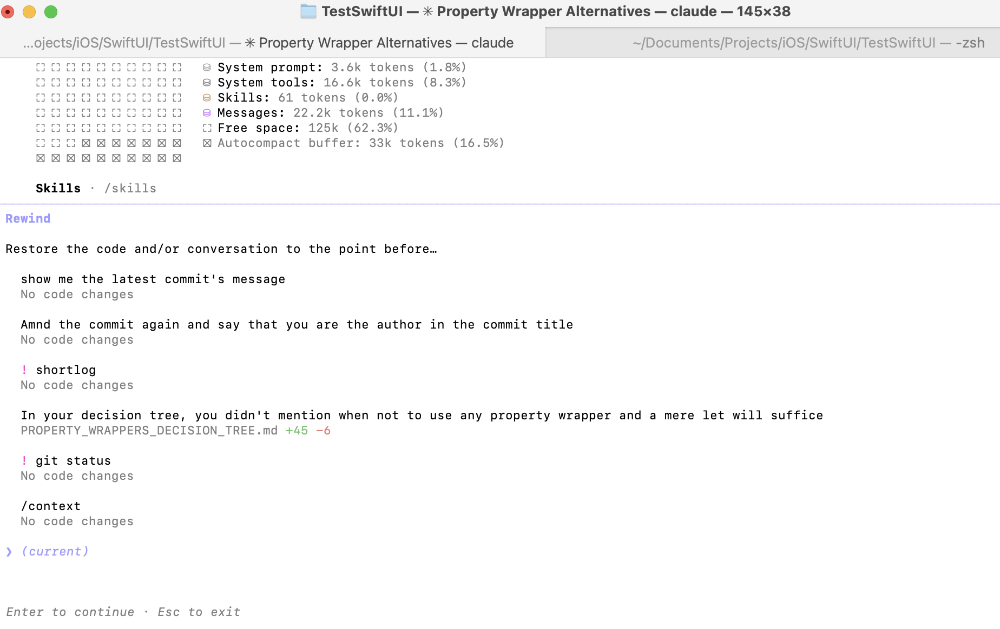
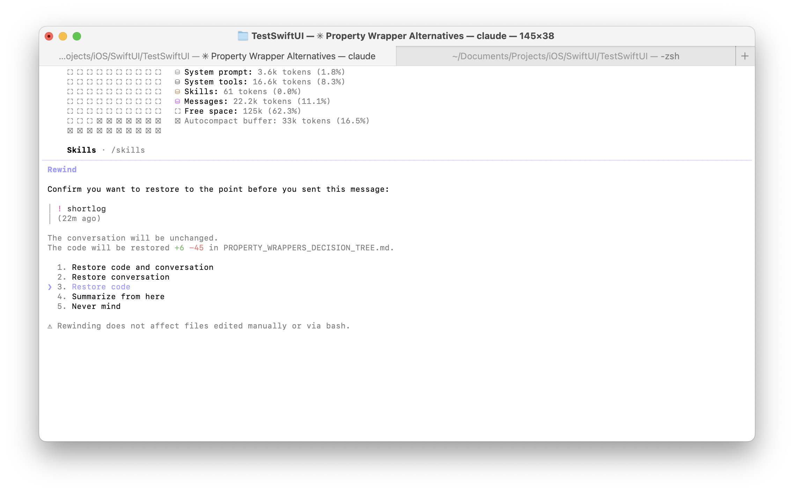

[toc]

##### Claude sessions

Its basically a persistent state that maintains conversations, information, and other settings across multiple Claude REPL sessions.

Every session has a name and ID too, which can be checked with **/status**.

Once inside the Claude REPL, **/rename** can be used set a name for the current session. 

##### Resuming sessions

Naming sessions can be useful to later resume them, which can be done while launching claude using **--resume** option.

> The frustrating thing however is that even if a session gets properly named, there is no telling if that will still be used while listing sessions in 'claude --resume', that uses some internal registry snapshot name and there is no telling what it will be.

> Technically, **/resume** too can be used to resume a Claude session but I have not seen it work, it just show the selected session's name later on **/status** even when you have selected the session. 

##### Rewinding

**/rewind** can take the session back to a previous point. It shows you the last few prompts you gave, and you can select which one to go back to.  

> It can also be invoked by hitting 'escape' twice.

And once you have selected that point, it then asks you what to rewind to - the conversation, the code, or none. For any option where the conversation is rewinded too (and not just 'summarized'), a new fork of the current session is created.

Internally, Claude accomplishes these using **checkpoints**, and are local to the session, separate from git.

##### Forking

In theory **/fork** is supposed to create a new branched session, and every new conversation there keeps the original session unaffected. But in reality, its pretty inconsistent. The session name across the original and the forked sessions get mixed even when you explicitly name sessions. And even using session IDs to resume sessions don't seem to be of much use.